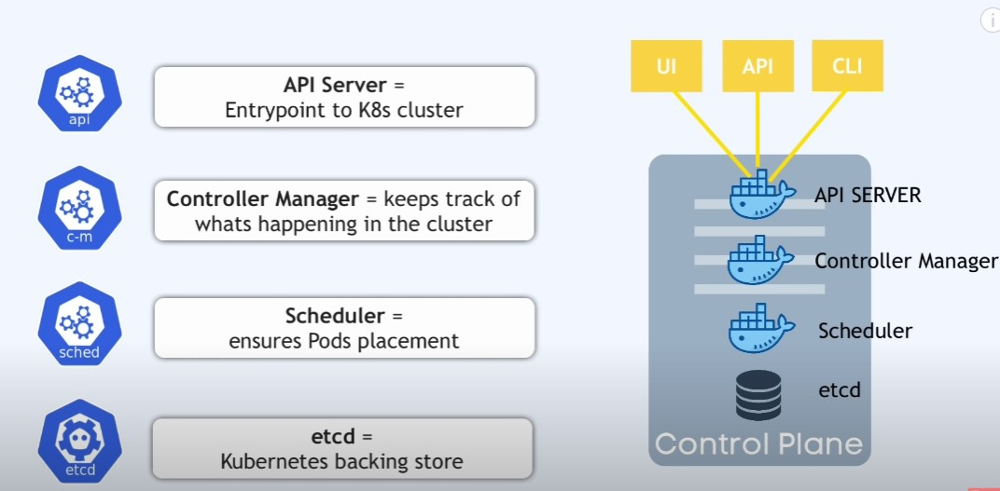

[Назад](menu.md)

# Kubernetes
+ [Определение](#Определение)
+ [Опишите техники управления объектами в Kubernetes](#какие-объекты-существуют-в-kubernetes)
+ [Опишите понятия Object names и IDs в Kubernetes](#опишите-понятия-object-names-и-ids-в-kubernetes)
+ [Опишите понятия Labels and Selectors в Kubernetes](#опишите-понятия-labels-and-selectors-в-kubernetes)
+ [Опишите понятия Namespaces в Kubernetes](#опишите-понятия-namespaces-в-kubernetes)
+ [Опишите понятия Annotations в Kubernetes](#опишите-понятия-annotations-в-kubernetes)
+ [Компоненты Kubernetes](#Компоненты-Kubernetes)
+ [Архитектура](#Архитектура)


## Определение

Kubernetes является проектом с открытым исходным кодом, предназначенным для управления кластером контейнеров Linux как 
единой системой. Kubernetes управляет и запускает контейнеры Docker на большом количестве хостов, а так же обеспечивает 
совместное размещение и репликацию большого количества контейнеров.

В проекте предлагается высокоуровневый API, определяющее логическое группирование контейнеров, позволяющее определять пулы 
контейнеров, балансировать нагрузку, а также задавать их размещение.


[к оглавлению](#Kubernetes)

## Какие объекты существуют в Kubernetes

Объектом Kubernetes следует управлять, используя только один метод. Смешение и сопоставление методов для одного и того 
же объекта приводит к неопределенному поведению.


|                  Техника управления |                                           Работает на | Рекоммендованное окружение |
|------------------------------------:|------------------------------------------------------:|----------------------------|
|                Императивные команды |                                          Live objects |       Development projects                     |
|           Императивная конфигурация |                                  Индивидуальные файлы |    Production projects                        |
|          Декларативная конфигурация | Каталоги файлов |        Production projects                    |                  |


- **Императивные команды** - При использовании императивных команд пользователь работает непосредственно с живыми объектами 
в кластере. Пользователь предоставляет операции команде kubectl в качестве аргументов или флагов. Это рекомендуемый способ 
начать работу или выполнить одноразовую задачу в кластере. Поскольку этот метод работает непосредственно с живыми объектами,
он не сохраняет историю предыдущих конфигураций.

Например:

`kubectl create deployment nginx --image nginx`

- **Преимущества по сравнению с объектной конфигурацией**:
- Команды выражаются одним словом действия.
- Команды требуют всего одного шага для внесения изменений в кластер.

- **Недостатки по сравнению с объектной конфигурацией**:
- Команды не интегрируются с процессами проверки изменений.
- Команды не предоставляют контрольный журнал, связанный с изменениями.
- Команды не предоставляют источника записей, кроме тех, которые находятся в реальном времени.
- Команды не предоставляют шаблона для создания новых объектов.

- **Императивная конфигурация** - В императивной конфигурации команда kubectl указывает операцию (создание, замена и т.д.),
необязательные флаги и хотя бы одно имя файла. Указанный файл должен содержать полное определение объекта в формате 
YAML или JSON.

Например:

`kubectl create -f nginx.yaml`

- **Преимущества по сравнению с императивными командами**:
- Конфигурация объекта может храниться в системе контроля версий, например Git.
- Конфигурация объекта может интегрироваться с такими процессами, как проверка изменений перед отправкой и контрольный журнал.
- Конфигурация объекта предоставляет шаблон для создания новых объектов.

- **Недостатки по сравнению с императивными командами**:
- Конфигурация объекта требует базового понимания схемы объекта.
- Для настройки объекта требуется дополнительный шаг по написанию файла YAML.

- **Преимущества по сравнению с декларативной конфигурацией**:
- Императивное поведение конфигурации объекта проще и понятнее.
- Начиная с версии Kubernetes 1.5, императивная конфигурация объектов стала более зрелой.

- **Недостатки по сравнению с декларативной конфигурацией**:
- Императивная конфигурация объекта лучше всего работает с файлами, а не с каталогами.
- Обновления живых объектов должны отражаться в файлах конфигурации, иначе они будут потеряны при следующей замене.

- **Декларативная конфигурация** - При использовании декларативной конфигурации объекта пользователь работает с файлами 
конфигурации объекта, хранящимися локально, однако он не определяет операции, которые следует выполнять с файлами. 
Операции создания, обновления и удаления автоматически обнаруживаются для каждого объекта kubectl. Это позволяет работать 
с каталогами, где для разных объектов могут потребоваться разные операции.

Обработайте все файлы конфигурации объектов в каталоге configs и создайте или исправьте действующие объекты. 
Вы можете сначала `diff`, чтобы увидеть, какие изменения будут внесены, а затем применить:

`kubectl diff -f configs/`
`kubectl apply -f configs/`

- **Преимущества по сравнению с императивной конфигурацией объекта**:
- Изменения, внесенные непосредственно в живые объекты, сохраняются, даже если они не 
объединены обратно в файлы конфигурации.
- Декларативная конфигурация объектов обеспечивает лучшую поддержку работы с каталогами и автоматическое определение 
типов операций (создание, исправление, удаление) для каждого объекта.

- **Недостатки по сравнению с императивной конфигурацией объекта**:
- Декларативную конфигурацию объекта труднее отлаживать и понимать результаты, если они неожиданны.
- Частичные обновления с использованием различий создают сложные операции слияния и исправления.


[к оглавлению](#Kubernetes)

## Опишите понятия Object names и IDs в Kubernetes

Каждый объект в кластере имеет имя, уникальное для этого типа ресурса. Каждый объект Kubernetes также имеет UID, 
уникальный во всем кластере. Например, у вас может быть только один Pod с именем myapp-1234 в одном пространстве имен, 
но у вас может быть один Pod и один Deployment с именем myapp-1234.

Для неуникальных атрибутов, предоставленных пользователем, Kubernetes предоставляет метки (labels) и аннотации.

Имена должны быть уникальными для всех версий API одного и того же ресурса. Ресурсы API различаются по группе API, 
типу ресурса, пространству имен (для ресурсов с пространством имен) и имени. Другими словами, версия API не имеет 
значения в этом контексте.

ID - Созданная системой Kubernetes строка для уникальной идентификации объектов. Каждый объект, созданный за все время 
существования кластера Kubernetes, имеет отдельный UID. Он предназначен для различения исторических явлений аналогичных 
объектов. UID Kubernetes — это универсально уникальные идентификаторы (также известные как UUID). 
UUID стандартизированы как ISO/IEC 9834-8 и ITU-T X.667.


[к оглавлению](#Kubernetes)


## Опишите понятия Labels and Selectors в Kubernetes

Labels — это пары ключ/значение, прикрепленные к таким объектам, как Pods. Labels предназначены для использования для 
указания идентифицирующих атрибутов объектов, которые имеют смысл и актуальны для пользователей, но не несут прямой 
семантики для базовой системы. Labels можно использовать для организации и выбора подмножеств объектов. Labels можно 
прикреплять к объектам во время создания, а затем добавлять и изменять в любое время. Для каждого объекта может быть 
определен набор Labels «ключ/значение». Каждый ключ должен быть уникальным для данного объекта.

```json
"metadata": 
  {
    "labels": {
      "key1" : "value1",
      "key2" : "value2"
    }
  }
```
Labels позволяют пользователям сопоставлять свои собственные организационные структуры с системными объектами 
слабосвязанным образом, не требуя от клиентов хранить эти сопоставления. Service deployments и batch processing pipelines
часто представляют собой многомерные объекты (например, несколько разделов или развертываний, несколько версий выпуска, 
несколько уровней, несколько микросервисов на уровень). Управление часто требует сквозных операций, что нарушает 
инкапсуляцию строго иерархических представлений, особенно жестких иерархий, определяемых инфраструктурой, 
а не пользователями.

В отличие от имен и UID, Labels не обеспечивают уникальности. В общем, мы ожидаем, что многие объекты будут иметь одну 
и ту же метку(и). С помощью label selector клиент/пользователь может идентифицировать набор объектов. Селектор меток — 
это основной примитив группировки в Kubernetes. В настоящее время API поддерживает два типа селекторов: 
- на основе равенства (equality-based) - позволяют фильтроваться по ключам и значениям меток. Соответствующие объекты 
должны удовлетворять всем указанным ограничениям меток, хотя они также могут иметь дополнительные метки. Допускаются 
три вида операторов =,==,!=.
- на основе набора (set-based) - позволяют фильтроваться по ключам по набору значений. Поддерживаются три типа 
операторов: in, notin и exists (только идентификатор ключа).

Селектор меток может состоять из нескольких требований, разделенных запятыми. В случае нескольких требований все они 
должны быть удовлетворены, поэтому разделитель-запятая действует как логический оператор И (&&).

[к оглавлению](#Kubernetes)


## Опишите понятия Namespaces в Kubernetes

В Kubernetes пространства имен (namespace) предоставляют механизм изоляции групп ресурсов внутри одного кластера. 
Имена ресурсов должны быть уникальными внутри пространства имен, но не между пространствами имен. Область действия на 
основе пространства имен применима только для объектов пространства имен (например, Deployments, Services и т.д.), а не 
для объектов всего кластера (например, StorageClass, Nodes, PersistentVolumes и т.д.).

Пространства имен предназначены для использования в средах с большим количеством пользователей, распределенных по 
нескольким командам или проектам. Для кластеров с числом пользователей от нескольких до десятков вообще не нужно создавать 
или думать о пространствах имен. Начните использовать пространства имен, когда вам потребуются возможности, которые они
предоставляют.

Пространства имен предоставляют scope for names. Имена ресурсов должны быть уникальными внутри пространства имен, но не 
между пространствами имен. Пространства имен не могут быть вложены друг в друга, и каждый ресурс Kubernetes может 
находиться только в одном пространстве имен.

Пространства имен — это способ разделить ресурсы кластера между несколькими пользователями (с помощью resource quota).

Нет необходимости использовать несколько пространств имен для разделения немного разных ресурсов, например, 
разных версий одного и того же программного обеспечения: используйте метки, чтобы различать ресурсы в одном пространстве имен.


[к оглавлению](#Kubernetes)


## Опишите понятия Annotations в Kubernetes

Вы можете использовать аннотации Kubernetes для прикрепления к объектам произвольных неидентифицирующих метаданных. 
Клиенты, такие как инструменты и библиотеки, могут получать эти метаданные.

Вы можете использовать метки или аннотации для прикрепления метаданных к объектам Kubernetes. Метки можно использовать 
для выбора объектов и поиска коллекций объектов, удовлетворяющих определенным условиям. Напротив, аннотации не используются 
для идентификации и выбора объектов. Метаданные в аннотации могут быть маленькими или большими, структурированными или 
неструктурированными и могут включать символы, не разрешенные метками. В метаданных одного и того же объекта можно 
использовать метки и аннотации.

Аннотации, как и метки, представляют собой карты ключ/значение:

```json
"metadata": {
  "annotations": {
    "key1" : "value1",
    "key2" : "value2"
  }
}
```

Вот несколько примеров информации, которая может быть записана в аннотациях:

- Поля, управляемые декларативным уровнем конфигурации. Прикрепление этих полей в качестве аннотаций отличает их от 
значений по умолчанию, установленных клиентами или серверами, а также от автоматически создаваемых полей и полей, 
установленных системами автоматического определения размера или автоматического масштабирования.
- Информация о сборке, выпуске или образе, такая как метки времени, идентификаторы выпуска, ветка git, номера PR, 
хэши изображений и адрес реестра.
- Указатели на хранилища журналов, мониторинга, аналитики или аудита.
- Сведения о клиентской библиотеке или инструменте, которые можно использовать в целях отладки: например, имя, версия и 
информация о сборке.
- Информация о происхождении пользователя или инструмента/системы, например URL-адреса связанных объектов из других 
компонентов экосистемы.
- Упрощенные метаданные инструмента развертывания: например, конфигурация или контрольные точки.
- Номера телефонов или пейджеров ответственных лиц или записи каталога, указывающие, где можно найти эту информацию, 
например веб-сайт группы.
- Директивы конечного пользователя реализациям по изменению поведения или использованию нестандартных функций.

Вместо использования аннотаций вы можете хранить этот тип информации во внешней базе данных или каталоге, но это 
значительно усложнит создание общих клиентских библиотек и инструментов для развертывания, управления, самоанализа 
и тому подобного.

[к оглавлению](#Kubernetes)

## Компоненты Kubernetes

Когда вы развертываете Kubernetes, вы получаете кластер. Кластер Kubernetes состоит из набора рабочих машин, называемых 
nodes, на которых выполняются контейнерные приложения. В каждом кластере есть хотя бы один рабочий node.
На рабочих nodes размещаются pods, являющиеся компонентами рабочей нагрузки приложения. Control plane управляет рабочими 
nodes и pods в кластере. В production environments Control plane обычно работает на нескольких компьютерах, а в 
кластере обычно работает несколько nodes, что обеспечивает отказоустойчивость и высокую доступность.


[к оглавлению](#Kubernetes)


## Архитектура




[к оглавлению](#Kubernetes)

[Назад](menu.md)
