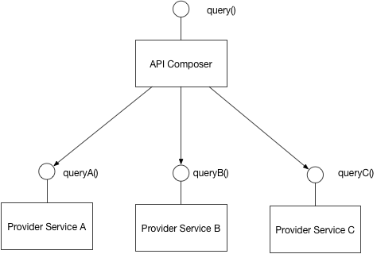

[Назад](../designmenu.md)

# A pattern language for microservices

## Application patterns (Паттерны приложения)
    
 ### Decomposition (Декомпозиция)
   - #### [Decompose by business capability (Декомпозиция по бизнес-возможностям)](#Decompose-by-business-capability)
   - #### [Decompose by subdomain DDD (Декомпозиция по сабдоменам DDD)](#decompose-by-subdomain-DDD)
   - #### [Self-contained Service (Автономный сервис)](#self-contained-service)
   - #### [Service per team (Сервис на команду)](#service-per-team)
   - #### [Strangler application](#strangler-application)

 ### Data patterns (Паттерны управления данными)
   - ### Database architecture (Архитектура БД)
        - #### [Database per Service (Отдельная БД на каждый сервис)](#Database-per-Service)
        - #### [Shared database (Сервисы работают с единой БД)](#Shared-database)
   - ### Maintaining data consistency (Управление констистентностью данных)
        - #### [Saga pattern](#saga)
        - #### [Event sourcing pattern](#event-sourcing)
        - #### [Domain Event pattern (DDD)](#domain-event)
        - #### [Aggregate (DDD)](#aggregate)
   - ### Querying (Запросы)
        - #### [CQRS pattern](#cqrs)
        - #### [API Composition pattern]()

 ### Testing (Тестирование)

 ### UI (Графический интерфейс)

 ### Observability (Наблюдаемость)

## Application Infrastructure patterns (Паттерны инфраструктуры приложения)

### Cross-cutting concerns (Сквозные проблемы)
### Security (Безопасность)
### Deployment (Развертывание приложения)
### Communication patterns (Паттерны коммуникации)
  - ### Transactional Messaging (Транзакционный обмен сообщениями)
  - ### Communication Style (Стиль коммуникаций)
  - ### Reliability (Надежность)
  - ### External API (Внешний API)
  - ### Discovery (Наблюдаемость)
### Observability (Наблюдаемость)

## Infrastructure patterns (Инфраструктурные паттерны)

### Deployment (Развертывание приложения)
### Communication patterns (Паттерны коммуникации)
- ### Discovery (Наблюдаемость)

## Decompose by business capability

В наши дни программное обеспечение обычно распространяется в виде сервисов, называемых веб-приложения (web apps) 
или software-as-a-service (SaaS). Приложение двенадцати факторов — это методология для создания SaaS-приложений, которые:

[к оглавлению](#a-pattern-language-for-microservices)

## Decompose by subdomain DDD

В наши дни программное обеспечение обычно распространяется в виде сервисов, называемых веб-приложения (web apps)
или software-as-a-service (SaaS). Приложение двенадцати факторов — это методология для создания SaaS-приложений, которые:

[к оглавлению](#a-pattern-language-for-microservices)

## Self-contained Service

В наши дни программное обеспечение обычно распространяется в виде сервисов, называемых веб-приложения (web apps)
или software-as-a-service (SaaS). Приложение двенадцати факторов — это методология для создания SaaS-приложений, которые:

[к оглавлению](#a-pattern-language-for-microservices)

## Service per team

В наши дни программное обеспечение обычно распространяется в виде сервисов, называемых веб-приложения (web apps)
или software-as-a-service (SaaS). Приложение двенадцати факторов — это методология для создания SaaS-приложений, которые:

[к оглавлению](#a-pattern-language-for-microservices)

## Strangler application

В наши дни программное обеспечение обычно распространяется в виде сервисов, называемых веб-приложения (web apps)
или software-as-a-service (SaaS). Приложение двенадцати факторов — это методология для создания SaaS-приложений, которые:

[к оглавлению](#a-pattern-language-for-microservices)

## Database per Service

В наши дни программное обеспечение обычно распространяется в виде сервисов, называемых веб-приложения (web apps)
или software-as-a-service (SaaS). Приложение двенадцати факторов — это методология для создания SaaS-приложений, которые:

[к оглавлению](#a-pattern-language-for-microservices)

## Shared database

В наши дни программное обеспечение обычно распространяется в виде сервисов, называемых веб-приложения (web apps)
или software-as-a-service (SaaS). Приложение двенадцати факторов — это методология для создания SaaS-приложений, которые:

[к оглавлению](#a-pattern-language-for-microservices)

## Saga

#### Контекст
В приложении применяется паттерн [Database per service](#database-per-service). Каждый микросервис имеет свою базу данных. 
Однако некоторые бизнес-транзакции охватывают несколько микросервисов, поэтому вам нужен механизм для реализации транзакций, 
охватывающих эти микросервисы. Например, предположим, что вы создаете интернет-магазин, в котором у клиентов есть кредитный лимит. 
Приложение должно гарантировать, что новый заказ не превысит кредитный лимит клиента. Поскольку заказы и клиенты находятся 
в разных базах данных, принадлежащих разным микросервисам, приложение не может использовать локальную ACID транзакцию.

#### Проблема
Как реализовать транзакции, охватывающие эти микросервисы? 2PC не вариант.

#### Решение
Реализуйте каждую бизнес-транзакцию, охватывающую несколько микросервисов, как сагу. Сага — это последовательность 
локальных транзакций. Каждая локальная транзакция обновляет базу данных, относящуюся к определенному микросервису
и публикует сообщение или событие, запускающее следующую локальную транзакцию в саге. Если локальная транзакция завершается 
с ошибкой из-за нарушения бизнес-правила, сага выполняет серию компенсирующих транзакций, которые отменяют изменения, 
внесенные предыдущими локальными транзакциями.
Существует два способа координации саг:
+ Хореография — каждая локальная транзакция публикует события домена, которые запускают локальные транзакции в других микросервисах.
+ Оркестрация — оркестратор (объект) сообщает участникам, какие локальные транзакции выполнять.

#### Пример: сага, основанная на хореографии.

Приложение электронной коммерции, использующее этот подход, создаст заказ, используя хореографическую сагу, 
состоящую из следующих шагов:

1. Микросервис OrderService получает запрос POST/orders (например, из UI приложения) и создает заказ в состоянии PENDING.
2. Затем он генерирует событие Order Created и отправляет его в топик "order-events-channel".
3. Обработчик событий микросервиса CustomerService считывает это событие из топика "order-events-channel" и пытается 
зарезервировать деньги (credit)
4. Затем он генерирует событие (CreditReserved или CreditLimitExceeded), указывающее результат и отправляет 
его в топик "customer-events-channel"
5. Обработчик событий микросервиса OrderService считывает событие из топика "customer-events-channel" и либо утверждает, 
либо отклоняет заказ.

#### Пример: сага, основанная на оркестрации.

Приложение электронной коммерции, использующее этот подход, создаст заказ, используя сагу на основе оркестрации, 
состоящую из следующих шагов:

1. Микросервис OrderService получает запрос POST/orders (например, из UI приложения) и создает оркестратор CreateOrderSaga.
2. Оркестратор саги создает заказ в состоянии PENDING.
3. Затем он отправляет ReserveCreditCommand через брокер сообщений в CustomerService.
4. CustomerService пытается зарезервировать деньги (credit)
5. Затем он отправляет обратно ответное сообщение ReserveCreditResponse с указанием результата.
6. Организатор саги либо одобряет, либо отклоняет Order.

#### Результат
Этот паттерн имеет следующие преимущества:
- Сага позволяет приложению поддерживать согласованность данных в нескольких микросервисах без использования распределенных 
транзакций.

Недостатки:
- Отсутствие автоматического отката — разработчик должен разработать компенсирующие транзакции, которые явно отменяют 
изменения, сделанные ранее в саге, а не полагаться на функцию автоматического отката транзакций ACID.
- Отсутствие изоляции («I» в ACID) — отсутствие изоляции означает, что существует риск того, что одновременное выполнение 
нескольких саг и транзакций может привести к аномалии данных. Следовательно, разработчик саги должен обычно использовать 
контрмеры, которые представляют собой методы проектирования, реализующие изоляцию. Более того, необходим тщательный анализ 
для выбора и правильной реализации контрмер.

Также необходимо решить следующие вопросы:
- Чтобы быть надежным, микросервис должен атомарно обновлять свою базу данных и публиковать сообщение/событие. Он не может 
использовать традиционный механизм распределенной транзакции, охватывающий базу данных и брокер сообщений. Вместо этого 
он должен использовать один из паттернов, перечисленных ниже.
- Клиент, который инициирует сагу, представляющую собой асинхронный поток, с использованием синхронного запроса 
(например, HTTP POST/orders), должен иметь возможность определять его результат. Есть несколько вариантов, каждый из 
которых имеет разные компромиссы:
    - Микросервис отправляет ответ после завершения саги, например, как только он получит событие OrderApproved или OrderRejected.
    - Микросервис отправляет обратно ответ (например, содержащий идентификатор заказа) после запуска саги, и клиент 
  периодически опрашивает (например, GET /orders/{orderID}), чтобы определить результат.
    - Микросервис отправляет ответ (например, содержащий идентификатор заказа) после запуска саги, а затем отправляет 
  событие (например, веб-сокет, веб-перехватчик и т. д.) клиенту после завершения саги.

#### Смежные паттерны
- Паттерн [Database per service](#database-per-service) создает необходимость в этом паттерне.
- Следующие паттерны представляют собой способы атомарного обновления состояния и публикации сообщений/событий:
    - Event Sourcing
    - Transactional Outbox
- Сага, основанная на хореографии, может публиковать события с использованием Aggregates и Domain Events.
- Command-side replica — это альтернативный паттерн, который может заменить этап саги, который запрашивает данные.

[к оглавлению](#a-pattern-language-for-microservices)

## Event Sourcing

#### Контекст
Команде микросервиса обычно необходимо создавать/обновлять/удалять агрегаты в базе данных и отправлять сообщения/события 
брокеру сообщений. Например, микросервису, который участвует в саге, необходимо обновлять бизнес-объекты и отправлять 
сообщения/события. Аналогично, микросервис, публикующая событие домена, должна обновить агрегат и опубликовать событие.

Команда должна атомарно обновлять базу данных и отправлять сообщения, чтобы избежать несогласованности данных и ошибок. 
Однако нецелесообразно использовать традиционную распределенную транзакцию (2PC), охватывающую базу данных и брокер сообщений. 
База данных и/или брокер сообщений могут не поддерживать 2PC. А даже если и так, зачастую нежелательно связывать микросервис 
одновременно с базой данных и брокером сообщений.

Но без использования 2PC отправка сообщения в середине транзакции ненадежна. Нет никакой гарантии, что транзакция будет 
зафиксирована. Аналогично, если микросервис отправляет сообщение после совершения транзакции, нет никакой гарантии, 
что она не выйдет из строя до отправки сообщения.

Кроме того, сообщения должны отправляться брокеру сообщений в том порядке, в котором они были отправлены микросервисом. 
Обычно они должны доставляться каждому потребителю в одном и том же порядке, хотя это выходит за рамки данного паттерна. 
Например, предположим, что агрегат обновляется серией транзакций T1, T2 и т. д. Эти транзакции могут выполняться одним и 
тем же экземпляром микросервиса или разными экземплярами микросервиса. Каждая транзакция публикует соответствующее 
событие: T1 -> E1, T2 -> E2 и т. д. Поскольку T1 предшествует T2, событие E1 должно быть опубликовано раньше E2.

#### Проблема

Как атомарно обновить базу данных и отправить сообщения брокеру сообщений?
- 2PC не вариант. База данных и/или брокер сообщений могут не поддерживать 2PC. Кроме того, часто нежелательно связывать 
микросервису одновременно с базой данных и брокером сообщений.
- Если транзакция базы данных фиксируется, сообщения должны быть отправлены. И наоборот, если база данных откатывается, 
сообщения не должны отправляться.
- Сообщения должны отправляться брокеру сообщений в том порядке, в котором они были отправлены микросервисом. Этот порядок 
должен сохраняться для нескольких экземпляров микросервиса, которые обновляют один и тот же агрегат.

#### Решение
Хорошим решением этой проблемы является использование event sourcing. Event sourcing сохраняет состояние бизнес-объекта, 
такого как Order или Customer, как последовательность событий, изменяющих состояние. При каждом изменении состояния 
бизнес-объекта к списку событий добавляется новое событие. Поскольку сохранение события представляет собой одну 
операцию, оно по своей сути является атомарным. Приложение восстанавливает текущее состояние объекта, воспроизводя события.

Приложения сохраняют события в хранилище событий (event store), которое представляет собой базу данных событий. 
В хранилище есть API для добавления и получения событий сущности. Хранилище событий также ведет себя как брокер сообщений. 
Он предоставляет API, который позволяет микросервисам подписываться на события. Когда микросервис сохраняет событие в 
хранилище событий, оно доставляется всем заинтересованным подписчикам.

Некоторые сущности, например Customer, могут иметь большое количество событий. Чтобы оптимизировать загрузку, приложение 
может периодически сохранять снимок (snapshot) текущего состояния объекта. Чтобы восстановить текущее состояние, 
приложение находит самый последний снимок и события, произошедшие после него. В результате событий, которые нужно 
воспроизвести, становится меньше.

#### Пример

«Customers and Orders» — это пример приложения, созданного с использованием Event Sourcing и CQRS. Приложение написано на 
Java и использует Spring Boot. Он создан с использованием Eventuate, платформы приложений, основанной на Event Sourcing и CQRS.

На следующей диаграмме показано, как сохраняются заказы.

Вместо того, чтобы просто сохранять текущее состояние каждого заказа в виде строки в таблице ORDERS, 
приложение сохраняет каждый заказ как последовательность событий. CustomerService может подписываться на события заказа 
и обновлять свое собственное состояние.

#### Результат
Event sourcing имеет ряд преимуществ:

- Он решает одну из ключевых проблем при реализации архитектуры, управляемой событиями (event-driven architecture), и 
позволяет надежно публиковать события при каждом изменении состояния.
- Поскольку он сохраняет события, а не объекты предметной области, он в основном позволяет избежать проблемы 
объектно-реляционного несоответствия.
- Обеспечивает 100% надежный audit log изменений, внесенных в сущность.
- Позволяет реализовать временные запросы (temporal queries), определяющие состояние сущности в любой момент времени.
- Бизнес-логика, основанная на Event sourcing, состоит из слабосвязанных бизнес-объектов, которые обмениваются событиями. 
Это значительно упрощает переход от монолитного приложения к микросервисной архитектуре.

Источник событий также имеет несколько недостатков:

- К хранилищу событий сложно обращаться, поскольку для восстановления состояния бизнес-объектов требуются типичные запросы. 
Скорее всего, это будет сложно и неэффективно. В результате приложение должно использовать Command Query Responsibility 
Segregation (CQRS) для реализации запросов. Это, в свою очередь, означает, что приложения должны обрабатывать в 
конечном итоге согласованные данные (eventually consistent data).

#### Смежные паттерны
- [Saga](#saga) и Domain Event создают необходимость в этом паттерне.
- CQRS часто необходимо использовать с Event sourcing.
- Event sourcing реализует паттерн Audit logging.

[к оглавлению](#a-pattern-language-for-microservices)

## Domain event

#### Контекст
Микросервису часто необходимо публиковать события при обновлении своих данных. Эти события могут потребоваться, например, 
для обновления представления CQRS. В качестве альтернативы микросервис может участвовать в саге, основанной на хореографии, 
в которой для координации используются события.

#### Проблема
Как микросервис публикует событие при обновлении своих данных?

#### Решение
Организуйте бизнес-логику микросервиса как набор агрегатов DDD, которые генерируют события предметной области 
(domain events) при их создании или обновлении. Микросервис публикует эти domain events, чтобы их могли использовать 
другие микросервисы.

#### Смежные паттерны
- Паттерны [Saga](#saga) и CQRS создают потребность в этом паттерне.
- Паттерн Aggregate используется для структурирования бизнес-логики.
- Паттерн Transactional outbox используется для публикации событий как части транзакции базы данных.
- Паттерн [Event sourcing](#event-sourcing) иногда используется для публикации событий domain events.

[к оглавлению](#a-pattern-language-for-microservices)

## Aggregate

Из предметно-ориентированного проектирования (DDD).

Граф объектов, которые можно рассматривать как единое целое.

[к оглавлению](#a-pattern-language-for-microservices)

## CQRS

#### Контекст
Вы применили паттерн «База данных на сервис». В результате становится сложнее реализовывать запросы, объединяющие данные 
из нескольких сервисов. Кроме того, если вы применили Event sourcing, данные больше не будут легко запрашиваться.

#### Проблема
Как реализовать запрос, извлекающий данные из нескольких сервисов в микросервисной архитектуре?

#### Решение
Определите базу данных представления (view database), которая представляет собой реплику только для чтения (read-only replica), 
предназначенную для поддержки этого запроса. Приложение поддерживает актуальность данных реплики, подписываясь на
Domain events, публикуемые микросервисом, которому принадлежат данные.

#### Результат
Этот паттерн имеет следующие преимущества:

- Поддерживает несколько денормализованных представлений (denormalized views), которые являются масштабируемыми и производительными.
- Улучшенное разделение задач = более простые модели команд и запросов.
- Необходимо в архитектуре event sourced.

Этот паттерн имеет следующие недостатки:

- Повышенная сложность
- Возможное дублирование кода
- Задержка репликации/в конечном итоге согласованные представления (eventually consistent views)

#### Смежные паттерны
- Паттерн «База данных на сервис» создает необходимость в этом паттерне.
- Паттерн API Composition — альтернативное решение.
- Паттерн Domain event генерирует события
- CQRS часто используется с Event sourcing.

[к оглавлению](#a-pattern-language-for-microservices)

## API Composition

#### Контекст
Вы применили паттерн «База данных на сервис». В результате становится сложнее реализовывать запросы, 
объединяющие данные из нескольких сервисов.

#### Проблема
Как реализовать запросы в микросервисной архитектуре?

#### Решение
Реализуйте запрос, определив API Composer, который вызывает микросервисы, владеющие данными, и выполняет объединение 
результатов в памяти.

#### Пример
API Gateway часто выполняет API composition.

#### Результат
Этот паттерн имеет следующие преимущества:
- Это простой способ запроса данных в микросервисной архитектуре.

Этот паттерн имеет следующие недостатки:
- Некоторые запросы могут привести к неэффективному объединению больших наборов данных в памяти.

#### Смежные паттерны
- Паттерн «База данных на сервис» создает необходимость в этом шаблоне.
- Паттерн [CQRS](#cqrs) — альтернативное решение.

[к оглавлению](#a-pattern-language-for-microservices)

# Источники
+ [Сайт книги Сэма Ньюмена о паттернах микросервисов](https://microservices.io/patterns/index.html)

[Назад](../designmenu.md)
