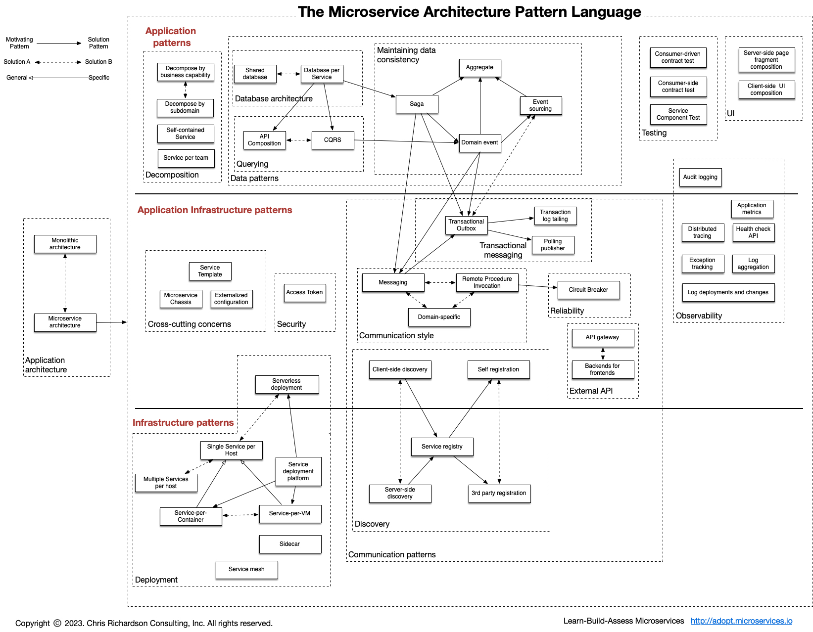

[Назад](../designmenu.md)

# A pattern language for microservices

## Application patterns (Паттерны приложения)
    
 ### Decomposition (Декомпозиция)
   - #### [Decompose by business capability (Декомпозиция по бизнес-возможностям)](#Decompose-by-business-capability)
   - #### [Decompose by subdomain DDD (Декомпозиция по сабдоменам DDD)](#decompose-by-subdomain-DDD)
   - #### [Self-contained Service (Автономный сервис)](#self-contained-service)
   - #### [Service per team (Сервис на команду)](#service-per-team)
   - #### [Strangler application](#strangler-application)

 ### Data patterns (Паттерны управления данными)
   - ### Database architecture (Архитектура БД)
        - #### [Database per Service (Отдельная БД на каждый сервис)](#Database-per-Service )
   - ### Maintaining data consistency (Управление констистентностью данных)
   - ### Querying (Запросы)

 ### Testing (Тестирование)

 ### UI (Графический интерфейс)

 ### Observability (Наблюдаемость)

## Application Infrastructure patterns (Паттерны инфраструктуры приложения)

### Cross-cutting concerns (Сквозные проблемы)
### Security (Безопасность)
### Deployment (Развертывание приложения)
### Communication patterns (Паттерны коммуникации)
  - ### Transactional Messaging (Транзакционный обмен сообщениями)
  - ### Communication Style (Стиль коммуникаций)
  - ### Reliability (Надежность)
  - ### External API (Внешний API)
  - ### Discovery (Наблюдаемость)
### Observability (Наблюдаемость)

## Infrastructure patterns (Инфраструктурные паттерны)

### Deployment (Развертывание приложения)
### Communication patterns (Паттерны коммуникации)
- ### Discovery (Наблюдаемость)

## Decompose by business capability

В наши дни программное обеспечение обычно распространяется в виде сервисов, называемых веб-приложения (web apps) 
или software-as-a-service (SaaS). Приложение двенадцати факторов — это методология для создания SaaS-приложений, которые:

[к оглавлению](#a-pattern-language-for-microservices)

## Decompose by subdomain DDD

В наши дни программное обеспечение обычно распространяется в виде сервисов, называемых веб-приложения (web apps)
или software-as-a-service (SaaS). Приложение двенадцати факторов — это методология для создания SaaS-приложений, которые:

[к оглавлению](#a-pattern-language-for-microservices)

## Self-contained Service

В наши дни программное обеспечение обычно распространяется в виде сервисов, называемых веб-приложения (web apps)
или software-as-a-service (SaaS). Приложение двенадцати факторов — это методология для создания SaaS-приложений, которые:

[к оглавлению](#a-pattern-language-for-microservices)

## Service per team

В наши дни программное обеспечение обычно распространяется в виде сервисов, называемых веб-приложения (web apps)
или software-as-a-service (SaaS). Приложение двенадцати факторов — это методология для создания SaaS-приложений, которые:

[к оглавлению](#a-pattern-language-for-microservices)

## Strangler application

В наши дни программное обеспечение обычно распространяется в виде сервисов, называемых веб-приложения (web apps)
или software-as-a-service (SaaS). Приложение двенадцати факторов — это методология для создания SaaS-приложений, которые:

[к оглавлению](#a-pattern-language-for-microservices)

## Database per Service

В наши дни программное обеспечение обычно распространяется в виде сервисов, называемых веб-приложения (web apps)
или software-as-a-service (SaaS). Приложение двенадцати факторов — это методология для создания SaaS-приложений, которые:

[к оглавлению](#a-pattern-language-for-microservices)

# Источники
+ [Сайт книги Сэма Ньюмена о паттернах микросервисов](https://microservices.io/patterns/index.html)

[Назад](../designmenu.md)
