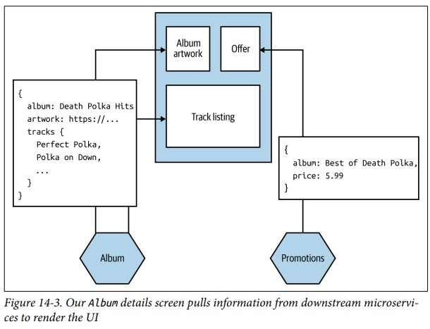

[Назад](../patternsmenu.md)

# User Interfaces
+ [Модели собственности](#Модели-собственности)
+ [Pattern: Monolithic Frontend](#Pattern-Monolithic-Frontend)
+ [O - Open closed Principle](#O---Open-closed-Principle)
+ [L - Liskov substitution Principle](#L---Liskov-substitution-Principle)
+ [I -  Interface Segregation Principle](#I---Interface-Segregation-Principle)
+ [D - Dependency Inversion Principle](#D---Dependency-Inversion-Principle)

Пользовательские интерфейсы - место, где объединяются различные аспекты возможностей, предлагаемые пользователям. 
Проблема объединения этих аспектов рассматривается с двух сторон: кто и как. Во-первых, существуют организационные аспекты: 
кто несет какие обязанности, когда дело доходит до предоставления пользовательских интерфейсов. Во-вторых, существует
набор шаблонов, которые можно использовать для реализации этих интерфейсов.

### Модели собственности
Традиционная многоуровневая архитектура может вызвать проблемы при эффективной доставке программного обеспечения. 
т.к. ответственность за уровень пользовательского интерфейса принадлежит одной фронтенд-группе (dedicated front-end team),
а работу по бэкэнд-сервисам 
выполняет другая. В этом примере добавление простого элемента управления предполагает работу, выполняемую тремя разными 
командами. Подобные многоуровневые организационные структуры могут существенно повлиять на скорость реализации из-за 
необходимости постоянно координировать изменения и передавать работу между командами.

Существует другая модель, которая состоит в том, чтобы пользовательский интерфейс был разбит на части и управлялся командой, 
которая также управляет компонентами на стороне сервера. В данном случае за все изменения, которые нам необходимо 
внести для добавления нового элемента управления, отвечает одна команда.
Команды, полностью владеющие комплексной функциональностью, (Teams with full ownership) могут 
вносить изменения быстрее. Наличие полного владения побуждает каждую команду иметь прямой контакт с конечным пользователем 
программного обеспечения. При работе с 
бэкэнд-командами легко потерять представление о том, кто является конечным пользователем.

Потребность в специализированных фронтенд-командах (dedicated frontend teams) сводится к трем ключевым факторам: 
- нехватка специалистов;
- стремление к последовательности
- технические проблемы - с некоторыми технологиями пользовательского интерфейса может быть сложно работать немонолитно.


Команда, ориентированная на поток (Stream-Aligned Team) — это команда, ориентированная на единый, ценный поток работы. 
Эта команда имеет право создавать и доставлять ценность для клиентов или пользователей настолько быстро, безопасно и независимо, 
насколько это возможно, не требуя передачи других команд для выполнения части работы.
В каком-то смысле речь идет о командах полного стека (full stack teams) (а не о разработчиках полного стека - full stack developers). 
Команда, несущая сквозную ответственность (end-to-end) за предоставление функциональности, ориентированной на пользователя,
также будет иметь более очевидную и прямую связь с конечным пользователем. 

[к оглавлению](#User-interfaces)


## Pattern: Monolithic Frontend

Паттерн монолитного интерфейса описывает архитектуру, в которой все состояние и поведение пользовательского интерфейса 
определяются в самом пользовательском интерфейсе с вызовами к резервным микросервисам для получения необходимых данных 
или выполнения необходимых операций. На рис. 14-3 показан пример этого. Наш экран хочет отобразить информацию об альбоме 
и списке его треков, поэтому пользовательский интерфейс отправляет запрос на получение этих данных из микросервиса «Альбом». 
Также мы отображаем информацию о самых последних специальных предложениях, запрашивая информацию у микросервиса «Промоакции». 
В этом примере наши микросервисы возвращают JSON, который пользовательский интерфейс использует для обновления отображаемой 
информации.



Эта модель является наиболее распространенной для людей, создающих monolithic single-page applications, часто с 
dedicated frontend team. Требования к микросервисам довольно просты — им просто нужно обмениваться информацией 
в форме, которая может быть легко интерпретирована пользовательским интерфейсом. В случае веб-интерфейса это означает, 
что микросервисам, скорее всего, придется предоставлять данные в текстовом формате, причем JSON является наиболее 
вероятным выбором. Затем пользовательскому интерфейсу потребуется создать различные компоненты, составляющие интерфейс, 
обрабатывающие синхронизацию состояния и тому подобное с серверной частью. 

**Когда его использовать**
У этого подхода есть некоторые недостатки. Разделение ответственности за этот монолитный интерфейс может 
оказаться сложной задачей из-за множества источников разногласий. Мало возможностей адаптировать ответы 
для разных типов устройств.
Одним из решений этого подхода является то, что пользовательский интерфейс указывает, какие поля следует возвращать при 
выполнении запроса, но это предполагает, что каждый поддерживающий микросервис поддерживает эту форму взаимодействия.
Этот шаблон работает лучше всего, когда вы хотите, чтобы вся реализация и поведение вашего пользовательского 
интерфейса были сосредоточены в одном развертываемом модуле. Для одной команды, разрабатывающей интерфейс и все поддерживающие 
микросервисы, это может быть нормально. Однако, если над приложением работает несколько команд, 
вам следует бороться с этим побуждением, поскольку оно может привести к тому, что вы скатитесь к многоуровневой архитектуре с 
соответствующими организационными структурами. Однако если вы не можете избежать многоуровневой архитектуры и соответствующей 
организационной структуры, вероятно, вы в конечном итоге воспользуетесь именно этим шаблоном.


[к оглавлению](#User-interfaces)


```java
public class RentCarService {

    public Car findCar(String carNo) {
        //find car by number
        return car;
    }

    public Order orderCar(String carNo, Client client) {
        //client order car
        return order;
    }

    public void printOrder(Order order) {
        //print order
    }
    public void getCarInterestInfo(String carType) {
        if (carType.equals("sedan")) {
            //do some job
        }
        if (carType.equals("pickup")) {
            //do some job
        }
        if (carType.equals("van")) {
            //do some job
        }
    }
    public void sendMessage(String typeMessage, String message) {
        if (typeMessage.equals("email")) {
            //write email
            //use JavaMailSenderAPI
        }
    }
}
```

У данного класса есть несколько зон ответственности, что является нарушением первого принципа. Возьмем метод получения информации об машине. Теперь у нас есть только три типа машин sedan, pickup и van, но если Заказчик захочет добавить еще несколько типов, тогда придется изменять и дописывать данный метод.

Или возьмем метод отправки сообщения. Если кроме отправки сообщения по электронной почте необходимо будет добавить отправку смс, то также необходимо будет изменять данный метод.

Одним словом, данный класс нарушает принцип единой ответственности, так как отвечает за разные действия.

Необходимо разделить данный класс RentCarService на несколько, и тем самым, следуя принципу единой ответственности, предоставить каждому классу отвечать только за одну зону или действие, так в дальнейшем его будет проще дополнять и модифицировать.

Необходимо создать класс PrinterService и вынести там функционал по печати.

```java
public class PrinterService {
    public void printOrder(Order order) {
        //print order
    }
}
```

Аналогично работа связанная с поиском информации о машине перенести в класс CarInfoService.

```java
public class CarInfoService {
    public void getCarInterestInfo(String carType) {
        if (carType.equals("sedan")) {
            //do some job
        }
        if (carType.equals("pickup")) {
            //do some job
        }
        if (carType.equals("van")) {
            //do some job
        }
    }
}
```

Метод по отправке сообщений перенести в класс NotificationService. А метод поиска машины в CarService.

Теперь каждый класс несет ответственность только за одну зону и есть только одна причина для его изменения.

[к оглавлению](#solid)

## O - Open closed Principle

Класс по отправке сообщений:

```java
public class NotificationService {
    public void sendMessage(String typeMessage, String message) {
        if (typeMessage.equals("email")) {
            //write email
            //use JavaMailSenderAPI
        }
    }
}
```

Допустим нам необходимо кроме отправки сообщения по электронной почте отправлять еще смс сообщения. И мы можем дописать метод sendMessage таким образом:

```java
public class NotificationService {
    public void sendMessage(String typeMessage, String message) {
        if (typeMessage.equals("email")) {
            //write email
            //use JavaMailSenderAPI
        }
        if (typeMessage.equals("sms")) {
            //write sms
            //send sms
        }

    }
}
```

Но в данном случае мы нарушим второй принцип, потому что класс должен быть закрыт для модификации, 
но открыт для расширения, а мы модифицируем (изменяем) метод.

Для того чтобы придерживаться принципа открытости-закрытости нам необходимо спроектировать наш код таким образом, 
чтобы каждый мог повторно использовать нашу функцию, просто расширив ее. Поэтому создадим интерфейс 
NotificationService и в нем поместим метод sendMessage.

```java
public interface NotificationService {
    void sendMessage(String message);
}
```

Далее создадим класс EmailNotification, который имплементит интерфейс NotificationService и реализует
метод отправки сообщений по электронной почте.

```java
public class EmailNotification implements NotificationService{
    @Override
    public void sendMessage(String message) {
        //write email
        //use JavaMailSenderAPI
    }
}
```

Создадим аналогично класс MobileNotification, который будет отвечать за отправку смс сообщений.

```java
public class MobileNotification implements NotificationService{
    @Override
    public void sendMessage(String message) {
        //write sms
        //send sms
    }
}
```

Проектируя таким образом код мы не будем нарушать принцип открытости-закрытости, так как мы расширяем нашу 
функциональность, а не изменяем (модифицируем) наш класс.

[к оглавлению](#solid)

## L - Liskov substitution Principle

Данный принцип непосредственно связан с наследованием классов. Допустим у нас есть базовый класс Счет (Account), 
в котором есть три метода: просмотр остатка на счете, пополнение счета и оплата.

```java
public class Account {
    public BigDecimal balance(String numberAccount){
        //logic
        return bigDecimal;
    }
    public void refill(String numberAccount, BigDecimal sum){
        //logic
    }
    public void payment(String numberAccount, BigDecimal sum){
        //logic
    }
}
```

Нам необходимо написать еще два класса: зарплатный счет и депозитный счет, при этом зарплатный счет должен поддерживать 
все операции, представленные в базовом классе, а депозитный счет - не должен поддерживать проведение оплаты.

Если сейчас в коде программы везде, где мы использовали класс Account заменить на его класс-наследник (подтип) SalaryAccount, то программа продолжит нормально работать, так как в классе SalaryAccount доступны все операции, которые есть и в классе Account.

Если же мы такое попробуем сделать с классом DepositAccount, то есть заменим базовый класс Account на его класс-наследник DepositAccount, то программа начнет неправильно работать, так как при вызове метода payment() будет выбрасываться исключение new UnsupportedOperationException. Таким образом произошло нарушение принципа подстановки Барбары Лисков.

Для того чтобы следовать принципу подстановки Барбары Лисков необходимо в базовый (родительский) класс выносить только общую логику, характерную для классов наследников, которые будут ее реализовывать и, соответственно, можно будет базовый класс без проблем заменить на его класс-наследник.

В нашем случае класс Account будет выглядеть следующим образом.

```java
public class Account {
    public BigDecimal balance(String numberAccount){
        //logic
        return bigDecimal;
    }
    public void refill(String numberAccount, BigDecimal sum){
        //logic
    }
}
```

Мы сможем от него наследовать класс DepositAccount.

```java
public class DepositAccount extends Account{
    @Override
    public BigDecimal balance(String numberAccount){
        //logic
        return bigDecimal;
    }
    @Override
    public void refill(String numberAccount, BigDecimal sum){
        //logic
    }
}
```

Создадим дополнительный класс PaymentAccount, который унаследуем от Account и его расширим методом проведения оплаты.

```java
public class PaymentAccount extends Account{
    public void payment(String numberAccount, BigDecimal sum){
        //logic
    }
}
```

И наш класс SalaryAccount уже унаследуем от класса PaymentAccount.

```java
public class SalaryAccount extends PaymentAccount{
    @Override
    public BigDecimal balance(String numberAccount){
        //logic
        return bigDecimal;
    }
    @Override
    public void refill(String numberAccount, BigDecimal sum){
        //logic
    }
    @Override
    public void payment(String numberAccount, BigDecimal sum){
        //logic
    }
}
```

Сейчас замена класса PaymentAccount на его класс-наследник SalaryAccount не "поломает" нашу программу, так как класс SalaryAccount имеет доступ ко всем методам, что и PaymentAccount. Также все будет хорошо при замене класса Account на его класс-наследник PaymentAccount.

Принцип подстановки Барбары Лисков заключается в правильном использовании отношения наследования. Мы должны создавать наследников какого-либо базового класса тогда и только тогда, когда они собираются правильно реализовать его логику, не вызывая проблем при замене родителей на наследников.

[к оглавлению](#solid)

## I -  Interface Segregation Principle

Допустим у нас имеется интерфейс Payments и в нем есть три метода: оплата WebMoney, оплата банковской карточкой и оплата по номеру телефона.

```java
public interface Payments {
    void payWebMoney();
    void payCreditCard();
    void payPhoneNumber();
}
```

Далее нам надо реализовать два класса-сервиса, которые будут у себя реализовывать различные виды проведения
оплат (класс InternetPaymentService и TerminalPaymentService). При этом TerminalPaymentService не 
будет поддерживать проведение оплат по номеру телефона. Но если мы оба класса имплементим от интерфейса Payments, 
то мы будем "заставлять" TerminalPaymentService реализовывать метод, который ему не нужен.

Таким образом произойдет нарушение принципа разделения интерфейсов.

Для того чтобы этого не происходило необходимо разделить наш исходный интерфейс Payments на несколько и, создавая классы, имплементить в них только те интерфейсы с методами, которые им нужны.

```java
public interface WebMoneyPayment {
    void payWebMoney();
}

public interface CreditCardPayment {
    void payCreditCard();
}

public interface PhoneNumberPayment {
    void payPhoneNumber();
}

public class InternetPaymentService implements WebMoneyPayment,
        CreditCardPayment,
        PhoneNumberPayment{
    @Override
    public void payWebMoney() {
        //logic
    }
    @Override
    public void payCreditCard() {
        //logic
    }
    @Override
    public void payPhoneNumber() {
        //logic
    }
}

public class TerminalPaymentService implements WebMoneyPayment, CreditCardPayment{
    @Override
    public void payWebMoney() {
        //logic
    }
    @Override
    public void payCreditCard() {
        //logic
    }
}
```

[к оглавлению](#solid)

## D - Dependency Inversion Principle

Допустим мы пишем приложение для магазина и решаем вопросы с проведением оплат. Вначале это просто небольшой магазин, 
где оплата происходит только за наличные. Создаем класс Cash и класс Shop.

```java
public class Cash {
    public void doTransaction(BigDecimal amount){
        //logic
    }
}

public class Shop {
    private Cash cash;
    public Shop(Cash cash) {
        this.cash = cash;
    }
    public void doPayment(Object order, BigDecimal amount){
        cash.doTransaction(amount);
    }
}
```

Вроде все хорошо, но мы уже нарушили принцип инверсии зависимостей, так как мы тесно связали оплату наличными к нашему магазину. И если в дальнейшем нам необходимо будет добавить оплату еще банковской картой и телефоном ("100% понадобится"), то нам придется переписывать и изменять много кода. Мы в нашем коде модуль верхнего уровня тесно связали с модулем нижнего уровня, а нужно чтобы оба уровня зависели от абстракции.

Поэтому создадим интерфейс Payments.

```java
public interface Payments {
    void doTransaction(BigDecimal amount);
}
```

Теперь все наши классы по оплате будут имплементить данный интерфейс.

```java
public class Cash implements Payments{
    @Override
    public void doTransaction(BigDecimal amount) {
        //logic
    }
}

public class BankCard implements Payments{
    @Override
    public void doTransaction(BigDecimal amount) {
        //logic
    }
}

public class PayByPhone implements Payments {
    @Override
    public void doTransaction(BigDecimal amount) {
        //logic 
    }
}
```

Теперь надо перепроектировать реализацию нашего магазина.

```java
public class Shop {
    private Payments payments;

    public Shop(Payments payments) {
        this.payments = payments;
    }

    public void doPayment(Object order, BigDecimal amount){
        payments.doTransaction(amount);
    }
}
```

Сейчас наш магазин слабо связан с системой оплаты, то есть он зависит от абстракции и уже не важно каким способом оплаты будут пользоваться (наличными, картой или телефоном) все будет работать.

[к оглавлению](#solid)

[Вопросы для собеседования](/README.md)