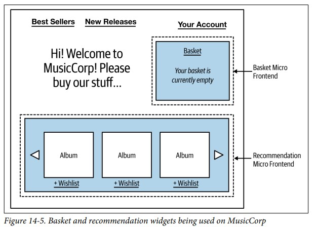

[Назад](../patternsmenu.md)

# User Interfaces
+ [Модели собственности](#Модели-собственности)
+ [Pattern: Monolithic Frontend](#Pattern-Monolithic-Frontend)
+ [Pattern: Micro Frontends](#Pattern-Micro-Frontends)
+ [Pattern: Page-Based Decomposition](#Pattern-Page-Based-Decomposition)
+ [I -  Interface Segregation Principle](#I---Interface-Segregation-Principle)
+ [D - Dependency Inversion Principle](#D---Dependency-Inversion-Principle)

Пользовательские интерфейсы - место, где объединяются различные аспекты возможностей, предлагаемые пользователям. 
Проблема объединения этих аспектов рассматривается с двух сторон: кто и как. Во-первых, существуют организационные аспекты: 
кто несет какие обязанности, когда дело доходит до предоставления пользовательских интерфейсов. Во-вторых, существует
набор шаблонов, которые можно использовать для реализации этих интерфейсов.

### Модели собственности
Традиционная многоуровневая архитектура может вызвать проблемы при эффективной доставке программного обеспечения. 
т.к. ответственность за уровень пользовательского интерфейса принадлежит одной фронтенд-группе (dedicated front-end team),
а работу по бэкэнд-сервисам 
выполняет другая. В этом примере добавление простого элемента управления предполагает работу, выполняемую тремя разными 
командами. Подобные многоуровневые организационные структуры могут существенно повлиять на скорость реализации из-за 
необходимости постоянно координировать изменения и передавать работу между командами.

Существует другая модель, которая состоит в том, чтобы пользовательский интерфейс был разбит на части и управлялся командой, 
которая также управляет компонентами на стороне сервера. В данном случае за все изменения, которые нам необходимо 
внести для добавления нового элемента управления, отвечает одна команда.
Команды, полностью владеющие комплексной функциональностью, (Teams with full ownership) могут 
вносить изменения быстрее. Наличие полного владения побуждает каждую команду иметь прямой контакт с конечным пользователем 
программного обеспечения. При работе с 
бэкэнд-командами легко потерять представление о том, кто является конечным пользователем.

Потребность в специализированных фронтенд-командах (dedicated frontend teams) сводится к трем ключевым факторам: 
- нехватка специалистов;
- стремление к последовательности
- технические проблемы - с некоторыми технологиями пользовательского интерфейса может быть сложно работать немонолитно.

Команда, ориентированная на поток (Stream-Aligned Team) — это команда, ориентированная на единый, ценный поток работы. 
Эта команда имеет право создавать и доставлять ценность для клиентов или пользователей настолько быстро, безопасно и независимо, 
насколько это возможно, не требуя передачи других команд для выполнения части работы.
В каком-то смысле речь идет о командах полного стека (full stack teams) (а не о разработчиках полного стека - full stack developers). 
Команда, несущая сквозную ответственность (end-to-end) за предоставление функциональности, ориентированной на пользователя,
также будет иметь более очевидную и прямую связь с конечным пользователем. 

[к оглавлению](#User-interfaces)

## Pattern: Monolithic Frontend

Паттерн монолитного интерфейса описывает архитектуру, в которой все состояние и поведение пользовательского интерфейса 
определяются в самом пользовательском интерфейсе с вызовами к резервным микросервисам для получения необходимых данных 
или выполнения необходимых операций. На рис. 14-3 показан пример этого. Наш экран хочет отобразить информацию об альбоме 
и списке его треков, поэтому пользовательский интерфейс отправляет запрос на получение этих данных из микросервиса «Альбом». 
Также мы отображаем информацию о самых последних специальных предложениях, запрашивая информацию у микросервиса «Промоакции». 
В этом примере наши микросервисы возвращают JSON, который пользовательский интерфейс использует для обновления отображаемой 
информации.

Эта модель является наиболее распространенной для людей, создающих monolithic single-page applications, часто с 
dedicated frontend team. Требования к микросервисам довольно просты — им просто нужно обмениваться информацией 
в форме, которая может быть легко интерпретирована пользовательским интерфейсом. В случае веб-интерфейса это означает, 
что микросервисам, скорее всего, придется предоставлять данные в текстовом формате, причем JSON является наиболее 
вероятным выбором. Затем пользовательскому интерфейсу потребуется создать различные компоненты, составляющие интерфейс, 
обрабатывающие синхронизацию состояния и тому подобное с серверной частью. 

**Когда его использовать**

У этого подхода есть некоторые недостатки. Разделение ответственности за этот монолитный интерфейс может 
оказаться сложной задачей из-за множества источников разногласий. Мало возможностей адаптировать ответы 
для разных типов устройств.
Одним из решений этого подхода является то, что пользовательский интерфейс указывает, какие поля следует возвращать при 
выполнении запроса, но это предполагает, что каждый поддерживающий микросервис поддерживает эту форму взаимодействия.
Этот шаблон работает лучше всего, когда вы хотите, чтобы вся реализация и поведение вашего пользовательского 
интерфейса были сосредоточены в одном развертываемом модуле. Для одной команды, разрабатывающей интерфейс и все поддерживающие 
микросервисы, это может быть нормально. Однако, если над приложением работает несколько команд, 
вам следует бороться с этим побуждением, поскольку оно может привести к тому, что вы скатитесь к многоуровневой архитектуре с 
соответствующими организационными структурами. Однако если вы не можете избежать многоуровневой архитектуры и соответствующей 
организационной структуры, вероятно, вы в конечном итоге воспользуетесь именно этим шаблоном.

[к оглавлению](#User-interfaces)

## Pattern: Micro Frontends

Подход Micro Frontends — это организационная модель, при которой различные части интерфейса могут разрабатываться и 
развертываться независимо. Это становится важным шаблоном для команд, ориентированных на потоки, (stream-aligned teams)
которые хотят самостоятельно предоставлять как серверные микросервисы, так и поддерживающий пользовательский интерфейс. 
В то время как микросервисы обеспечивают независимую возможность развертывания серверной части, микроинтерфейсы обеспечивают 
независимую возможность развертывания внешней части. Концепция микроинтерфейса приобрела популярность из-за проблем, 
создаваемых монолитными веб-интерфейсами с большим количеством JavaScript, типичными примерами которых являются 
одностраничные приложения. Благодаря микроинтерфейсу разные команды могут работать над разными частями интерфейса и 
вносить изменения. 

**Реализация**

Для веб-интерфейсов мы можем рассмотреть два ключевых метода декомпозиции, которые могут помочь в реализации шаблона 
микроинтерфейса. Декомпозиция на основе виджетов (Widget-based decomposition) предполагает объединение различных 
частей интерфейса в один экран. С другой стороны, при декомпозиции на основе страниц (Page-based decomposition) 
интерфейс разделяется на независимые веб-страницы.

**Когда его использовать**

Шаблон микроинтерфейса важен, если вы хотите внедрить end-to-end, stream-aligned teams, где вы пытаетесь отойти от 
многоуровневой архитектуры. Я также могу представить, что это будет полезно в ситуации, когда вы хотите сохранить 
многоуровневую архитектуру, но функциональность внешнего интерфейса теперь настолько велика, что требуется несколько 
выделенных команд внешнего интерфейса. В этом подходе есть одна ключевая проблема. Иногда возможности, предлагаемые 
микросервисом, не вписываются в виджет или страницу. Конечно, я, возможно, захочу разместить рекомендации в поле на 
странице нашего веб-сайта, но что, если я захочу добавить динамические рекомендации в другое место? Когда я выполняю поиск, я хочу, 
чтобы текст автоматически показывал новые рекомендации. Чем более сквозной является форма взаимодействия, тем меньше 
вероятность, что эта модель подойдет, и тем больше вероятность того, что мы вернемся к простым вызовам API.

[к оглавлению](#User-interfaces)

## Pattern: Page-Based Decomposition

При постраничной декомпозиции наш пользовательский интерфейс разбивается на несколько веб-страниц. Различные наборы страниц 
могут обслуживаться разными микросервисами. Например: Запросы на страницы в /albums/ направляются непосредственно в микросервис «Альбомы», который обрабатывает эти страницы, 
и мы делаем нечто подобное с /artists/. Для объединения этих страниц используется общая навигация. Эти микросервисы, в 
свою очередь, могут получать информацию, необходимую для создания этих страниц — например, получать данные об уровне 
запасов из микросервиса «Инвентаризация», чтобы показать в пользовательском интерфейсе, какие товары есть на складе. 
С помощью этой модели команда, владеющая микросервисом «Альбомы», сможет отображать полный комплексный пользовательский 
интерфейс, что позволит команде легко понять, как его изменения повлияют на пользователя.

**Когда его использовать**

Декомпозиция на основе страниц полезна как для монолитного интерфейса, так и для микроинтерфейса. Декомпозиция на основе 
страниц была бы моим выбором по умолчанию для декомпозиции пользовательского интерфейса, если бы моим пользовательским 
интерфейсом был веб-сайт.

[к оглавлению](#User-interfaces)

## Pattern: Widget-Based Decomposition

При декомпозиции на основе виджетов экран графического интерфейса содержит виджеты, которые можно изменять независимо. 
На рисунке 14-5 мы видим пример интерфейса Music Corp с двумя виджетами, обеспечивающими функциональность пользовательского 
интерфейса для корзины покупок и рекомендаций.

Вообще говоря, вам понадобится «контейнерное» приложение, которое определяет такие вещи, как базовая навигация по интерфейсу 
и какие виджеты необходимо включить. Если бы мы думали о сквозных командах, ориентированных на потоки, мы могли бы 
представить одну команду, предоставляющую виджет рекомендаций, а также отвечающую за поддерживающий микросервис «Рекомендации».
Этот шаблон часто встречается в реальном мире. Например, пользовательский интерфейс Spotify активно использует этот шаблон. 
Один виджет может содержать список воспроизведения, другой — информацию об исполнителе, а третий виджет — информацию 
об исполнителях и других пользователях Spotify, на которых вы подписаны. Эти виджеты комбинируются по-разному в разных ситуациях.
Вам все еще нужен какой-то сборочный слой, чтобы соединить эти части вместе. Однако это может быть так же просто, 
как использование server-side или client-side templates.

**Реализация**

Как встроить виджет в ваш пользовательский интерфейс, во многом будет зависеть от того, как создан ваш пользовательский интерфейс. 
На простом веб-сайте включение виджетов в виде фрагментов HTML с использованием шаблонов на стороне клиента или на 
стороне сервера может быть довольно простым, хотя у вас могут возникнуть проблемы, если виджеты имеют более сложное поведение. 
Например, если наш виджет рекомендаций содержит множество функций JavaScript, как мы можем гарантировать, что это не будет 
конфликтовать с поведением, загруженным в остальную часть веб-страницы? В идеале весь виджет можно упаковать таким образом, 
чтобы он не нарушал другие аспекты пользовательского интерфейса. Вопрос о том, как реализовать автономную функциональность 
в пользовательском интерфейсе, не нарушая другие функции, исторически был особенно проблематичным для одностраничных приложений, 
отчасти потому, что концепция модульности, по-видимому, не была главной проблемой для поддержки инфраструктур SPA.

**Когда его использовать**

Декомпозиция на основе страниц полезна как для монолитного интерфейса, так и для микроинтерфейса. Декомпозиция на основе
страниц была бы моим выбором по умолчанию для декомпозиции пользовательского интерфейса, если бы моим пользовательским
интерфейсом был веб-сайт.

[к оглавлению](#User-interfaces)

[Назад](../designmenu.md)