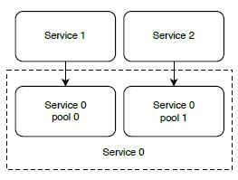

[Назад](tan_menu.md)

## Нефункциональные требования (Non-functional Requirements)

Система имеет функциональные и нефункциональные требования (functional and non-functional requirements). 
Функциональные требования описывают входы и выходы системы. Вы можете представить их как приблизительную 
спецификацию API и конечные точки (endpoints).

Типичные нефункциональные требования включают:
+ [Scalability (Масштабируемость)](#scalability-масштабируемость) - Способность системы легко и без 
особых усилий регулировать использование ресурсов (hardware resource) для экономичной поддержки их нагрузки
+ [Availability (Доступность)](#availability-доступность) - Процент времени, в течение которого система может принимать запросы и возвращать 
желаемый ответ
+ [Performance/latency/P99 and throughput (Производительность/задержка/P99 и пропускная способность)](#производительностьзадержка-и-пропускная-способность) - 
Производительность или задержка — это время, необходимое пользователю для запроса системы на возврат ответа. 
Максимальная скорость запросов (request rate), которую может обработать система — это bandwidth.
Tекущая скорость обработки запросов системой - пропускная способность (throughput).
Система с низкой задержкой (low latency) имеет высокую пропускную способность (high throughput).
+ [Fault-tolerance (Отказоустойчивость)](#Fault-tolerance-Отказоустойчивость) - Способность системы продолжать работу в случае выхода из строя 
некоторых ее компонентов и предотвращение необратимого ущерба (например, потери данных) в случае простоя (downtime).
+ [Security (Безопасность)](#Что-такое-механизм-try-with-resources) - Предотвращение несанкционированного доступа к системам
+ [Privacy (Конфиденциальность)](#Возможно-ли-использование-блока-try-finally-без-catch) - Контроль доступа к личной информации (PII), которая может использоваться для 
однозначной идентификации человека
+ [Accuracy (Точность)](#Может-ли-один-блок-catch-отлавливать-сразу-несколько-исключений) - Данные системы, возможно, не обязательно должны быть абсолютно точными, и компромисс 
между точностью для снижения затрат или сложности часто является актуальным обсуждением.
+ [Consistency (Консистентность)](#Всегда-ли-исполняется-блок-finally) - Совпадают ли данные на всех узлах/машинах
+ [Cost (Затраты)](#Существуют-ли-ситуации-когда-блок-finally-не-будет-выполнен) - Снижение затрат засчет компромисса с другими нефункциональными свойствами системы.
+ [Complexity, maintainability, debuggability, and testability (Сложность, возможность поддержки, поддерджка отладки и тестируемость)](#Какие-существуют-модификаторы-доступа) -
Концепции, которые определяют, насколько сложно построить систему, а затем поддерживать ее после создания.

Заказчик, технический или нетехнический, не может явно запрашивать нефункциональные требования и может предполагать, 
что система их удовлетворит. То есть, - __заявленные требования заказчика практически всегда будут неполными, 
неверными, а иногда и чрезмерными__. Мы можем не получить определенные требования и, следовательно, неадекватно их 
удовлетворить, или мы можем предположить определенные требования, которые на самом деле не требуются и обеспечивают 
избыточное решение.

Мы должны начинать любое обсуждение проектирования системы с обсуждения и разъяснения как функциональных, так и 
нефункциональных требований. Нефункциональные требования обычно противопоставляются друг другу. Мы должны обсудить, 
как можно принимать различные проектные решения для различных компромиссов. Трудно отдельно обсуждать нефункциональные 
требования и методы их решения, поскольку некоторые методы имеют компромиссный выигрыш от множества нефункциональных 
требований и потери от других.

## Scalability (Масштабируемость)

Процесс расширения (expanding) для поддержки большей нагрузки или количества пользователей называется масштабированием. 
Масштабирование требует увеличения вычислительной мощности ЦП, оперативной памяти, емкости хранилища и пропускной способности 
сети (network bandwidth). Масштабирование может относиться к вертикальному масштабированию или горизонтальному масштабированию:
 + Вертикальное масштабирование - переход на более мощный и дорогой хост, с более быстрым процессором, 
большим объемом оперативной памяти, жестким диском большего размера, твердотельным диском вместо вращающегося жесткого 
диска для меньшей задержки или сетевой картой с более высокой пропускной способностью. Есть три основных недостатка 
вертикального масштабирования.
    + Мы достигнем точки, когда денежные затраты будут расти быстрее, чем производительность модернизированного оборудования.
    + Вертикальное масштабирование имеет технологические ограничения. Независимо от бюджета, текущие технологические ограничения 
   будут налагать максимальный объем вычислительной мощности, оперативной памяти или емкости хранилища, который технологически 
   возможен на одном хосте.
    + Вертикальное масштабирование может потребовать простоя. Мы должны остановить наш хост, сменить его оборудование, 
   а затем запустить его снова. Чтобы избежать простоя, нам нужно предоставить другой хост, запустить на нем нашу службу, 
   а затем направить запросы на новый хост. Более того, это возможно только в том случае, если состояние службы хранится 
   на машине, отличной от старого или нового хоста.

 + Горизонтальное масштабирование - распределение требований к обработке и хранению данных между несколькими хостами. 
«Истинная» масштабируемость может быть достигнута только за счет горизонтального масштабирования.

### Stateless and stateful services
HTTP — это протокол без сохранения состояния (stateless), поэтому серверную службу, использующую его, легко масштабировать по горизонтали. 
Серверная часть HTTP без сохранения состояния в сочетании с горизонтально масштабируемыми операциями чтения базы данных 
является хорошей отправной точкой для обсуждения проекта масштабируемой системы.
Запись в общее хранилище сложнее всего масштабировать. Ниже в этой книге мы обсудим методы, включая репликацию, сжатие, 
агрегацию, денормализацию и службу метаданных.
Обратитесь к разделу 6.7 для обсуждения различных общих коммуникационных архитектур, включая компромиссы между состояниями и без состояния.

### Основные понятия балансировки нагрузки
Каждая служба с горизонтальным масштабированием использует балансировщик нагрузки, который может быть одним из следующих:
   + Аппаратный балансировщик нагрузки (hardware load balancer) — специализированное физическое устройство, распределяющее 
трафик между несколькими хостами. Аппаратные балансировщики нагрузки известны своей дороговизной и могут стоить от нескольких 
тысяч до нескольких сотен тысяч долларов.
   + Коллективный сервис балансировки нагрузки (shared load balancer service), также называемая LBaaS (балансировка нагрузки как услуга).
   + Сервер с установленным программным обеспечением для балансировки нагрузки. HAProxy и NGINX являются наиболее распространенными.

Рисуя диаграммы системы, обычно понимают, что запросы к сервису проходят через балансировщик нагрузки и направляются на хосты сервиса.

Существуют балансировщики нагрузки уровня 4 и уровня 7, какой из них больше подходит для того или иного сервиса.
+ Балансировщик нагрузки уровня 4 работает на транспортном уровне (TCP). Он принимает решения о маршрутизации на основе 
адресной информации, извлеченной из первых нескольких пакетов в потоке TCP, и не проверяет содержимое других пакетов; 
он может только пересылать пакеты. 
+ Балансировщик нагрузки уровня 7 работает на уровне приложений (HTTP), поэтому он имеет следующие возможности:
    + Решения о балансировке нагрузки/маршрутизации — на основе содержимого пакета.
    + Аутентификация — может вернуть 401, если указанный заголовок аутентификации отсутствует.
    + Завершение TLS. Требования безопасности для трафика внутри центра обработки данных могут быть ниже, чем для трафика 
  через Интернет, поэтому выполнение терминации TLS (HTTPS ‹ HTTP) означает отсутствие накладных расходов на шифрование/дешифрование 
  между хостами центра обработки данных. Если наше приложение требует шифрования трафика внутри нашего центра обработки данных 
  (т.е. шифрования при передаче), мы не будем выполнять терминацию TLS.

Прикрепленный сеанс (sticky session) означает, что балансировщик нагрузки отправляет запросы от определенного клиента на 
определенный хост в течение периода, установленного балансировщиком нагрузки или приложением. Закрепленные сеансы 
используются для сервисов с отслеживанием состояния (stateful services). Например, веб-сайт электронной коммерции, 
веб-сайт социальной сети или банковский веб-сайт может использовать закрепленные сеансы для хранения данных сеанса 
пользователя, таких как данные для входа или настройки профиля, поэтому пользователю не нужно повторно проходить 
аутентификацию или повторно вводить настройки при навигации по сайту. Веб-сайт электронной коммерции может использовать 
закрепленные сеансы для корзины покупок пользователя.
Прикрепленный сеанс можно реализовать с использованием файлов cookie, зависящих от продолжительности или управляемых 
приложением. В сеансе на основе продолжительности (duration-based session) балансировщик нагрузки выдает клиенту файл cookie, 
определяющий продолжительность. Каждый раз, когда балансировщик нагрузки получает запрос, он проверяет файл cookie. 
В сеансе, управляемом приложением, приложение создает файл cookie. Балансировщик нагрузки по-прежнему создает собственный 
файл cookie поверх файла cookie, выпущенного приложением, но файл cookie балансировщика нагрузки соответствует сроку 
действия файла cookie приложения. Этот подход гарантирует, что клиенты не будут перенаправлены на другой хост после 
истечения срока действия файла cookie балансировщика нагрузки, но его сложнее реализовать, поскольку требуется дополнительная 
интеграция между приложением и балансировщиком нагрузки.

При репликации сеанса, записи на хост копируются на несколько других хостов в кластере, назначенных тому же сеансу, 
поэтому операции чтения можно маршрутизировать на любой хост с этим сеансом. Это повышает доступность (availability).
Эти хосты могут образовывать резервное кольцо (backup ring). Например, если в сеансе участвуют три хоста, 
когда хост A получает запись, он записывает на хост B, который, в свою очередь, записывает на хост C. 
Другой способ — балансировщик нагрузки отправляет запросы на запись всем хостам, назначенным сеансу.

Также существует термин «reverse proxy». Балансировка нагрузки предназначена для масштабируемости, а обратный прокси-сервер — 
это метод управления связью клиент-сервер. Обратный прокси-сервер располагается перед кластером серверов и действует как 
шлюз между клиентами и серверами, перехватывая и перенаправляя входящие запросы на соответствующий сервер на основе URI 
запроса или других критериев. Обратный прокси-сервер также может обеспечивать функции производительности, такие как кэширование 
и сжатие, а также функции безопасности, такие как завершение SSL. Балансировщики нагрузки также могут обеспечивать завершение SSL, 
но их основная цель — масштабируемость.

[к оглавлению](#нефункциональные-требования-non-functional-requirements)

## Availability (Доступность)
Доступность — это процент времени, в течение которого система может принимать запросы и возвращать желаемый ответ.

Для большинства сервисов требуется высокая доступность, а степень влияния других нефункциональных требований может быть понижена, 
чтобы обеспечить высокую доступность без ненужных сложностей.
В связке с доступностью всегда идут понятия высокая согласованность (strong consistency) и низкая задержка (low latency) - 
это 3 элемента теоремы CAP. В соответствии с ней, мы можем оптимизировать/установить фокус только на 2 из 3 элементов (или 1 из 3-х).
Значит, если для сервиса действительно важна высокая доступность, мы должны попробовать понизить степень влияния других элементов теоремы.
Сервисы, в которых запросы не требуют немедленной обработки и немедленного возврата ответов, вряд ли потребуют строгой 
согласованности и малой задержки, например запросы, выполняемые программно между сервисами. Например, запись в 
долгосрочное хранилище или отправка запроса в Airbnb на бронирование номера на несколько дней вперед.
Для запросов, сделанных непосредственно людьми, использующими ваше приложение, чаще используются протоколы синхронной связи, 
когда немедленный ответ абсолютно необходим.

Тем не менее, не всегда запросы людей требуют немедленного ответа с запрошенными данными. Например, если пользователь 
запрашивает оплату подоходного налога, этот платеж не обязательно должен произойти немедленно. Сервис может поставить 
запрос в очередь внутри себя и немедленно ответить пользователю, что запрос будет обработан в течение нескольких минут 
или часов. Позже платеж может быть обработан с помощью потокового задания или периодического пакетного задания, а затем 
пользователь может быть уведомлен о результате (например, об успешном или неудачном платеже) по таким каналам, 
как электронная почта, текстовые сообщения или уведомления приложений.
Примером ситуации, когда высокая доступность может не требоваться, является служба кэширования. Поскольку кеширование 
может использоваться для уменьшения задержки и сетевого трафика запроса и не требуется для выполнения запроса, мы можем 
принять решение пожертвовать доступностью ради более низкой задержки в конструкции системы службы кэширования.

Доступность также можно измерить с помощью показателей инцидентов, с помощью таких метрик, как MTTR (среднее время восстановления) и 
MTBF (среднее время между сбоями).

[к оглавлению](#нефункциональные-требования-non-functional-requirements)

## Производительность/задержка и пропускная способность

Производительность (performance) или задержка (latency) — это время, необходимое пользователю для запроса системы на возврат ответа. 
Сюда входит:
1. Сетевая задержка запроса клиента;
2. Переход этого запроса к сервису; 
3. Время, необходимое сервису для обработки запроса и создания ответа;
4. Сетевая задержка ответа при отправке из сервиса;
5. Переход этого ответа к клиенту. 

Типичный запрос в приложении, ориентированном на потребителя (например, просмотр меню ресторана в приложении для доставки еды 
или отправка платежа в приложении для электронной коммерции) имеет желаемую задержку от десятков миллисекунд до нескольких секунд. 
Приложения для высокочастотной торговли могут требовать задержки в несколько миллисекунд. 
Строго говоря, под задержкой понимается время прохождения пакета от источника до пункта назначения. Однако термин «задержка» (latency) 
стал широко использоваться в том же значении, что и «производительность» (performance), и оба термина часто используются как синонимы. 

Термин «задержка» также может использоваться для описания времени ответа на запрос между компонентами внутри системы, 
а не времени ответа на запрос пользователя. Например, если внутренний хост отправляет запрос к системе регистрации или 
хранения данных для хранения данных, задержка системы — это время, необходимое для регистрации/сохранения данных и возврата 
ответа на внутренний хост.

Функциональные требования системы могут означать, что ответ на самом деле может не содержать запрошенную пользователем информацию, 
а может быть просто подтверждением и обещанием, что по истечении определенного периода времени запрошенная информация 
будет отправлена пользователю или будет доступна. чтобы пользователь мог получить его, сделав еще один запрос. 
Такой компромисс может упростить конструкцию системы, поэтому мы всегда должны уточнять требования и обсуждать, как скоро 
потребуется информация после запроса пользователя.

Типичные проектные решения для достижения низкой задержки включают следующее. Мы можем развернуть сервис в дата-центре, 
географически близком к его пользователям, поэтому пакетам между пользователями и нашим сервисом не придется путешествовать 
далеко. Если наши пользователи географически разбросаны, мы можем развернуть наш сервис в нескольких центрах обработки данных, 
выбранных для минимизации географического расстояния до кластеров пользователей. Если хостам в центрах обработки данных 
необходимо обмениваться данными, наш сервис должен быть горизонтально масштабируемым.

Иногда могут существовать и другие факторы, влияющие на задержку в большей степени, чем физическое расстояние между 
пользователями и центрами обработки данных, такие как трафик или пропускная способность (network bandwidth) сети или 
обработка внутренней системы (фактическая бизнес-логика и уровень персистентного хранения данных). Мы можем использовать 
тестовые запросы между пользователями и различными центрами обработки данных, чтобы определить центр обработки данных 
с наименьшей задержкой для пользователей в определенном месте.

Другие методы включают использование CDN, кэширование, уменьшение размера данных с помощью RPC вместо REST, 
разработку собственного протокола с такой структурой, как Netty, для использования TCP и UDP вместо HTTP, а 
также использование методов пакетной (batch) и потоковой (streaming) передачи.

[к оглавлению](#нефункциональные-требования-non-functional-requirements)

## Fault-tolerance (Отказоустойчивость)

Отказоустойчивость — это способность системы продолжать работу в случае выхода из строя некоторых ее компонентов и 
предотвращение необратимого вреда (например, потери данных) в случае простоя. Она обеспечивает плавную деградацию, 
поэтому наша система может сохранять некоторую функциональность при выходе из строя отдельных ее частей, а не при полном 
катастрофическом сбое. Это дает инженерам время на исправление неисправных участков и восстановление рабочего состояния системы. 
Мы также можем реализовать механизмы самовосстановления, которые автоматически подготавливают запасные компоненты и 
подключают их к нашей системе, чтобы наша система могла восстановиться без ручного вмешательства и без какого-либо заметного 
влияния на конечных пользователей.
Доступность и отказоустойчивость часто обсуждаются вместе. В то время как доступность является мерой времени безотказной 
работы/простоя, отказоустойчивость — это не мера, а скорее характеристика системы.
Тесно связанная концепция — это проектирование отказов, которое подразумевает плавную обработку ошибок. 
Это вопросы о том, как мы будем обрабатывать ошибки в сторонних API, которые находятся вне нашего контроля, а также 
скрытые/необнаруженные ошибки. 

### Методы обеспечения отказоустойчивости:

#### Репликация и избыточность (Replication and redundancy)
   Один из методов репликации заключается в наличии нескольких (например, трех) избыточных экземпляров/копий компонента, 
   поэтому до двух из них можно одновременно отключить, не влияя на время безотказной работы. Операции обновления обычно 
   назначаются определенному хосту, поэтому производительность обновления влияет только в том случае, если другие хосты 
   находятся в разных центрах обработки данных, географически дальше от запрашивающей стороны, но чтение часто выполняется 
   на всех репликах, поэтому производительность чтения снижается, когда компоненты не работают.
   
   Один экземпляр обозначается как источник истины (часто называемый лидером (leader)), а два других компонента обозначаются
   как реплики (replicas) (или последователи (followers)). Возможны различные варианты расположения реплик. 
   Одна реплика находится на другой серверной стойке в том же центре обработки данных, а другая реплика — в другом центре 
   обработки данных. Другой вариант — разместить все три экземпляра в разных центрах обработки данных, что максимизирует 
   отказоустойчивость за счет более низкой производительности. Примером является распределенная файловая система Hadoop (HDFS), 
   которая имеет настраиваемое свойство, называемое «коэффициент репликации», позволяющее установить количество копий любого 
   блока. Значение по умолчанию — три. Репликация также помогает повысить доступность.

#### Прямое исправление ошибок и код исправления ошибок
Прямое исправление ошибок (Forward error correction - FEC) — это метод предотвращения ошибок при передаче данных из-за 
шума или ненадежных каналов связи путем кодирования сообщения избыточным способом, например, с помощью кода исправления 
ошибок (error correction code - ECC).

#### Circuit breaker (Разъединитель цепи)
Разъединитель цепи (или автоматический выключатель) — это механизм, который предотвращает повторные попытки клиента 
выполнить операцию, которая может завершиться неудачей. Что касается нижестоящих сервисов, автоматический выключатель 
подсчитывает количество неудачных запросов за последний интервал. Если порог ошибки превышен, клиент прекращает вызов 
нижестоящих сервисов. Некоторое время спустя клиент пытается выполнить ограниченное количество запросов. Если они успешны, 
клиент предполагает, что сбой устранен, и возобновляет отправку запросов без ограничений.

ОПРЕДЕЛЕНИЕ: Если услуга B зависит от услуги A, то A является восходящей услугой, а B — нисходящей услугой. Автоматический 
выключатель экономит ресурсы, которые не тратятся на выполнение запросов, которые могут завершиться неудачей. 
Это также не позволяет клиентам создавать дополнительную нагрузку на и без того перегруженную систему.

Однако автоматический выключатель затрудняет тестирование системы. Например, предположим, что у нас есть нагрузочный тест, 
который делает неверные запросы, но все еще правильно проверяет ограничения нашей системы. Теперь этот тест активирует 
автоматический выключатель и нагрузку, которая раньше могла перегрузить нижестоящие службы и теперь пройдет. 
Подобная нагрузка со стороны наших клиентов приведет к отключению электроэнергии. Также сложно оценить соответствующий 
порог ошибки и таймеры. 

Автоматический выключатель может быть реализован на стороне сервера. Примером является Resilience4j. Акцент Netflix сместился 
в сторону более адаптивных реализаций, которые реагируют на производительность приложения в реальном времени, а не на 
заранее настроенные параметры, такие как адаптивные ограничения параллелизма.

#### Экспоненциальная отсрочка (backoff) и повторная попытка (retry)
Экспоненциальная отсрочка и повторная попытка аналогичны автоматическому выключателю. Когда клиент получает ответ об ошибке, 
он будет ждать перед повторной попыткой запроса и экспоненциально увеличивать продолжительность ожидания между повторными 
попытками. Клиент также корректирует период ожидания на небольшую случайную отрицательную или положительную величину — 
метод, называемый «дрожанием (jitter)». Это предотвращает одновременную отправку повторных попыток несколькими клиентами, 
вызывая «шторм повторных попыток (retry storm)», который может перегрузить нижестоящую службу. Подобно автоматическому выключателю, 
когда клиент получает ответ об успешном выполнении, он предполагает, что сбой устранен, и возобновляет отправку запросов 
без ограничений.

#### Кэширование ответов других сервисов
Наш сервис может зависеть от внешних сервисов в отношении определенных данных. Как нам поступить в случае, когда внешний 
сервис недоступен? Обычно предпочтительнее плавное ухудшение (graceful degradation), а не сбой или возврат ошибки. 
Вместо возвращаемого значения мы можем использовать ответ по умолчанию или пустой ответ. Если использование устаревших 
данных лучше, чем отсутствие данных, мы можем кэшировать ответы внешней службы при каждом успешном запросе и использовать 
эти ответы, когда внешняя служба недоступна.

#### Checkpointing (Контрольные точки)
Машина может выполнять определенные операции агрегирования данных над многими точками данных, систематически извлекая их 
подмножество, выполняя агрегирование, затем записывая результат в указанное место, повторяя этот процесс до тех пор, 
пока все точки данных не будут обработаны или бесконечно, например, в случай потокового конвейера. Если эта машина выйдет 
из строя во время агрегации данных, заменяющая машина должна знать, с каких точек данных следует возобновить агрегацию. 
Это можно сделать, написав контрольную точку после обработки каждого подмножества точек данных и успешной записи результата. 
Заменяющая машина может возобновить обработку на контрольно-пропускном пункте.
Контрольные точки обычно применяются к конвейерам ETL, в которых используются брокеры сообщений, такие как Kafka. 
Машина может получить несколько событий из топика Kafka, обработать их, а затем записать результат с последующей записью 
контрольной точки. Если эта машина выйдет из строя, ее замена может возобновиться на самой последней контрольной точке.
Kafka предлагает смещенное хранилище на уровне партиций в Kafka. Flink потребляет данные из топиков Kafka и периодически 
проверяет точки с помощью механизма распределенных контрольных точек Flink.

#### Dead letter queue (Очередь недоставленных писем)
Если запрос на запись к стороннему API завершается неудачей, мы можем поставить запрос в очередь недоставленных писем и 
повторить запросы позже.
Очереди недоставленных писем хранятся локально или в отдельном сервисе? Мы можем найти компромисс между сложностью и надежностью:
 - Самый простой вариант: если пропускать запросы допустимо, просто отбрасывайте невыполненные запросы.
 - Реализуйте очередь недоставленных писем локально с помощью блока try-catch. Запросы будут потеряны в случае сбоя хоста.
 - Более сложный и надежный вариант — использовать платформу потоковой передачи событий, такую как Kafka.

#### Logging and periodic auditing 
Один из способов обработки скрытых ошибок — логировать запросы на запись и выполнять периодический аудит. 
Задание аудита может обрабатывать журналы и проверять, соответствуют ли данные в сервисе, в который мы записываем, ожидаемым значениям.

#### Bulkhead
Паттерн bulkhead — это механизм отказоустойчивости, при котором система делится на изолированные пулы, поэтому сбой в одном 
пуле не повлияет на всю систему.
Например, каждый эндпойнт сервиса может иметь собственный пул потоков и не использовать общий пул потоков, поэтому, 
если пул потоков эндпойнта исчерпан, это не повлияет на способность других эндпойнтов обслуживать запросы.
Определенный запрос может привести к сбою хоста из-за ошибки. Каждый раз, когда этот запрос повторяется, он приводит к 
сбою другого хоста. Разделение сервиса на bulkheads (т. е. разделение хостов на пулы) предотвращает сбой всех хостов в 
результате этого запроса и полный сбой. Этот запрос должен быть расследован, поэтому в сервисе должно быть ведение 
журнала и мониторинг. Мониторинг обнаружит нарушающий запрос, а инженеры смогут использовать журналы для устранения сбоя 
и определения его причины.
Или запрашивающая сторона может иметь высокую частоту запросов к услуге и препятствовать тому, чтобы последняя обслуживала 
других запрашивающих. Паттерн bulkhead выделяет определенные хосты конкретному запрашивающему, не позволяя последнему 
использовать всю мощность сервиса.
Хосты сервиса можно разделить на пулы, и каждому пулу выделяются запрашивающие устройства. Это также метод определения 
приоритетов определенных запрашивающих сторон путем выделения им большего количества ресурсов.

На рисунке ниже хосты службы разделены на пулы, которые выделяются запросчикам. Недоступность хостов одного пула не 
повлияет на других запросчиков. Очевидным компромиссом этого подхода является то, что пулы не могут поддерживать друг 
друга, если от определенных запросчиков наблюдаются всплески трафика. Это осознанное решение, которое мы приняли, 
чтобы выделить определенное количество хостов конкретному запросчику. Мы можем вручную или автоматически масштабировать 
пулы по мере необходимости.

[к оглавлению](#нефункциональные-требования-non-functional-requirements)

[Назад](tan_menu.md)