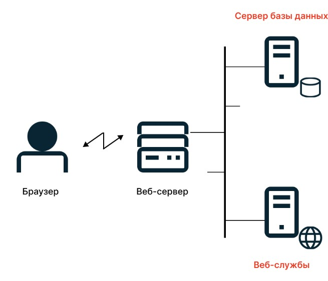
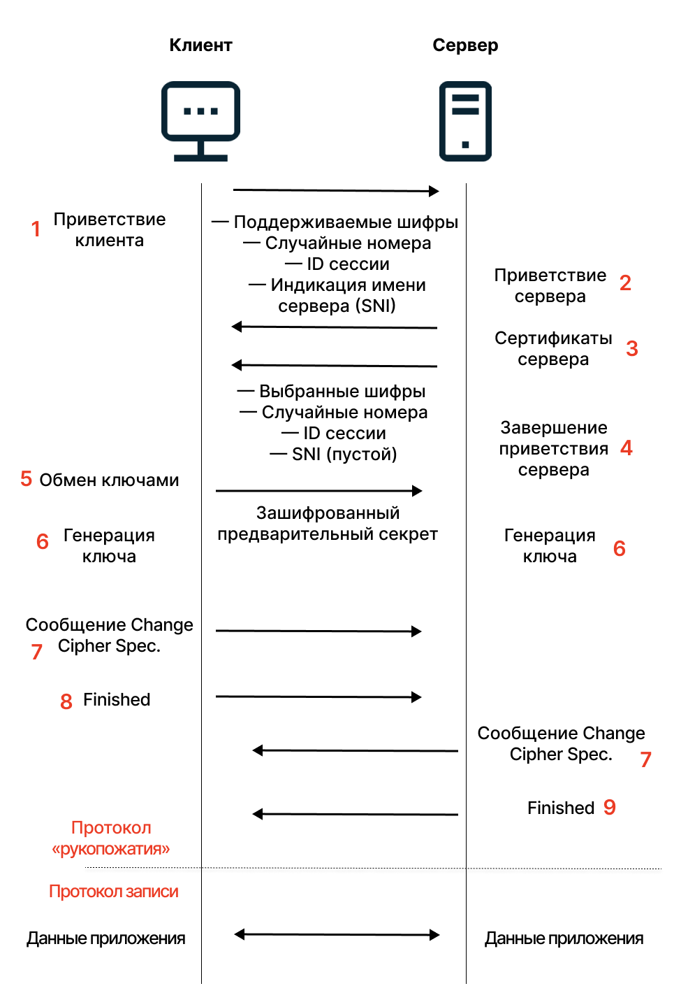

[Назад](httpmenu.md)

# HTTP
+ [HTTP](#Протокол-HTTP)
+ [HTTPS](#HTTPS)
+ [SSL/TLS](#SSL/TLS)

## Протокол HTTP

Протокол HTTP описан в официальной спецификации RFC 2616:

«HTTP, или Hyper Text Transfer Protocol, — это протокол передачи гипертекстовой разметки, 
которая используется для передачи данных в интернете».

Когда мы набрали запрос и нажали ввод, браузер отправил этот запрос на веб-сервер.



На веб-сервере хранятся статьи в виде картинок, HTML-документов, файлов с CSS-стилями и JavaScript-файлами. Также на веб-сервере установлено ПО, которое понимает HTTP-протокол.

Веб-сервер принимает запрос, обрабатывает, определяет, какие файлы отправить, и отдает их в ответ. Браузер принимает эти данные, интерпретирует и показывает нам в «человеческом» виде.

Каждое действие в блоге, например, переход по ссылке на статью, — это новый запрос серверу и новый ответ. Запрос выглядит примерно так:

```code
GET / HTTP/1.1
Host: selectel.ru
User-Agent: Mozilla/5.0
Accept: text/html
Connection: close
```

В запросе есть данные о браузере, версии HTTP-протокола, адресе, к которому обращается браузер, и о том, что именно нужно получить от сервера.

За последнее отвечает метод. Приведенном примере метод GET, который указывает, что браузер хочет прочитать страницу с сервера. Есть еще методы HEAD, PUT, PATCH, POST и другие. С их помощью можно отправить серверу команды удалить страницы, добавить на них новые данные или что-то скачать. Но эти методы встречаются гораздо реже.

HTTP-ответ выглядит примерно так:

```code
HTTP/1.1 200 OK
Date: Tue, 05 Aug 2021 09:50:20 GMT
Server: Apache/1.3.26
X-Powered-By: PHP/4.1.2.
Content-Language: ru
Content-Type: text/html; charset=utf-8
Content-Length: 18
Connection: close
```

В ответе содержится:

+ версия протокола — HTTP/1.0 — и ответ: в примере это «200» — страница доступна;
+ время и дата ответа;
+ информация о сервере — в примере Apache-сервер;
+ инструкция, как браузеру отобразить страницу (content-type) — в примере это необходимо сделать в кодировке UTF-8.

В ответе мы также получаем HTML с данными страницы — ту самую гипертекстовую разметку из определения HTTP.
Браузер помогает собирать из разметки страницы.
В слове «протокол» тоже нет ничего необычного — это просто свод правил и инструкций.

[к оглавлению](#http)


## HTTPS

HTTPS — это не совсем протокол. Это расширение HTTP-протокола — объединение двух протоколов: HTTP и SSL или HTTP и TLS.

Протоколы TLS (Transport Layer Security) и SSL (Secure Socket Layer) — криптографические. Это значит, что они позволяют шифровать данные, в нашем случае те, что передаются между браузером и сервером. Расшифровать эти данные могут только сервер и браузер, для всех остальных это будет набор нечитаемых символов.

Примечание: TLS основан на SSL, но второй уже устарел, и вместо него используют TLS.

Как работает шифрование
У ресурса/сайта, поддерживающего HTTPS, есть SSL/TLS-сертификат, который выдается центром сертификации. Если у ресурса в адресной строке есть зеленый замок, соединение с ним защищено.

Посмотреть информацию о сертификате и его подлинности можно, нажав на значок.

Как правило, SSL/TLS-сертификат — это подтверждение, что ресурс настоящий. Но могут быть исключения: сертификат может быть выдан легитимным центром на фишинговый сайт. В таком случае важно совпадение CN в сертификате с доменным именем сайта и уверенность пользователя в этом имени.

Перед тем как запустить HTTP-соединение, браузер обращается к серверу, чтобы наладить защищенное соединение. Сервер отправляет копию сертификата безопасности в ответ.

Браузер проверяет данные по своим спискам доверенных центров (список есть в каждом браузере), проверяет совпадение CN с доменным именем, даты выпуска и срока окончания сертификата, отсутствие в CRL, поддерживаемые алгоритмы, наличие издателя в списке доверенных корневых сертификатов и в списке доверенных издателей. В случае проблем на любой из этих проверок сертификат считается невалидным.

Если все хорошо, то браузер считает ресурс безопасным: они выбирают алгоритм шифрования, обмениваются ключом шифрования и потом данными по протоколу HTTP. Схематически это выглядит так:



Без сертификата безопасности и шифрования данных у HTTP нет преимуществ.

HTTP — универсальный протокол. Он может передавать любые данные: страницы, музыку, видео, PDF-файлы. Но его минус в том, что он открытый: данные, которые передает протокол, никак не защищены.

По пути между браузером и сервером его легко перехватить, прочитать данные, например, пароли или данные кредитной карты. Все равно, что отправлять посылки и письма по почте без конвертов. Кроме того, HTTP-ответ можно подменить или добавить в него свои данные.

HTTPS тоже можно перехватить, но толку от этого мало — данные зашифрованы, а секретного ключа для расшифровки нет. Здесь есть не только конверты или упаковка, но и сургучная печать. HTTPS шифрует данные.

В шифровании — ключевое различие между HTTP и HTTPS.

HTTP подойдет, только если у вас статичный веб-сайт, на котором пользователь не оставляет никакой важной и конфиденциальной информации. Также этот протокол можно использовать в локальных сетях, если снаружи вас защищает файрвол.

У HTTP есть следующие достоинства:

использовать протокол можно в локальных сетях;
страницы HTTP хранятся в кэше компьютера и они быстрее открываются;
страницы HTTP открываются во всех браузерах;
страницы HTTP мало весят.
Хотя HTTPS — это «производная» от HTTP, не все свойства HTTP автоматически переносятся на последователя. Например, возникают локальные проблемы с настройками антивирусов или браузеров. Также HTTPS-ссылки не открываются или открываются дольше, потому что сервер тратит больше ресурсов на обработку запроса из-за шифрования. Впрочем, первая проблема решается обновлением настроек антивирусов или браузеров, а вторая — продавцами сертификатов, ряд из которых ускоряют загрузку сайтов.

Кроме того есть ключевая проблема, которая связана с тем, что для проверки сертификата используется цепочка подписей. Доверенные центры (центры сертификаций) бывают корневыми и промежуточными. Сертификат безопасности считается подлинным, если он подписан корневым центром. Обычно от корневого центра до браузера пролегает длинная цепочка промежуточных центров и их подписей.

Где-то в этой цепочке может встроиться злоумышленник и получить доступ к сертификату, а значит, ко всем данным HTTP-соединения. Так было с программой Superfish, которая перехватывала сертификаты на компьютерах Lenovo. Но здесь именно сама компания ставила на свои компьютеры это ПО, к ней было доверие пользователей. Никто не ожидал, что она будет вредить.

Потенциальная уязвимость тревожит. Кажется, что разница между HTTP и HTTPS небольшая и нет необходимости тратиться на получение сертификата и его установку. Но не все так просто.

[к оглавлению](#http)

## SSL/TLS

Несмотря на недостатки HTTPS, это стандарт для интернет-магазинов, банков, агрегаторов. Для всех ресурсов, которые позволяют пользователям что-то покупать и продавать, хранят учетные данные пользователей, документы, собирают персональные данные.

По статистике центра сертификации Let’s Encrypt, основанной на данных Firefox, больше 80% страниц в мире загружаются по HTTPS.


Стандарт задают поисковики и веб-браузеры. Сейчас без зеленого значка у сайта в адресной строке к ресурсу не будет доверия у пользователей, если он вообще откроется в браузере. Поисковики настоятельно рекомендуют переходить на HTTPS. Например, Яндекс открыто сообщает о том, что сайты, не использующие сертификаты, будут ниже в поисковой выдаче.

Сейчас в браузерах работает HSTS — HTTP Strict Transport Security. Это защитный механизм браузера, который принудительно переводит соединение из HTTP в HTTPS или обрывает HTTP-соединение.

+ Не получится открыть ресурс из закладок, если он работает на HTTP. HSTS переводит все запросы в HTTPS.
+ Если ресурс открывает по HTTPS, но где-то в нем остались HTTP-ссылки, то HSTS переводит их в HTTPS-запросы. Если не открываются, то браузеры просто блокируют ресурс. Так решается вопрос смешанного контента, когда в на HTTPS-ресурс подмешиваются HTTP-ссылки.
+ HSTS блокирует все попытки зайти на ресурс с поддельным сертификатом, как на скрине ниже. Это сразу прерывает атаки с перехватом HTTP-запросов.

Чаще всего ресурс на HTTP браузер просто не откроет, а выведет предупреждение. 


**Типы SSL/TLS-сертификатов и кто их выдает**

Сертификаты бывают разные: групповые, многодоменные, подтверждающие организацию. Рассмотрим самые популярные, расположив их от небезопасных к безопасным.


+ **Самоподписанные**. Такой сертификат можно сгенерировать на своем сервере и подписать самому же. 
В целом, самоподписанный сертификат обеспечивает такой же уровень безопасности в части криптографии, но 
имеет меньший уровень доверия, пока издатель не добавится в список доверенных издателей. Иногда самоподписанные
сертификаты используют, чтобы протестировать процесс установки сертификата;
+ **Групповые сертификаты**. На CloudFlare или Let’s Encrypt выдают бесплатные сертификаты. Но их нужно продлевать 
несколько раз в год . Также такие сертификаты выдаются на группу сайтов. Wildcard-сертификаты выдаются на доменное имя 
уровня выше, чем предполагается использовать: то есть сертификат на CN *.test.ru будет валидным для всех доменных имен 
с доменом .test.ru. Для некоторых компаний такой сертификат — возможность закрыть большое количество доменов одним сертификатом;
+ **Подписанные доверенным центром сертификации**. Такие сертификаты выдают центры сертификации или удостоверяющие центры (УЦ). 
Например, для блога Selectel выбрал УЦ GeoTrust. Лучше выбирать крупные и надежные центры, 
к которым есть доверие у браузеров. Они подтверждают подлинность ключей шифрования своей электронной подписью.


**Сертификаты по уровню проверки и организации в HTTPS**

+ **Domain Validation** — сертификат, который подтверждает домен. УЦ проверяет право собственности на домен. Обычно через электронную почту. Подойдут для простых сайтов — например, личных блогов, новостных сайтов и других, на которых не собираются персональные данные и не проводятся платежи.

+ **Organization Validation** — сертификат, который подтверждает организацию. Здесь УЦ проверяет, существует ли организация юридически: идентифицирует владельца домена, его личность, просит предоставить документы. Подойдут для магазинов и других ресурсов, где можно проводить платежи.

+ **Extended Validation** — сертификаты с расширенной проверкой. Сайты с таким сертификатом имеют зеленый замочек и выдают всю информацию о ресурсе при нажатии на него.


**Как подключить SSL/TLS-сертификат**

Эту услугу предлагают хостинг-провайдеры и платформы для создания веб-сайтов. Самостоятельное подключение производится через панель администратора.

Краткий перечень шагов по подключению:

1. Выбрать тип и вид сертификата.
2. Настроить запись WHOIS, чтобы в ней были верные данные.
3. Создать запрос на сервере на подпись SSL-сертификата — CSR.
4. Отправить запроса в УЦ для проверки ваших данных, в зависимости от того, какой тип проверки выбрали.
5. Добавить сертификат с секретным ключом на сервер: как файл .crt (есть еще форматы .pfx, .cer, .crt, .pem, которые можно конвертировать друг в друга).

SSL-сертификаты обычно хранятся на сервере, но ничто не мешает хранить их в облаке, например, в облачном хранилище.

[к оглавлению](#http)

[Назад](httpmenu.md)