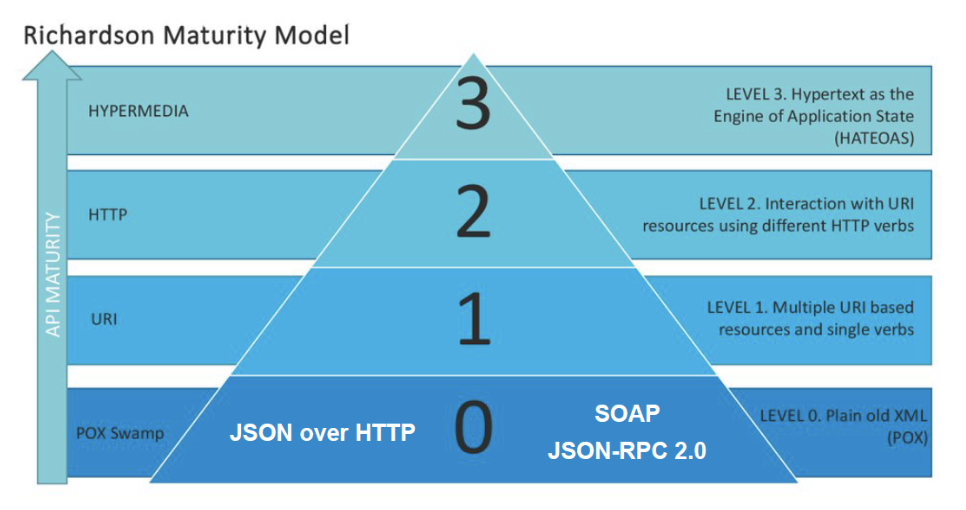

[Назад](httpmenu.md)

# REST API
+ [REST](#REST)
+ [Принципы REST](#Принципы-REST)
+ [Модель зрелости](#Модель-зрелости)

## REST

REST (Representational State Transfer — «передача репрезентативного состояния») — архитектурный стиль взаимодействия 
компонентов распределённого приложения в сети. Другими словами, REST — это набор правил того, 
как программисту организовать написание кода серверного приложения, чтобы все системы легко обменивались данными и 
приложение можно было масштабировать. REST представляет собой согласованный набор ограничений, учитываемых при 
проектировании распределённой гипермедиа-системы. В определённых случаях (интернет-магазины, поисковые системы) 
это приводит к повышению производительности и упрощению архитектуры. В широком смысле компоненты в REST взаимодействуют 
наподобие взаимодействия клиентов и серверов во Всемирной паутине. REST является альтернативой RPC.

В интернете RPC может представлять собой обычный HTTP-запрос (обычно GET или POST; такой запрос называют «REST-запрос»),
а необходимые данные передаются в качестве параметров запроса.

Для веб-служб, построенных с учётом REST (то есть не нарушающих накладываемых им ограничений), применяют термин «RESTful».

В отличие от веб-сервисов (веб-служб) на основе SOAP, не существует «официального» стандарта для RESTful веб-API. 
Дело в том, что REST является архитектурным стилем, в то время как SOAP является протоколом. 
Несмотря на то, что REST не является стандартом сам по себе, большинство RESTful-реализаций используют такие стандарты, 
как HTTP, URL, JSON и, реже, XML.

Если обратиться к первоисточнику — к работе Филдинга, назначение REST в том, чтобы придать проектируемой системе такие свойства как:

+ Производительность,
+ Масштабируемость,
+ Гибкость к изменениям,
+ Отказоустойчивость,
+ Простота поддержки.

Это наиболее ценные свойства, с которыми встречается, например, аналитик при проектировании систем. 
В действительности их намного больше. Если внимательно посмотреть на эти свойства, то мы увидим ни что иное, 
как нефункциональные требования к системе, которых мы на своих проектах стремимся достичь.

[к оглавлению](#rest-api)

## Принципы REST

6 принципов REST — ограничения, которые помогают нам добиться этих нефункциональных требований.

+ Клиент-серверная архитектура
+ Stateless
+ Кэширование
+ Единообразие интерфейса
+ Layered system
+ Code on demand

**Принцип 1. Клиент-серверная архитектура**

Сама концепция клиент-серверной архитектуры заключается в разделении некоторых зон ответственности: 
в разделении функций клиента и сервера. Что это означает?

Например, мы разделяем нашу систему так, что клиент (допустим, это мобильное приложение) реализует только 
функциональное взаимодействие с сервером. При этом сервер реализует в себе логику хранения данных, 
сложные взаимодействия со смежными системами и т.д.

Что мы этим добиваемся и как могло бы быть иначе? Давайте представим, что клиент и сервер у нас объединены. 
Тогда, если мы говорим о мобильном приложении, каждое мобильное приложение каждого клиента должно было бы быть 
абсолютно самодостаточной единицей. И тогда, поскольку у нас единого сервера нет для получения/отправки информации, 
у нас получилась бы какая-то сеть единообразных компонентов – например, мобильные приложения общались бы друг с 
другом – такая распределённая сеть равноценных узлов.

Такие системы в реальной жизни есть и можно найти их примеры. Например, в блокчейне. Тем не менее, в случае с 
REST мы говорим о том, что разделяем ответственность. Например, отображение информации, её обработку и хранение.

Также сервер может иметь базу данных (см. рисунок ниже). В данном случае надо понимать, что пара «сервер и БД» 
тоже будет парой «клиент-сервер». Только в данном случае сервером будет БД, а сам сервер — клиентом.

Во-первых, клиент-серверная архитектура дает нам определённую **масштабируемость**: 
есть сервер, есть единая точка обработки запросов. При необходимости выдерживать большую нагрузку мы можем 
поставить несколько серверов. Также к нему можно подключать достаточно большое количество клиентов 
(сколько сможет выдержать). Таким образом, клиент-серверная архитектура позволяет добиться масштабируемости.

Во-вторых, REST даёт определённую **простоту поддержки**. Если мы хотим изменить логику обработки информации на сервере, 
то выполним эти изменения на сервере. В данном случае мы можем и не менять каждого клиента, как если бы они 
были абсолютно равноценной сетью.

Конечно, есть и минусы. В случае с клиент-серверной архитектурой мы понимаем, что у нас есть **единая точка отказа** 
в виде сервера. Если отказал сервер и у нас нет дополнительных инстансов, то для нас это будет означать неработоспособность системы.

Также потенциально может **увеличиться нагрузка**, поскольку часть логики мы вынесли с клиента на сервер. 
Клиент будет совершать меньше каких-либо действий самостоятельно, соответственно, у нас возрастёт количество 
запросов между клиентом и сервером.

**Принцип 2. Stateless**

Принцип заключается в том, что сервер не должен хранить у себя информацию о сессии с клиентом. Он должен в каждом запросе получать всю информацию для обработки.

Представим, что у нас есть некоторый сервис прогноза погоды, в котором уже реализована клиент-серверная архитектура, и мы хотим получить сообщение о прогнозе погоды на завтра.

Что мы делаем в случае, если мы работаем с Stateless? Мы отправляем запрос «Какая погода?», отправляем место, 
где хотим погоду узнать, и дату. Соответственно, прогноз погоды отвечает нам — «Будет жарко».

Если я захочу узнать, какая будет погода через день, то опять укажу место, где хочу узнать погоду, укажу другую дату. 
Сервер получит этот запрос, обработает и сообщит мне, что там уже будет очень жарко.

Рассмотрим ситуацию: что было бы, если бы у нас не было Stateless? В таком случае у нас бы был Stateful. 
В этом случае сервер хранит информацию о предыдущих обращениях клиента, хранит информацию о сессии, 
какую-то часть контекста взаимодействия с клиентом. А затем может использовать эту информацию при обработке следующих запросов.

Я всё так же хочу узнать, какая погода будет завтра: отправляю запрос, сервер его обрабатывает, 
формирует ответ и, помимо того, что он возвращает ответ клиентам, он еще сохраняет какую-то информацию (часть или всю) 
о том, какой запрос он получил. В случае, если я захочу узнать, какая погода будет через день, 
я могу сделать такой вызов: «А завтра?». Не сообщая ничего о месте и о дате.

В этом случае у сервера хранится некоторый контекст. Он понимает, что я у него спрашиваю про 21-е число и могу дать 
ответ на основе информации, хранимой у него в БД или в кэше. Один из примеров, где можно встретить подход 
Stateful в жизни — это работа с FTP-сервером.

Вернёмся к Statless-подходу. Почему в REST-архитектуре мы должны использовать именно Statless-подход?

Какие он даёт плюсы?

+ Масштабируемость сервера;
+ Уменьшение времени обработки запроса,
+ Простота поддержки,
+ Возможность использовать кэширование.

В первую очередь, это масштабирование сервера. Если каждый запрос содержит в себе абсолютно весь контекст, 
необходимый для обработки, то можно, например, клонировать сервер-обработчик: вместо одного поставить десять таких. 
Мне будет абсолютно неважно, в какой из этих клонов придёт запрос. Если бы они хранили состояние, 
то либо должны были синхронизироваться, либо мне нужно было бы умело направлять запрос в нужное место.

Помимо этого, появляется простота поддержки. Каждый раз я вижу в логах, какое сообщение приходило от клиента, 
какой ответ он получал. Мне не нужно дополнительно узнавать о том, какое состояние хранил сервер.

Также подход Stateless позволяет использовать кэширование.

Какие проблемы может создать Stateless-подход?

Усложнение логики клиента (именно на стороне клиента нам нужно хранить всю информацию о состоянии, о 
допустимых действиях, о недопустимых действиях и подобных вещах).

Увеличение нагрузки на сеть (каждый раз мы передаём всю информацию, весь контекст. Таким образом, больше информации гоняем по сети).

**Принцип 3. Кэширование**

В оригинале этот принцип говорит нам о том, что каждый ответ сервера должен иметь пометку, можно ли его кэшировать.

Что такое кэширование?

Представим, что у нас всё так же есть сервис по прогнозу погоды, есть клиент, с которым взаимодействуют. 
Сам по себе этот сервис погоду не определяет. Погоду определяет метеостанция, с которой он связывается с 
помощью специальных удалённых вызовов. Что происходит, когда мы используем кэширование?

Например, клиент обратился к серверу с запросом «Хочу узнать погоду». Что делает сервер?

Если мы его только запустили и используем кэширование или если мы не используем кэширование вообще — 
сервер обратится к метеостанции, а она вернёт ему ответ. Перед тем, как сервер ответит клиенту, он должен сохранить 
эту информацию в кэше. И только потом вернуть ответ. Для чего?

Когда клиент в следующий раз отправит ровно такой же запрос, сервер сможет не обращаться к метеостанции. 
Он сможет извлечь прогноз из кэша и вернуть ответ клиенту.

Какие у кэширования плюсы?

Уменьшение количества сетевых взаимодействий.

Уменьшение нагрузки на системы (не грузим их дополнительными запросами).

В каких-то случаях одинаковых обращений будет не так много. Тогда кэширование использовать нет смысла.

При этом важно понимать, что кэширование — это совсем не простая штука. Она бывает достаточно сложна и нетривиальна в реализации.
Также мы должны учитывать, что если отдаём какие-то данные, которые сохранили раньше, то важно помнить, 
что эти данные могли уже устареть.

В каких-то случаях это может быть приемлемо, но в каких-то случаях — абсолютно недопустимо. Соответственно, 
стоит ли использовать кэширование — всегда нужно обдумывать на конкретном примере.

**Принцип 4. Единообразие интерфейса. HATEOAS**

Hypermedia as the Engine of Application State (HATEOAS) — одно из ограничений REST, согласно которому сервер возвращает 
не только ресурс, но и его связи с другими ресурсами и действия, которые можно с ним совершить.

Что же предлагает HATEOAS? Если бы мы с учётом этого ограничения выполняли бы этот запрос, то в ответе получим не 
только информацию об этом объекте, но и все те действия, которые мы можем с ним совершить. И, если бы у него были бы 
какие-то важные связанные объекты, мы получили бы ещё и ссылки на них.

Получая такие ответы, клиент самостоятельно понимает, какие конкретные действия он может совершать над этим объектом 
и какую ещё информацию о связанных объектах он может получить. Мы даём клиентскому приложению намного больше 
информации и свободы действий. Логика клиента становится более гибкой, но при этом и более сложной.

Главный плюс этого подхода — клиент становится очень гибким в плане изменений на сервере с точки зрения изменения 
допустимых действий, изменения модели данных и т.д.

В качестве обратной стороны медали мы получаем сильное усложнение логики, в первую очередь, клиента. 
Это может потянуть за собой и усложнение логики на сервере, потому что такие ответы нужно правильно формировать. 
Фактически ответственность за действия, которые совершает клиент, мы передаём на его же сторону. Мы ослабляем контроль 
валидности совершаемых операций на стороне сервера.

**Принцип 5. Layered system (слоистая архитектура)**

В предыдущих схемах мы рассматривали сторону клиента и сторону сервера, но не думали, что между ними могут быть посредники.

В реальной жизни между ними могут быть, к примеру, proxy-сервера, роутеры, балансировщики — все, что угодно. И то, по какому пути запрос проходит от клиента до сервера, мы часто не можем знать.

Концепция слоистой архитектуры заключается в том, что ни клиент, ни сервер не должны знать о том, как происходит цепочка вызовов дальше своих прямых соседей.

Знания балансировщика в этой схеме об участниках конкретно этой цепочки вызовов должны заканчиваться proxy-сервером слева и сервером справа. О клиенте он уже ничего не знает.

Если изменяется поведение proxy-сервера (балансировщика, роутера или чего-то ещё), это не должно повлечь изменения для клиентского приложения или для сервера. Помещая их в эту цепочку вызовов, мы не должны замечать никакой разницы. Это позволяет нам изменять общую архитектуру без доработок на стороне клиента или сервера.

Минусы:

Увеличение нагрузки на сеть (больше участников и больше вызовов, чем если бы мы шли один раз от клиента до сервера напрямую).

Увеличение времени получения ответа (из-за появления дополнительных участников).

**Принцип 6. Code on done (код по требованию)**

Идея передачи некоторого исполняемого кода (по сути какой-то программы) от сервера клиенту.

Представьте, что клиент — это, например, обычный браузер. Клиент отправляет некоторый запрос и ждёт ответа — 
страницу с определённым интерактивом (например, должен появляться фейерверк в том месте, где пользователь кликает 
кнопкой мышки). Это всё может быть реализовано на стороне клиента.

Либо клиент, запрашивая данную страницу приветствия, получит в ответ от сервера не просто HTML-код для отображения, 
а ещё программу, которую он сам и исполнит. Получается, что сервер передаёт исходный код клиенту, а тот его выполняет.

Что мы за счёт этого получаем? Отчасти, это схоже с принципом HATEOAS. Мы позволяем клиенту стать гибче. 
Если мы захотим изменить цвет фейерверка, то нам не нужно вносить изменений на клиенте — мы можем сделать это на 
сервере, а затем передавать клиенту. Пример такого языка — javascript.

[к оглавлению](#rest-api)

## Модель зрелости

Ричардсон выделил уровни зрелости REST-сервисов. Выделение происходило исходя из подхода, что REST — это, с точки зрения протокола, всё-таки HTTP. Соответственно, он спроектировал модель, по которой можно понять: насколько сервис REST или не REST.

**Уровень 0**

В первую очередь, он выделил нулевой уровень. К нему относятся любые сервисы, которые в качестве транспорта 
используют HTTP и какой-то формат представления данных. Например, когда мы говорим про JSON over HTTP – 
мы говорим про нулевой уровень.

Если более наглядно «пощупать ручками» с точки зрения использования протокола HTTP, то можно представить, 
что мы выставляем некоторый API. Мы начинаем с того, что объявляем единый путь для отправки команд и 
всегда используем один и тот же HTTP-глагол для совершения абсолютно любых действий с любыми объектами. 
Например: создай вебинар, запиши вебинар, удали вебинар и т.д. То есть мы всегда используем один и тот же URL и 
всегда используем один и тот же HTTP-метод, обычно POST.

**Уровень 1**

Следующий уровень — первый. Мы уже научились использовать разные ресурсы и делаем это не по одному URL.
Но при этом всё ещё игнорируем HTTP-глаголы.

Мы просто разделяем явно наши объекты, как некоторые ресурсы. Например: спикер, курс, вебинар. Но, независимо от того, 
что мы хотим сделать — удалить, создать, редактировать, мы всё равно используем один и тот же HTTP-глагол POST.

**Уровень 2**

Второй уровень — это когда мы начинаем правильно с точки зрения спецификации HTTP-протокола использовать HTTP-глаголы.

Например, если есть спикер, то, чтобы создать спикера и получить информацию о нём, я использую соответствующий глагол: 
GET, POST. Когда хочу создать или удалить спикера — я использую глаголы: PUT, DELETE.

По сути, второй уровень зрелости — это то, что чаще всего называют REST.

Надо понимать, что, с точки зрения изначальной концепции, если мы дошли до второго уровня зрелости, 
то это еще не означает, что мы спроектировали REST-систему/ REST-сервис. Но в очень распространённом понимании 
соответствие 2-ому уровню часто называют RESTfull сервисом.

RESTfull-сервис — это такой сервис, который спроектирован с учётом REST-ограничений. Хотя, в целом, правильнее 
сервис такого уровня зрелости называть HTTP-сервисом или HTTP-API, нежели REST-API.

**Уровень 3**

Третий уровень зрелости — это уровень, в котором мы начинаем использовать концепцию HATEOAS. 
Когда мы передаём информацию, ресурсы, мы сообщаем потребителям (клиентам) о том, какие ещё действия необходимо 
совершить ресурсу, а также связи с другими ресурсами.

[к оглавлению](#rest-api)

[Назад](httpmenu.md)