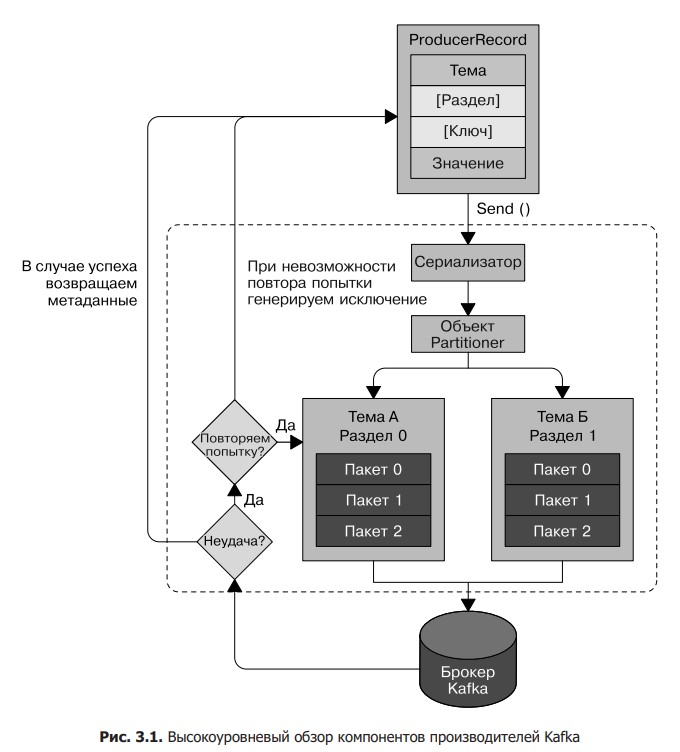

[Назад](brokers.md)

# Apache Kafka

## Основы
+ [Расскажите о API, предоставляемых Apache Kafka.](#Расскажите-о-API-предоставляемых-Apache-Kafka)
+ [Что такое broker в Apache Kafka](#Что-такое-broker-в-Apache-Kafka)
+ [Как запустить один Kafka Broker?](#Как-запустить-один-Kafka-Broker)
+ [Как вывести список всех брокеров, доступных в кластере?](#Как-вывести-список-всех-брокеров-доступных-в-кластере)
+ [Почему брокера Kafka называют «тупым»?](#Почему-брокера-Kafka-называют-тупым)
+ [Каковы обязанности брокера-контролера в Kafka?](#Каковы-обязанности-брокера-контролера-в-Kafka)
+ [Как лучше всего определить количество тем у одного брокера Kafka?](#Как-лучше-всего-определить-количество-тем-у-одного-брокера-Kafka)
+ [Что означает ZooKeeper в Apache Kafka](#Что-означает-ZooKeeper-в-Apache-Kafka)
+ [Можно ли использовать Kafka без ZooKeeper?](#Можно-ли-использовать-Kafka-без-ZooKeeper)
+ [Как поддерживается балансировка нагрузки в Kafka](#Как-поддерживается-балансировка-нагрузки-в-Kafka)
+ [Каков максимальный размер сообщения, которое может получить Apache Kafka?](#Каков-максимальный-размер-сообщения-которое-может-получить-Apache-Kafka)
+ [Объясните период хранения в кластере Apache Kafka.](#Объясните-период-хранения-в-кластере-Apache-Kafka)
+ [Как долго сообщения сохраняются в Apache Kafka](#Как-долго-сообщения-сохраняются-в-Apache-Kafka)
+ [Объясните отказоустойчивость в Apache Kafka](#Объясните-отказоустойчивость-в-Apache-Kafka)
+ [В чем важность репликации в Kafka?](#В-чем-важность-репликации-в-Kafka)
+ [Как лучше всего запустить сервер Kafka](#Как-лучше-всего-запустить-сервер-Kafka)
+ [Что такое георепликация в Kafka?](#Что-такое-георепликация-в-Kafka)
+ [Как можно расширить кластер в Kafka?](#Как-можно-расширить-кластер-в-Kafka)
+ [Объяснение сериализации и десериализации клиентов в Kafka.](#Объяснение-сериализации-и-десериализации-клиентов-в-Kafka)
+ [Что подразумевается под реестром схем Kafka?](#Что-подразумевается-под-реестром-схем-Kafka)
+ [Для чего можно использовать Kafka Monitoring?](#Для-чего-можно-использовать-Kafka-Monitoring)
+ [Как Kafka обеспечивает минимальную модификацию данных при передаче данных от производителя к брокеру и потребителю?](#Как-Kafka-обеспечивает-минимальную-модификацию-данных-при-передаче-данных-от-производителя-к-брокеру-и-потребителю)
+ [Назовите различные типы API-интерфейса производителя Kafka.](#Назовите-различные-типы-API-интерфейса-производителя-Kafka)
+ [Какую роль играют Kafka consumer API и Kafka producer API?](#Какую-роль-играют-Kafka-consumer-API-и-Kafka-producer-API)
+ [Как записать данные из Kafka в базу данных?](#Как-записать-данные-из-Kafka-в-базу-данных)
+ [Что подразумевается под мультитенантностью в Apache Kafka?](#Что-подразумевается-под-мультитенантностью-в-Apache-Kafka)
+ [Упомяните некоторые недостатки Apache Kafka](#Упомяните-некоторые-недостатки-Apache-Kafka)
+ [Упомяните некоторые реальные примеры использования Apache Kafka?](#Упомяните-некоторые-реальные-примеры-использования-Apache-Kafka)
+ [Почему Apache Kafka предпочтительнее традиционных методов обмена сообщениями?](#Почему-Apache-Kafka-предпочтительнее-традиционных-методов-обмена-сообщениями)
+ [Упомяните некоторые системные инструменты, доступные в Apache Kafka](#Упомяните-некоторые-системные-инструменты-доступные-в-Apache-Kafka)
+ [Упомяните некоторые преимущества Apache Kafka](#Упомяните-некоторые-преимущества-Apache-Kafka)
+ [Какой метод использует Apache Kafka для подключения к клиентам и серверам?](#Какой-метод-использует-Apache-Kafka-для-подключения-к-клиентам-и-серверам)
+ [Определите роль Kafka Streams API и Kafka Connector API.](#Определите-роль-Kafka-Streams-API-и-Kafka-Connector-API)
+ [Что подразумевается под инструментом репликации (Replication Tool)](#Что-подразумевается-под-инструментом-репликации-Replication-Tool)
+ [Как можно настроить Kafka для достижения оптимальной производительности?](#Как-можно-настроить-Kafka-для-достижения-оптимальной-производительности)
+ [Как просмотреть сообщение Kafka?](#Как-просмотреть-сообщение-Kafka)
+ [Что такое Kafka MirrorMaker?](#Что-такое-Kafka-MirrorMaker)
+ [Какова роль Kafka Migration Tool?](#Какова-роль-Kafka-Migration-Tool)
+ [Каковы ограничения на имена для тем Kafka?](#Каковы-ограничения-на-имена-для-тем-Kafka)
+ [Что такое Confluent Replicator?](#Что-такое-Confluent-Replicator)
+ [Как обеспечить балансировку нагрузки в Apache Kafka при сбое одного Kafka?](#Как-обеспечить-балансировку-нагрузки-в-Apache-Kafka-при-сбое-одного-Kafka)
+ [Где хранится метаинформация о темах в кластере Kafka?](#Где-хранится-метаинформация-о-темах-в-кластере-Kafka)
+ [Как отправлять большие сообщения в Apache Kafka?](#Как-отправлять-большие-сообщения-в-Apache-Kafka)
+ [Объясните масштабируемость Apache Kafka?](#Объясните-масштабируемость-Apache-Kafka)
+ [Какие гарантии дает Кафка?](#Какие-гарантии-дает-Кафка)
+ [Каковы преимущества распределенного приложения?](#Каковы-преимущества-распределенного-приложения)
+ [Каковы некоторые недостатки распределенного приложения?](#Каковы-некоторые-недостатки-распределенного-приложения)
+ [Что вы знаете об уплотнении журналов в Kafka?](#Что-вы-знаете-об-уплотнении-журналов-в-Kafka)
+ [Что вы понимаете о квотах в Кафке?](#Что-вы-понимаете-о-квотах-в-Кафке)
+ [Что подразумевается под идентификатором кластера в Kafka?](#Что-подразумевается-под-идентификатором-кластера-в-Kafka)
+ [Можно ли интегрировать Apache Kafka с Apache Storm? Если да, объясните как](#Можно-ли-интегрировать-Apache-Kafka-с-Apache-Storm-Если-да-объясните-как)
+ [Когда Kafka выдает исключение BufferExhaustedException?](#Когда-Kafka-выдает-исключение-BufferExhaustedException)
+ [Что вызывает исключение OutOfMemoryException?](#Что-вызывает-исключение-OutOfMemoryException)
+ [Как можно изменить время хранения Kafka во время выполнения?](#Как-можно-изменить-время-хранения-Kafka-во-время-выполнения)
+ [Объясните корректное завершение работы в Kafka](#Объясните-корректное-завершение-работы-в-Kafka)
+ [Что подразумевается под Kafka Connect?](#Что-подразумевается-под-Kafka-Connect)
+ [Объясните сжатие сообщений в Apache Kafka](#Объясните-сжатие-сообщений-в-Apache-Kafka)
+ [Для чего необходимо сжатие сообщений в Apache Kafka?](#Для-чего-необходимо-сжатие-сообщений-в-Apache-Kafka)
+ [Каковы некоторые недостатки сжатия сообщений в Apache Kafka?](#Каковы-некоторые-недостатки-сжатия-сообщений-в-Apache-Kafka)
+ [Объясните, как Apache Kafka обеспечивает безопасность](#Объясните-как-Apache-Kafka-обеспечивает-безопасность)
+ [Можно ли считать Apache Kafka платформой распределенной потоковой передачи?](#Можно-ли-считать-Apache-Kafka-платформой-распределенной-потоковой-передачи)
+ [Упомяните некоторые случаи использования, когда Apache Kafka не подходит.](#Упомяните-некоторые-случаи-использования-когда-Apache-Kafka-не-подходит)

## Topics, Partitions & Replicas
+ [Что такое topic в Apache Kafka](#Что-такое-topic-в-Apache-Kafka)
+ [Что такое partitions в Apache Kafka](#Что-такое-partitions-в-Apache-Kafka)
+ [Как распределяются partitions в кластере Apache Kafka](#Как-распределяются-partitions-в-кластере-Apache-Kafka)
+ [Какова роль Partitioning Key](#Какова-роль-Partitioning-Key)
+ [Объясните роли leader и follower в Apache Kafka.](#Объясните-роли-leader-и-follower-в-Apache-Kafka)
+ [Какова роль реплик в Apache Kafka](#Какова-роль-реплик-в-Apache-Kafka)
+ [Какова цель ISR в Apache Kafka?](#Какова-цель-ISR-в-Apache-Kafka)
+ [Что подразумевается под partition offset в Apache Kafka?](#Что-подразумевается-под-partition-offset-в-Apache-Kafka)
+ [Объясните фактор репликации темы?](#Объясните-фактор-репликации-темы)
+ [Различие между partitions и replicas в кластере Kafka?](#Различие-между-partitions-и-replicas-в-кластере-Kafka)
+ [Можно ли добавить partitions в существующую тему в Apache Kafka?](#Можно-ли-добавить-partitions-в-существующую-тему-в-Apache-Kafka)
+ [Какое оптимальное количество partitions для темы?](#Какое-оптимальное-количество-partitions-для-темы)
+ [Как вы можете перечислить темы, используемые в Apache Kafka?](#Как-вы-можете-перечислить-темы-используемые-в-Apache-Kafka)
+ [Объясните, как можно добавлять и удалять темы](#Объясните-как-можно-добавлять-и-удалять-темы)
+ [Объясните, как можно изменить конфигурации тем в Apache Kafka?](#Объясните-как-можно-изменить-конфигурации-тем-в-Apache-Kafka)
+ [Можно ли уменьшить количество разделов по теме?](#Можно-ли-уменьшить-количество-разделов-по-теме)
+ [Что означает, если реплика долгое время находится вне ISR?](#Что-означает-если-реплика-долгое-время-находится-вне-ISR)

## Consumers
+ [Что такое consumer в Apache Kafka](#Что-такое-consumer-в-Apache-Kafka)
+ [Что такое consumer group в Apache Kafka](#Что-такое-consumer-group-в-Apache-Kafka)
+ [Фиксации и смещения](#Фиксации-и-смещения)
+ [Может ли потребитель прочитать более одного раздела из темы?](#Может-ли-потребитель-прочитать-более-одного-раздела-из-темы)
+ [Определить задержку потребителя (consumer lag) в Apache Kafka](#Определить-задержку-потребителя-consumer-lag-в-Apache-Kafka)
+ [Может ли группа Kafka Consumer иметь более одного потребителя?](#Может-ли-группа-Kafka-Consumer-иметь-более-одного-потребителя)

## Producers
+ [Что такое producer в Apache Kafka](#Что-такое-producer-в-Apache-Kafka)
+ [Каков метод создания Kafka producer API?](#Каков-метод-создания-Kafka-producer-API)
+ [Что такое producer acknowledgment Кафки? Какие типы настроек producer acknowledgment предоставляет Kafka?](#Что-такое-producer-acknowledgment-Кафки-Какие-типы-настроек-producer-acknowledgment-предоставляет-Kafka)
+ [Когда в API-интерфейсе Producer возникает QueueFullException](#Когда-в-API-интерфейсе-Producer-возникает-QueueFullException)
+ [Объясните producer batch в Apache Kafka](#Объясните-producer-batch-в-Apache-Kafka)
+ [Как производитель Kafka может сохранить ровно exactly one?](#Как-производитель-Kafka-может-сохранить-ровно-exactly-one)

## Сравнение Apache Kafka с другими похожими технологиями
+ [Каковы некоторые различия между Apache Kafka и Flume](#Каковы-некоторые-различия-между-Apache-Kafka-и-Flume)
+ [В чем разница между Redis и Kafka?](#В-чем-разница-между-Redis-и-Kafka)
+ [Упомяните некоторые различия между Kafka и JMS](#Упомяните-некоторые-различия-между-Kafka-и-JMS)
+ [Выделите некоторые различия между Kafka Streams и Spark Streaming](#Выделите-некоторые-различия-между-Kafka-Streams-и-Spark-Streaming)
+ [Разница между RabbitMQ и Apache Kafka.](#Разница-между-RabbitMQ-и-Apache-Kafka)
+ [Чем Kafka работает лучше, чем RabbitMQ?](#Чем-Kafka-работает-лучше-чем-RabbitMQ)
+ [Применяет ли Kafka тот же подход, что и RabbitMQ, для обработки сообщений?](#Применяет-ли-Kafka-тот-же-подход-что-и-RabbitMQ-для-обработки-сообщений)

## Zookeeper
+ [Какая команда запускает ZooKeeper?](#Какая-команда-запускает-ZooKeeper)
+ [Назовите файл конфигурации, который будет использоваться для настройки свойств ZooKeeper в Kafka](#Назовите-файл-конфигурации-который-будет-использоваться-для-настройки-свойств-ZooKeeper-в-Kafka)
+ [Что такое ансамбль ZooKeeper?](#Что-такое-ансамбль-ZooKeeper)
+ [Что такое Znodes?](#Что-такое-Znodes)
+ [Какие бывают типы Znodes?](#Какие-бывают-типы-Znodes)
+ [Как мы можем создавать Znodes?](#Как-мы-можем-создавать-Znodes)
+ [Как мы можем удалить Znodes?](#Как-мы-можем-удалить-Znodes)
+ [Что такое ZooKeeper watches?](#Что-такое-ZooKeeper-watches)
+ [Что такое кворум ZooKeeper?](#Что-такое-кворум-ZooKeeper)
+ [Что подразумевается под протоколом атомной трансляции ZooKeeper (ZAB)?](#Что-подразумевается-под-протоколом-атомной-трансляции-ZooKeeper-ZAB)
+ [Где еще используется ZooKeeper?](#Где-еще-используется-ZooKeeper)
+ [Что такое барьеры ZooKeeper?](#Что-такое-барьеры-ZooKeeper)
+ [Объясните Cages в ZooKeeper](#Объясните-Cages-в-ZooKeeper)
+ [Как называется демон ZooKeeper?](#Как-называется-демон-ZooKeeper)
+ [Объясните CLI в ZooKeeper?](#Объясните-CLI-в-ZooKeeper)

## Задачи по Kafka
+ [Предположим, вы отправляете сообщения в тему Kafka, используя kafkaTemplate. Вы сталкиваетесь с требованием, в котором говорится, что в случае сбоя при доставке сообщений в тему Kafka вы должны повторить отправку сообщений в тот же раздел с тем же смещением. Как этого добиться с помощью kafkatemplate](#Предположим-вы-отправляете-сообщения-в-тему-Kafka-используя-kafkaTemplate-Вы-сталкиваетесь-с-требованием-в-котором-говорится-что-в-случае-сбоя-при-доставке-сообщений-в-тему-Kafka-вы-должны-повторить-отправку-сообщений-в-тот-же-раздел-с-тем-же-смещением-Как-этого-добиться-с-помощью-kafkatemplate)
+ [Предположим, что ваши брокеры размещены на AWS EC2. Если вы являетесь производителем или потребителем за пределами сети кластера Kafka, вы сможете связаться с брокерами только через их общедоступный DNS, а не через их частный DNS. Теперь предположим, что ваш клиент (производитель или потребитель) находится за пределами сети вашего кластера Kafka, и вы можете связаться с брокерами только через их общедоступный DNS. Брокер будет возвращать частный DNS брокеров, на которых размещены ведущие разделы, а не общедоступный DNS. К сожалению, поскольку ваш клиент отсутствует в сети вашего кластера Kafka, он не сможет разрешить частный DNS, что приведет к ошибке LEADER NOT AVAILABLE. Как вы решите эту сетевую ошибку?](#Предположим-что-ваши-брокеры-размещены-на-AWS-EC2-Если-вы-являетесь-производителем-или-потребителем-за-пределами-сети-кластера-Kafka-вы-сможете-связаться-с-брокерами-только-через-их-общедоступный-DNS-а-не-через-их-частный-DNS-Теперь-предположим-что-ваш-клиент-производитель-или-потребитель-находится-за-пределами-сети-вашего-кластера-Kafka-и-вы-можете-связаться-с-брокерами-только-через-их-общедоступный-DNS-Брокер-будет-возвращать-частный-DNS-брокеров-на-которых-размещены-ведущие-разделы-а-не-общедоступный-DNS-К-сожалению-поскольку-ваш-клиент-отсутствует-в-сети-вашего-кластера-Kafka-он-не-сможет-разрешить-частный-DNS-что-приведет-к-ошибке-LEADER-NOT-AVAILABLE-Как-вы-решите-эту-сетевую-ошибку)
+ [Предположим, что производитель записывает записи в тему Kafka со скоростью 10 000 сообщений в секунду, но потребитель может читать только 2 500 сообщений в секунду. Каковы различные стратегии расширения вашей группы потребителей?](#Предположим-что-производитель-записывает-записи-в-тему-Kafka-со-скоростью-10-000-сообщений-в-секунду-но-потребитель-может-читать-только-2-500-сообщений-в-секунду-Каковы-различные-стратегии-расширения-вашей-группы-потребителей)
+ [Как заставить Kafka работать в порядке FIFO?](#Как-заставить-Kafka-работать-в-порядке-FIFO)
+ [Опишите, как можно получить ровно одно сообщение от Kafka в процессе создания данных?](#Опишите-как-можно-получить-ровно-одно-сообщение-от-Kafka-в-процессе-создания-данных)

## Что такое topic в Apache Kafka?

Поток сообщений, принадлежащих к определенной категории, в Kafka называется topic. Kafka хранит данные в темах, 
разделенных на разделы (partitions)

Основные настройки топиков:
- num.partitions - определяет, с каким количеством разделов создается новая тема, главным образом в том случае, 
когда включено автоматическое создание тем (что является поведением по умолчанию). Значение этого параметра по умолчанию — 1. 
Имейте в виду, что количество разделов для темы можно лишь увеличивать, но не уменьшать.
- log.retention.ms - промежуток времени, по истечении которого сообщения удаляются. Рекомендуется использовать именно его,
ведь в случае указания нескольких параметров приоритет принадлежит наименьшей единице измерения, так что всегда будет 
использоваться значение log.retention.ms
- log.retention.bytes - ограничение срока жизни сообщений по размеру партиции;
- log.segment.bytes\ms - По достижении сегментом журнала размера, задаваемого параметром и равного по умолчанию 1 Гбайт, 
этот сегмент закрывается и открывается новый. После закрытия сегмент журнала можно выводить из обращения. Чем меньше размер
сегментов журнала, тем чаще приходится закрывать файлы и создавать новые, что снижает общую эффективность операций записи на диск
- message.max.bytes


[к оглавлению](#apache-kafka)

## Что такое partitions в Apache Kafka?

Темы в Kafka разделены на разделы (partitions). Один или несколько потребителей могут одновременно читать данные 
из темы Kafka, читая их из каждого раздела. Разделы разделены по порядку. При создании темы необходимо указать 
количество разделов, хотя это количество произвольно и в дальнейшем может быть изменено.

Если ключ в сообщении равен null и используется метод секционирования по умолчанию, то запись будет отправлена в один из 
доступных разделов темы случайным образом. Для балансировки сообщений по разделам при этом будет использоваться 
циклический алгоритм.

Если же ключ присутствует и используется метод секционирования по умолчанию, Kafka вычислит хеш-значение ключа с помощью 
собственного алгоритма хеширования, так что хеш-значения не изменятся при обновлении Java, и отправит сообщение в конкретный 
раздел на основе полученного результата. А поскольку важно, чтобы ключи всегда соответствовали одним и тем же разделам, 
для вычисления соответствия используются все разделы темы, не только доступные. Это значит, что, если конкретный раздел 
недоступен на момент записи в него данных, будет возвращена ошибка.

[к оглавлению](#apache-kafka)

## Как распределяются partitions в кластере Apache Kafka?

Разделы темы Kafka распределены по серверам в кластере Kafka. Каждый сервер Kafka обрабатывает данные и запросы со 
своей долей разделов. Разделы могут быть реплицированы на несколько серверов для обеспечения отказоустойчивости. 
В каждом разделе есть один сервер Kafka, который играет роль лидера для этого раздела. Лидер заботится обо всех 
запросах на чтение и запись для этого конкретного раздела. Лидер может иметь ноль или более последователей. 
Отношения лидера и последователя таковы, что последователи пассивно копируют лидера. В случае неудачи лидера 
роль лидера может взять на себя один из последователей. 

[к оглавлению](#apache-kafka)

## Что такое consumer в Apache Kafka?

Потребители читают данные от брокеров. Потребители могут подписаться на одну или несколько тем и получать опубликованные 
сообщения из этих тем, получая данные от брокеров. Потребители извлекают данные в своем собственном темпе

Основная настройка потребителей:

- fetch.min.bytes - позволяет потребителю задавать минимальный объем данных, получаемых от брокера при извлечении записей. 
Если брокеру поступает запрос на записи от потребителя, но новые записи оказываются на несколько байт меньше, чем значение 
fetch.min.bytes, брокер будет ждать до тех пор, пока не появятся новые сообщения, прежде чем отправлять записи потребителю
- max.partition.fetch.bytes - определяет максимальное число байт, возвращаемых сервером из расчета на один раздел. 
Значение по умолчанию равно 1 Мбайт. Если в теме 20 разделов, а потребителей — 5, каждому из них понадобится 4 Мбайт 
доступной для объекта ConsumerRecords памяти. На практике обычно приходится выделять больше памяти, поскольку в случае отказа 
потребителя каждому из оставшихся придется взять на себя работу с большим числом разделов
- session.timeout.ms - По умолчанию потребитель может находиться вне связи с брокерами и продолжать считаться работающим 
не более 3 с. Если потребитель не отправляет контрольный сигнал координатору группы в течение промежутка времени, 
большего, чем определено параметром session.timeout.ms, он считается отказавшим и координатор группы инициирует 
перебалансировку группы потребителей с назначением разделов отказавшего потребителя другим потребителям групп
- auto.offset.reset - определяет поведение потребителя при начале чтения раздела, для которого у него зафиксированное 
смещение отсутствует или стало некорректным (например, вследствие слишком продолжительного бездействия потребителя, приведшего
к удалению записи с этим смещением с брокера). Значение по умолчанию — latest («самое позднее»). Это значит, что в 
отсутствие корректного смещения потребитель начинает читать самые свежие записи (сделанные после начала его работы). 
Альтернативное значение — earliest («самое раннее»), при  котором в отсутствие корректного смещения потребитель читает 
все данные из раздела с начала.
- enable.auto.commit - определяет, будет ли потребитель фиксировать смещения автоматически, и по умолчанию равен true. 
Если вы предпочитаете контролировать, когда фиксируются смещения, установите для него значение false. Это нужно для того, 
чтобы уменьшить степень дублирования и избежать пропущенных данных. При значении true этого параметра имеет смысл задать 
также частоту фиксации смещений;
- partition.assignment.strategy - позволяет выбирать стратегию распределения разделов.

Разделы распределяются по потребителям в группе. Класс PartitionAssignor определяет (при заданных потребителях и темах, на 
которые они подписаны), какие разделы к какому потребителю будут относиться. По умолчанию в Kafka есть две стратегии распределения.

- Диапазонная (Range). Каждому потребителю присваиваются последовательные подмножества разделов из тем, на которые он подписан. 
Так что если потребители C1 и C2 подписаны на темы T1 и T2, оба по три раздела, то потребителю C1 будут назначены разделы
0 и 1 из тем T1 и T2, а C2 — раздел 2 из тем T1 и T2. Поскольку в каждой из тем нечетное количество разделов, а распределение 
разделов по потребителям выполняется для каждой темы отдельно, у первого  потребителя окажется больше разделов, чем у второго.
- Циклическая (RoundRobin) - Все разделы от всех подписанных тем распределяются по потребителям последовательно, один за другим. 
Если бы описанные ранее потребители C1 и C2 использовали циклическое распределение, C1 были бы  назначены разделы 0 и 2 из 
темы T1 и раздел 1 из темы T2, а C2 были бы назначены раздел 1 из темы T1 и разделы 0 и 2 из темы T2. Когда все потребители 
подписаны на одни и те же темы (очень распространенный сценарий), циклическое распределение дает одинаковое количество 
разделов у всех потребителей (или, в крайнем случае, различие в 1 раздел)


- client.id - Значение этого параметра может быть любой строкой. В дальнейшем его будут использовать брокеры для 
идентификации отправленных клиентом сообщений. Используется при журналировании и для показателей, а также при задании квот.
- max.poll.records - задает максимальное число записей, возвращаемое при одном вызове метода poll(). Он удобен для управления 
объемом данных, обрабатываемым приложением в цикле опроса.

[к оглавлению](#apache-kafka)

## Фиксации и смещения

(commit) - действие по обновлению текущей позиции потребителя в разделы фиксацией.

Потребители фиксируют смещение путем отправки в специальную тему __consumer_offsets сообщения, содержащего смещение 
для каждого из раздeлов. Это ни на что не влияет до тех пор, пока все потребители работают нормально. Однако в случае 
аварийного сбоя потребителя или присоединения к группе нового потребителя это инициирует перебалансировку. 
После перебалансировки каждому из потребителей может быть назначен набор разделов, отличный от обрабатываемого им ранее. 
Чтобы знать, с какого места продолжать работу, потребитель должен прочитать последнее зафиксированное смещение для каждого 
из разделов и продолжить оттуда.

Если зафиксированное смещение меньше смещения последнего обработанного клиентом сообщения, то расположенные между ними 
сообщения будут обработаны дважды.

Если зафиксированное смещение превышает смещение последнего фактически обработанного клиентом события, расположенные в 
этом промежутке сообщения будут пропущены группой потребителей

API Kafka Consumer предоставляет множество способов фиксации смещений

- Автоматическая фиксация

При значении true параметра enable.auto.commit потребитель каждые 5 с будет автоматически фиксировать максимальное смещение, 
возвращенное клиенту методом poll(). Пятисекундный интервал — значение по умолчанию, которое можно изменить заданием 
параметра auto.commit.interval.ms. В основе автоматической фиксации лежит цикл опроса. При каждом опросе потребитель 
проверяет, не время ли выполнить фиксацию, и, если да, фиксирует возвращенные при последнем опросе смещения.

- Фиксация текущего смещения

При задании параметра auto.commit.offset=false смещения будут фиксироваться только тогда, когда приложение потребует 
этого явным образом. Простейший и наиболее надежный API фиксации — commitSync(). Он фиксирует последнее возвращенное 
методом poll() смещение и сразу же после этого завершает выполнение процедуры, генерируя исключение в случае сбоя фиксации.

- Асинхронная фиксация

Один из недостатков фиксации вручную — то, что приложение оказывается заблокировано, пока брокер не ответит на запрос фиксации. 
Это ограничивает пропускную способность приложения.
Недостаток этого подхода commitAsync(): в то время как commitSync() будет повторять попытку фиксации до тех пор, пока она 
не завершится успешно или не возникнет ошибка, которую нельзя исправить путем повтора, commitAsync() повторять попытку не станет. 
Причина такого поведения состоит в том, что на момент получения commitSync() ответа от сервера уже может быть успешно 
выполнена более поздняя фиксация. Представьте себе, что мы отправили запрос на фиксацию смещения 2000. Из-за временных 
проблем со связью брокер не получил этого запроса и, следовательно, не ответил. Тем временем мы обработали другой пакет 
и успешно зафиксировали смещение 3000. Если теперь commitAsync() попытается выполнить неудавшуюся предыдущую фиксацию 
смещения, она может зафиксировать смещeние 2000 после обработки и фиксации смещения 3000. В случае перебалансировки
это приведет к дополнительным дубликатам.

- Сочетание асинхронной и синхронной фиксации

При обычных обстоятельствах случайные сбои при фиксации (без повторных запросов) — незначительная помеха, ведь если 
проблема носит временный характер, то следующая фиксация будет выполнена успешно. Но если мы знаем, что речь идет о последней 
фиксации перед закрытием потребителя или перебалансировкой, то лучше позаботиться, чтобы она точно была успешной.

Поэтому часто непосредственно перед остановом комбинируют commitAsync() с commitSync():

```java
public class Main {
  public static void main(String[] args) {
    try {
        while (true) {
            ConsumerRecords<String, String> records = consumer.poll(100);
            for (ConsumerRecord<String, String> record : records) {
              System.out.printf("topic = %s, partition = %s", record.key, record.value);
            }
            consumer.commitAsync();
        }
    } catch (Exception e) {
        log.error();
    }
    finally {
        try {
            consumer.commitSync();
        } finally {
            consumer.close();
        }
    }
  }
}
```

- Фиксация заданного смещения

API потребителей предоставляет возможность вызывать методы commitAsync() или commitSync(), передавая им ассоциативный 
словарь разделов и смещений, которые нужно зафиксировать. Если идет процесс обработки пакета записей и смещение последнего 
полученного вами из раздела 3 в теме «покупатели» сообщения равно 5000, то можете вызвать метод commitSync() для фиксации 
смещения 5000 для раздела 3 в теме «покупатели». А поскольку потребитель может отвечать более чем за один раздел, 
придется отслеживать смещения во всех его разделах, что приведет к дополнительному усложнению кода

## Прослушивание на предмет перебалансировки

API потребителей позволяет вашему коду работать во время смены (добавления/удаления) принадлежности разделов потребителю. 
Для этого необходимо передать объект ConsumerRebalanceListener при вызове обсуждавшегося ранее метода subscribe().
У класса ConsumerRebalanceListener есть два доступных для реализации метода:

- public void onPartitionsRevoked(Collection<TopicPartition> partitions) — вызывается до начала перебалансировки и после 
завершения получения сообщений потребителем. Именно в этом методе необходимо фиксировать смещения, чтобы следующий потребитель, 
которому будет назначен этот раздел, знал, с какого места начинать;
- public void onPartitionsAssigned(Collection<TopicPartition> partitions) — вызывается после переназначения разделов потребителю, 
но до того, как он начнет получать сообщения

Когда потребитель вот-вот потеряет раздел из-за перебалансировки, необходимо зафиксировать смещения. Обратите внимание на 
то, что мы фиксируем последние обработанные смещения, а не последние смещения во все еще обрабатываемом пакете. Делаем 
это из-за возможной смены принадлежности раздела в ходе обработки пакета. Мы фиксируем смещения для всех разделов, а не 
только тех, которые «потеряем», — раз смещения относятся к уже обработанным событиям, никакого вреда это не принесет. 
И мы используем метод commitSync() для гарантии фиксации смещений до перебалансировки.

```java
public class Main {
    
    public void rebalance() {
      private Map<TopicPartiotion, OffsetAndMetadata> currentOffsets = new HashMap<>();
      
      private class HandleRebalance implements ConsumerRebalanceListener {
        public void onPartitionsRevoked(Collection<TopicPartition> partitions) {
          comsumer.commitSync(currentOffsets);
        }
      }
      
      try{
        consumer.subscribe(topics, new HandleRebalance());
      } catch (Exception e) {
        throw new Exception(e);
      } finally {
          try {
            consumer.commitSync(currentOffsets);
          } finally {
              consumer.close();
          }
      }
    }
    
}
```

## Получение записей с заданными смещениями

Иногда необходимо начать чтение с другого смещения.

Рассмотрим распространенный сценарий использования: приложение читает события из Kafka (например, поток данных о маршрутах 
перемещения пользователей по веб-сайту), обрабатывает данные (к примеру, удаляет записи, соответствующие посещению сайта 
автоматизированными программами, а не живыми пользователями), после чего сохраняет результаты в базе данных, NoSQL-хранилище 
или Hadoop. Допустим, что нам не хотелось бы ни терять какие-либо данные, ни сохранять одни и те же результаты в базе 
данных дважды. 

Однако, остается вероятность аварийного сбоя приложения после сохранения записи в базе данных, но до фиксации смещений,
вследствие чего запись будет обработана снова и в базе данных окажутся дубликаты. Этого можно было бы избежать, одномоментно
сохраняя записи и смещения. При этом или запись и смещение фиксировались бы вместе, или не фиксировалось бы ни то ни другое.

```java
public class Main {

  private class SaveOffsetsOnRebalance implements ConsumerRebalanceListener {
    
      public void onPartitionsRevoked(Collection<TopicPartition> partitions) {
      commitDBTransaction(); //1
    }

    public void onPartitionsAssigned(Collection<TopicPartition> partitions) {
      for (TopicPartition partition : partitions) {
          consumer.seek(partition, getOffsetFromDB(partition)); //2
      }
    }
  }
      
    public void offset() {
      consumer.subscribe(topics, new SaveOffsetsOnRebalance(consumer));
      consumer.poll(0);

      for (TopicPartition partition : consumer.assignment()) {
        consumer.seek(partition, getOffsetFromDB(partition));  //3
      }
      
      while(true) {
            ConsumerRecords<String, String> records = consumer.poll(100);
            for (ConsumerRecord<String, String> record : records) {
                processRecord(record);
                storeRecordInDB(record);
                storeOffsetInDB(record.topic(), record.partition(), record.offset()); //4
            }
            commitDBTransaction();
      }
    }
}

```
1) Используем тут фиктивный метод, предназначенный для фиксации транзакций в базе данных. Идея состоит во вставке 
записей и смещений в базу данных в процессе обработки записей, так что для обеспечения сохранности данных нужно только 
зафиксировать транзакции перед «потерей» раздела.
2) У нас также есть фиктивный метод для извлечения смещений из базы данных, после чего путем вызова seek() мы переходим 
к этим записям при назначении новых разделов.
3) В самом начале работы потребителя после подписки на темы мы один раз вызываем метод poll() для присоединения к группе 
потребителей и назначения разделов, после чего сразу же переходим с помощью seek() к нужному смещению в назначенных разделах. 
Не забывайте, что seek() лишь меняет место откуда мы получаем данные, так что нужные сообщения будут извлечены при следующем 
вызове метода poll(). Если в вызове seek() содержалась ошибка (например, такого смещения не существует), poll() сгенерирует 
исключение.
4) Еще один фиктивный метод: на этот раз мы обновляем таблицу в базе данных, в которой хранятся смещения. Мы предполагаем, 
что обновление записей происходит быстро, так что обновляем все записи, а фиксация — медленно, поэтому фиксируем транзакцию 
только в конце обработки пакета. Однако есть несколько вариантов оптимизации этих действий.


## Выход из цикла

В результате вызова consumer.wakeup() из другого потока poll() сгенерирует исключение WakeupException. Его лучше перехватить, 
чтобы не произошло непредвиденного завершения выполнения приложения, но ничего делать с ним не требуется. Перед завершением 
выполнения потребителя аккуратно закрываем его с помоью метода close().

## Автономный потребитель

Если вы точно знаете, какие разделы должен читать потребитель, то не подписываетесь на тему, а просто назначаете себе 
несколько разделов. Пользователь может или подписываться на темы и состоять в группе потребителей, или назначать себе 
разделы, но не то и другое одновременно.

`List<PartitionInfo> partitionInfos = consumer.partitionsFor("topic");` - запрос у кластера доступных в данной теме разделов

`consumer.assign(partitions);`

[к оглавлению](#apache-kafka)

## Что такое producer в Apache Kafka?

Производители могут публиковать сообщения по одной или нескольким темам Kafka. Производители отправляют данные брокерам Kafka. 
Всякий раз, когда производитель публикует сообщения брокеру, брокер добавляет опубликованные сообщения в раздел.
Производитель также может отправлять сообщения в раздел по своему выбору.



Для генерации сообщений для Kafka нам понадобится сначала создать объект ProducerRecord включающий тему, в которую мы 
собираемся отправить запись, и значение. При желании можно задать также ключ и раздел. После отправки объекта
ProducerRecord он прежде всего сериализует объекты ключа и значения в байтовые массивы для отправки по сети.
Далее данные попадают в объект Partitioner. Если в ProducerRecord был указан раздел, объект Partitioner ничего не делает и 
просто возвращает указанный раздел. Если же нет, он выбирает раздел, обычно в соответствии с ключом из ProducerRecord. 
Если раздел выбран, производитель будет знать, в какую тему и раздел должна попасть запись. После этого он помещает эту 
запись в пакет записей, предназначенных для отправки в соответствующие тему и раздел. За отправку этих пакетов записей 
соответствующему брокеру Kafka отвечает отдельный поток выполнения.
После получения сообщений брокер отправляет ответ. В случае успешной записи сообщений в Kafka будет возвращен объект 
RecordMetadata, содержащий тему, раздел и смещение записи в разделе. Если брокеру не удалось записать сообщения, он вернет 
сообщение об ошибке. При получении сообщения об ошибке производитель может попробовать отправить сообщение еще несколько раз, 
прежде чем оставит эти попытки и вернет ошибку.

[к оглавлению](#apache-kafka)

## Что такое broker в Apache Kafka?

Кластер Kafka содержит один или несколько серверов, которые называются брокерами. Брокер работает как контейнер, 
содержащий несколько тем с различными разделами. Брокер в кластере можно идентифицировать только по связанному 
с ним целочисленному идентификатору. Соединение с каким-либо одним брокером в кластере подразумевает соединение 
со всем кластером. Брокеры в Kafka не содержат полных данных, но знают о других брокерах, темах и разделах кластера.

Основные настройки брокера:
- broker.id - У каждого брокера Kafka должен быть целочисленный идентификатор, задаваемый посредством параметра broker.id. 
По умолчанию это значение равно 0, но может быть любым числом. Главное, чтобы оно не повторялось в пределах одного кластера.
- port - по умолчанию используется TCP-порт 9092. Этот порт можно изменить на любой другой доступный путем изменения 
параметра конфигурации port.
- zookeeper.connect - путь, который ZooKeeper использует для хранения метаданных брокеров.
- log.dirs - Kafka сохраняет все сообщения на жесткий диск, и хранятся эти сегменты журналов в каталогах, 
задаваемых в настройке log.dirs.
- num.recovery.threads.per.data.dir - Для обработки сегментов журналов Kafka использует настраиваемый пул потоков выполнения.
- auto.create.topics.enable - В соответствии с конфигурацией Kafka по умолчанию брокер должен автоматичеcки создавать тему, когда:
  - производитель начинает писать в тему сообщения;
  - потребитель начинает читать из темы сообщения;
  - любой клиент запрашивает метаданные темы.

Есть только два требования к конфигурации брокеров при их работе в составе одного кластера Kafka. 
1) В конфигурации всех брокеров должно быть одинаковое значение параметра zookeeper.connect. Он задает ансамбль ZooKeeper и путь
хранения кластером метаданных. 
2) У каждого из брокеров кластера должно быть уникальное значение параметра broker.id

[к оглавлению](#apache-kafka)

## Что такое consumer group в Apache Kafka?

В Kafka группа потребителей — это набор из одного или нескольких потребителей, которые совместно используют данные 
по одной и той же теме или одному и тому же набору тем. Группа потребителей в основном представляет собой имя приложения. 
Потребители в Кафке обычно принадлежат к определенной группе потребителей. Чтобы получать сообщения из группы потребителей, 
необходимо использовать команду «-group».

Основной способ масштабирования получения данных из Kafka — добавление новых потребителей в группу. Потребители Kafka 
часто выполняют операции с высоким значением задержки, например, запись данных в базу или занимающие много времени 
вычисления с ними. В этих случаях отдельный потребитель неизбежно будет отставать от темпов поступления данных в тему, 
и разделение нагрузки путем добавления новых потребителей, каждый из которых отвечает лишь за часть разделов и сообщений, —
основной метод масштабирования. Поэтому имеет смысл создавать темы с большим количеством разделов, ведь это дает 
возможность добавлять новых потребителей при возрастании нагрузки. Помните, что нет смысла добавлять столько потребителей, 
сколько нужно, чтобы их стало больше, чем разделов в теме, — часть из них будет просто простаивать.

Kafka масштабируется до очень больших количеств потребителей и их групп без снижения производительности.

Для каждого приложения, которому нужны все сообщения из одной темы или нескольких, создается новая группа потребителей. 
В существующую группу их добавляют при необходимости масштабирования чтения и обработки сообщений из тем, так что до 
каждого дополнительного потребителя в группе доходит только подмножество сообщений.


Потребители в группе делят между собой разделы тем, на которые подписаны. Добавленный в группу потребитель начинает 
получать сообщения из разделов, за которые ранее отвечал другой потребитель. То же самое происходит, если потребитель 
останавливается или аварийно завершает работу: он покидает группу, а разделы, за которые он ранее отвечал, 
обрабатываются одним из оставшихся потребителей. Переназначение разделов потребителям происходит также при изменении тем, 
которые читает группа (например, при добавлении администратором новых разделов).

Передача раздела от одного потребителя другому называется **перебалансировкой (rebalance)**. Перебалансировка важна, 
потому что обеспечивает группе потребителей масштабируемость и высокую доступность, позволяя легко и безопасно добавлять и 
удалять потребителей, но при обычных обстоятельствах она нежелательна.

Во время перебалансировки потребители не могут получать сообщения, так что она фактически представляет собой краткий 
интервал недоступности всей группы потребителей. Кроме того, при передаче разделов от одного потребителя другому
потребитель утрачивает свое текущее состояние: если он кэшировал какие-либо данные, ему придется обновить кэши, 
что замедлит приложение на время восстановления состояния. 

Потребители поддерживают членство в группе и принадлежность разделов за счет отправки назначенному координатором группы 
брокеру Kafka (для разных групп потребителей это могут быть разные брокеры) периодических контрольных сигналов (heartbeats). 
До тех пор, пока потребитель регулярно отправляет контрольные сигналы, он считается активным, нормально работающим и 
обрабатывающим сообщения с относящихся к нему разделов. Контрольные сигналы отправляются во время опросов (то есть при 
извлечении потребителем записей) и при фиксации полученных им записей.

Если потребитель на длительное время прекращает отправку контрольных сигналов, время его сеанса истекает и координатор 
группы признает его неработающим и инициирует перебалансировку.

consumer.subscribe('topics') - подписка на темы;
ConsumerRecords<String,String> records = consumer.poll(100); - получение сообщений

Цикл poll не только получает данные. При первом вызове метода для нового потребителя он отвечает за поиск координатора 
группы, присоединение потребителя к группе и назначение ему разделов. Перебалансировка в случае ее запуска также выполняется 
в цикле опроса. И конечно, в цикле опроса отправляются контрольные сигналы, подтверждающие функционирование потребителей.

[к оглавлению](#apache-kafka)

## Расскажите о API, предоставляемых Apache Kafka

Apache Kafka предоставляет четыре основных API:

+ Kafka Producer API: API-интерфейс производителя позволяет приложениям публиковать сообщения в виде потока записей в 
одной или нескольких темах Kafka.
+ Kafka Consumer API: consumer API позволяет приложениям подписываться на одну или несколько тем Kafka. consumer API
также позволяет приложениям обрабатывать потоки сообщений, созданных для этих тем.
+ API Kafka Streams: API потоков Kafka позволяет приложениям обрабатывать данные в парадигме потоковой обработки. 
Приложение может получать данные в виде входных потоков для одной или нескольких тем, обрабатывать эти потоки, 
а затем отправлять выходные потоки в одну или несколько тем.
+ Kafka Connector API: API соединителя помогает подключать приложения к темам Kafka. Он предоставляет функции для 
управления работой производителей и потребителей и управления связями между ними.

[к оглавлению](#apache-kafka)

## Что означает ZooKeeper в Apache Kafka?

ZooKeeper в Kafka отвечает за управление и координацию кластера Kafka. Он обеспечивает координацию между различными 
узлами в кластере. При возникновении каких-либо изменений в топологии кластера Kafka ZooKeeper уведомляет все узлы 
об этих изменениях. Изменения включают в себя удаление или добавление брокеров или тем.

[к оглавлению](#apache-kafka)

## Можно ли использовать Kafka без ZooKeeper?

Невозможно обойти ZooKeeper в Kafka и подключиться напрямую к серверу Apache Kafka. Следовательно, ответ — нет. Если по 
какой-либо причине ZooKeeper не работает, обслуживание клиентских запросов будет невозможно. Так было, но сейчас
использование ZooKeeper необязательно, т.к. Kafka последних версий может хранить данные об оффсетах внутри себя.

[к оглавлению](#apache-kafka)

## Как поддерживается балансировка нагрузки в Kafka

Балансировкой нагрузки в Kafka занимаются producers. Нагрузка сообщений распределяется между различными partitions, 
сохраняя при этом порядок сообщений. По умолчанию producer выбирает следующий partition для приема данных сообщения, 
используя циклический подход (round-robin approach). Если необходимо использовать другой подход, отличный от циклического 
перебора, пользователи также могут указать точные partitions для сообщения.

[к оглавлению](#apache-kafka)

## Каковы некоторые различия между Apache Kafka и Flume

Apache Kafka и Flume — это распределенные системы данных, но между Kafka и Flume есть определенная разница с 
точки зрения функций, масштабируемости и т. д. В таблице ниже перечислены все основные различия между Apache Kafka и Flume.

|                                                                                                 Apache Kafka | Apache Flume                                                                                                                                             |
|-------------------------------------------------------------------------------------------------------------:|----------------------------------------------------------------------------------------------------------------------------------------------------------|
|                       Kafka оптимизирован для приема и обработки потоковых данных в режиме реального времени | Flume в основном используется для сбора и агрегирования больших объемов данных журналов из нескольких источников в централизованное расположение данных. |
|                                                                                         Легко масштабируется | Не так легко масштабировать, как Kafka.                                                                                                                  |
|                                                                 Может поддерживаться в различных приложениях | Специально разработан для Hadoop                                                                                                                         |
| Apache Kafka работает как кластер и поддерживает автоматическое восстановление, если он устойчив к сбою узла | Инструмент для сбора данных журналов с распределенных веб-серверов                                                                                       | |

[к оглавлению](#apache-kafka)

## Каков максимальный размер сообщения, которое может получить Apache Kafka

Максимальный размер сообщения Kafka по умолчанию составляет 1 МБ (мегабайт). Размер можно изменить в настройках брокера. 
Однако Kafka оптимизирован для обработки небольших сообщений размером 1 КБ.

[к оглавлению](#apache-kafka)

## Объясните период хранения в кластере Apache Kafka

Сообщения, отправляемые в кластеры Kafka, добавляются в один из журналов нескольких разделов (partition logs). 
Эти сообщения остаются в журналах нескольких разделов даже после использования, в течение настраиваемого периода 
времени или до тех пор, пока не будет достигнут настраиваемый размер. Этот настраиваемый период времени, в течение 
которого сообщение остается в журнале, называется периодом хранения (retention period). Сообщение будет доступно в 
течение периода времени, указанного в периоде хранения. Kafka позволяет пользователям настраивать период хранения 
сообщений для каждой темы. Срок хранения сообщения по умолчанию составляет семь дней.

[к оглавлению](#apache-kafka)

## Как долго сообщения сохраняются в Apache Kafka

Сообщения, отправленные в Kafka, сохраняются независимо от того, опубликованы они или нет, в течение определенного периода, 
который называется периодом хранения. Срок хранения можно настроить для темы. Срок хранения по умолчанию составляет 7 дней.

[к оглавлению](#apache-kafka)

## Какова роль Partitioning Key

Сообщения отправляются в различные разделы, связанные с темой, по круговому принципу. Если есть требование 
отправить сообщение в определенный раздел, то с сообщением можно связать ключ. Ключ определяет, в какой раздел 
попадет это конкретное сообщение. Все сообщения с одинаковым ключом попадут в один и тот же раздел. 
Если для сообщения не указан ключ, производитель выберет раздел циклическим способом.

[к оглавлению](#apache-kafka)

## Когда в API-интерфейсе Producer возникает QueueFullException

QueueFullException возникает, когда производитель отправляет сообщения брокеру со скоростью, с которой брокер не может 
справиться. Решением здесь является добавление большего количества брокеров для обработки скорости сообщений, 
поступающих от производителя.

[к оглавлению](#apache-kafka)

## Объясните роли leader и follower в Apache Kafka

В каждом разделе сервера Kafka есть один сервер, который играет роль лидера. Лидер выполняет все задачи чтения и 
записи данных для раздела. Раздел может не иметь followers, иметь одного follower или более одного follower. 
Задача follower — копировать лидера. В таком случае, если в leader произошел сбой, то нагрузку leader может взять на 
себя один из follower.

[к оглавлению](#apache-kafka)

## Какова роль реплик в Apache Kafka

Реплики — это резервные копии разделов в Kafka. На самом деле их никогда не читают и не пишут; скорее, они используются 
для предотвращения потери данных в случае сбоя. Разделы темы публикуются на нескольких серверах в кластере Apache. 
Существует один сервер Kafka, который считается лидером для этого раздела. Лидер обрабатывает все операции чтения 
и записи для определенного раздела. В кластере, где реплицируются разделы тем, может не быть ни одного или более 
последователей. В случае сбоя в лидере данные не теряются из-за наличия реплик на других серверах. 
Кроме того, один из последователей возьмет на себя роль нового лидера.

[к оглавлению](#apache-kafka)

## Какова цель ISR в Apache Kafka?

ISR — in-synch replicas относятся ко всем реплицируемым разделам, которые полностью синхронизированы с ведущим. 
Реплика должна полностью догнать лидера за настраиваемый промежуток времени. По умолчанию это время составляет 10 секунд. 
По истечении этого периода времени, если ведомый не догонит лидера, лидер удалит ведомого из своего ISR, и 
запись продолжится в оставшихся репликах в ISR. Если ведомый возвращается, он сначала обрезает свой журнал до 
последней проверенной точки, а затем догоняет все сообщения после последней контрольной точки от лидера. 
Только когда ведомый полностью догонит, лидер добавит его обратно в ISR.

[к оглавлению](#apache-kafka)

## Что подразумевается под partition offset в Apache Kafka

Каждый раз, когда сообщение или запись назначается разделу в Kafka, ему присваивается смещение (offset). Смещение обозначает 
позицию записи в этом разделе. Запись может быть однозначно идентифицирована внутри раздела с помощью значения смещения. 
Смещение раздела имеет значение только внутри этого конкретного раздела. Записи всегда добавляются в концы разделов, 
поэтому более старые записи будут иметь меньшее смещение.

[к оглавлению](#apache-kafka)

## Объясните отказоустойчивость в Apache Kafka

В Kafka данные раздела копируются на другие брокеры, которые называются репликами. Если в данных раздела на одном узле 
есть точка сбоя, то есть и другие узлы, которые обеспечат резервную копию и обеспечат доступность данных. 
Вот как Kafka обеспечивает отказоустойчивость.

[к оглавлению](#apache-kafka)

## В чем важность репликации в Kafka?

В Kafka репликация обеспечивает отказоустойчивость, гарантируя, что опубликованные сообщения не будут потеряны безвозвратно. 
Даже если узел выходит из строя и они теряются на одном узле из-за ошибки программы, машины или даже из-за 
обновления программного обеспечения, на другом узле существует реплика, которую можно восстановить.

[к оглавлению](#apache-kafka)

## Как лучше всего запустить сервер Kafka

Загрузив последнюю версию Apache Kafka, не забудьте ее распаковать.

Чтобы запустить Kafka, помните, что в вашей локальной среде должна быть установлена Java 8+.

Если вы хотите запустить сервер Kafka, необходимо выполнить следующие команды, чтобы все службы можно было 
запустить в правильном порядке:

Запустите службу ZooKeeper:

$bin/zookeeper-server-start.sh config/zookeeper.properties

Откройте другой терминал и выполните следующую команду, чтобы запустить брокерскую службу Kafka:

$ bin/kafka-server-start.sh config/server.properties

[к оглавлению](#apache-kafka)

## Что такое георепликация в Kafka?

Георепликация в Kafka — это процесс, с помощью которого вы можете дублировать сообщения в одном кластере в 
других центрах обработки данных или облачных регионах. Георепликация предполагает копирование всех файлов и 
позволяет при необходимости хранить их по всему миру. В Kafka георепликацию можно реализовать с помощью 
инструмента Kafka MirrorMaker Tool. Георепликация — это способ обеспечить резервное копирование данных.

[к оглавлению](#apache-kafka)

## Что подразумевается под мультитенантностью в Apache Kafka?

Multi-tenancy относится к режиму работы программного обеспечения, при котором существует несколько экземпляров 
одного или нескольких приложений, работающих в общей среде, независимо друг от друга. Говорят, что 
экземпляры логически изолированы, но физически интегрированы. Чтобы система поддерживала мультитенантность, 
уровень логической изоляции должен быть полным, но уровень физической интеграции может варьироваться. 
Можно сказать, что Kafka является мультитенантным, поскольку он позволяет настраивать различные темы, 
для которых данные могут использоваться или создаваться в одном кластере.

[к оглавлению](#apache-kafka)

## Объясните фактор репликации темы

Коэффициент репликации темы (Topic replication factor) относится к количеству копий темы, присутствующих у нескольких 
брокеров. Коэффициент репликации должен быть больше 1 для обеспечения отказоустойчивости. В таких случаях будет 
копия данных у другого брокера, откуда данные можно будет получить при необходимости.

[к оглавлению](#apache-kafka)

## Различие между partitions и replicas в кластере Kafka

В Kafka темы разделены на части, называемые разделами. Разделы позволяют одному или нескольким потребителям параллельно 
считывать данные с серверов. Ответственность за чтение и запись для одного конкретного раздела осуществляется на 
одном сервере, называемом лидером этого раздела. Кластер может иметь ноль или более последователей, в которых будут 
создаваться реплики данных. Реплики — это просто копии данных в определенном разделе. Последователям не нужно читать 
или записывать разделы отдельно; скорее, они просто копируют лидера.

Разделы в Kafka используются для увеличения пропускной способности. Реплики обеспечивают отказоустойчивость.

[к оглавлению](#apache-kafka)

## Упомяните некоторые недостатки Apache Kafka

+ Настройка сообщений в Kafka приводит к проблемам с производительностью Kafka. Kafka хорошо работает в тех 
случаях, когда сообщение не нужно менять.

+ Kafka не поддерживает выбор темы по шаблону. Точное название темы должно совпадать.

+ В случае больших сообщений брокеры и потребители снижают производительность Kafka, сжимая и распаковывая сообщения. 
Это влияет на пропускную способность и производительность Kafka.

+ Kafka не поддерживает определенные парадигмы сообщений, такие как очередь «точка-точка» и клиентский запрос/ответ.

[к оглавлению](#apache-kafka)

## Упомяните некоторые реальные примеры использования Apache Kafka

+ Брокер сообщений: Kafka способен обрабатывать соответствующие метаданные, т. е. большой объем однотипных сообщений 
или данных, благодаря своей высокой пропускной способности. Kafka можно использовать как систему обмена сообщениями для 
публикации и подписки, которая позволяет удобно читать и записывать данные.

+ Мониторинг операционных данных. Kafka можно использовать для мониторинга показателей, связанных с определенными 
технологиями, например журналов безопасности.

+ Отслеживание активности веб-сайта: Kafka можно использовать для обеспечения успешной отправки и получения данных 
веб-сайтами. Kafka может обрабатывать огромное количество данных, генерируемых веб-сайтами для каждой конкретной 
страницы и действий пользователей.

+ Регистрация данных: функция репликации данных Kafka между узлами может использоваться для восстановления данных на 
вышедших из строя узлах. Kafka также предлагает службу реплицированного журнала из нескольких источников и делает 
реплицированные данные доступными для клиентов.

+ Kafka для потоковой обработки: Kafka может обрабатывать потоковые данные, при этом данные считываются из темы, 
обрабатываются и записываются в новую тему. Новая тема, содержащая обработанные данные, будет доступна пользователям и приложениям.

[к оглавлению](#apache-kafka)

## Почему Apache Kafka предпочтительнее традиционных методов обмена сообщениями

+ В отличие от традиционного метода передачи сообщений, Apache Kafka более масштабируем, поскольку позволяет добавлять 
больше разделов.

+ Kafka не замедляется при добавлении новых потребителей, в отличие от традиционного метода передачи сообщений, 
где производительность как очереди, так и темы снижается с ростом числа потребителей.

+ В Kafka сообщения содержат пару ключ-значение. Ключ используется для разделения на разделы и для размещения 
связанных сообщений в одном разделе. Традиционный метод передачи сообщений обычно не имеет такого метода группировки сообщений.

+ Apache Kafka поставляется с методом контрольной суммы, который используется для обнаружения повреждения сообщений на 
различных серверах; традиционный метод передачи сообщений не позволяет проверить, сохраняется ли целостность сообщения.

+ Apache Kafka поддерживает создание реплик сообщений, т. е. сообщения в Kafka не удаляются после использования и 
доступны в течение времени, указанного в времени хранения. Это также позволяет потребителям еще раз получить любое 
сообщение и повторно обработать его. В любой традиционной системе обмена сообщениями брокер либо удалит успешно 
обработанное сообщение, либо попытается повторно доставить необработанное, что может привести к снижению производительности 
из-за застревания сообщений в очереди.

[к оглавлению](#apache-kafka)

## Упомяните некоторые системные инструменты, доступные в Apache Kafka

Три основных системных инструмента, доступных в Apache Kafka:

+ Kafka Migration Tool — этот инструмент используется для переноса данных в кластере Kafka из одной версии в другую.
+ Kafka MirrorMaker — этот инструмент копирует данные из одного кластера Kafka в другой.
+ Consumer Offset Checker — этот инструмент отображает группу потребителей, тему, разделы, смещение, 
размер журнала и владельца для определенных наборов тем и групп потребителей.

[к оглавлению](#apache-kafka)

## Упомяните некоторые преимущества Apache Kafka

+ Высокая пропускная способность (High throughput): Kafka может обрабатывать тысячи сообщений в секунду. 
Благодаря низкой задержке Kafka поддерживает входящие сообщения с большим объемом и скоростью.
+ Низкая задержка (Low latency): Apache Kafka предлагает всего десять миллисекунд. Это связано с тем, что он отделяет 
сообщения от брокера, позволяя потребителю получать их в любое время.
+ Отказоустойчивость (Fault-tolerant): использование реплик позволяет Apache Kafka быть отказоустойчивым в случае 
сбоя внутри кластера.
+ Долговечность (Durability). Благодаря функции репликации Apache Kafka позволяет данным оставаться более постоянными 
в кластере, а не на диске, что делает их более долговечными.
+ Масштабируемость (Scalability): способность Kafka обрабатывать сообщения большого объема и с высокой скоростью 
делает его очень масштабируемым.
+ Возможность обработки данных в реальном времени: Kafka может обрабатывать конвейеры данных в реальном времени.

[к оглавлению](#apache-kafka)

## Какой метод использует Apache Kafka для подключения к клиентам и серверам

Apache Kafka использует базовый высокопроизводительный протокол TCP, не зависящий от языка, для облегчения связи между 
клиентами и серверами. Между этим протоколом и его предшественником существует обратная совместимость.

[к оглавлению](#apache-kafka)

## Определите роль Kafka Streams API и Kafka Connector API

Streams API позволяет приложению работать в качестве потокового процессора, эффективно преобразуя входные потоки в 
выходные потоки. Streams API отвечает за получение входных потоков из одной или нескольких тем и отправку выходных 
потоков в одну или несколько выходных тем.

Connector API Подключает темы Kapfka к приложениям. Connector API позволяет выполнять и создавать повторно используемые 
производители или потребители, которые связывают темы Kafka с уже существующими приложениями или системами данных.

[к оглавлению](#apache-kafka)

## Что подразумевается под инструментом репликации (Replication Tool)

Replication Tool в Kafka используется для высокоуровневого проектирования поддержки реплик Kafka. Некоторые из доступных 
инструментов репликации:

+ Preferred Replica Leader Election Tool: разделы распределяются между несколькими брокерами в кластере, 
каждая копия называется репликой. Предпочтительная реплика обычно относится к лидеру. Брокеры равномерно распределяют 
роль лидера по кластеру для различных разделов. Тем не менее, дисбаланс может возникнуть со временем из-за сбоев, 
плановых остановок и т. д. В таких случаях вы можете использовать инструмент репликации для поддержания 
балансировки нагрузки, переназначая предпочтительные реплики и, следовательно, лидеров.

+ Topics tool: инструмент тем Kafka отвечает за обработку всех операций управления, связанных с темами, включая
  + Перечисление и описание тем
  + Создание тем
  + Изменение темы
  + Добавление разделов в тему
  + Удаление тем

+ Reassign partitions tool: этот инструмент изменяет реплики, назначенные разделу. Это означает добавление или 
удаление подписчиков, связанных с разделом.
+ StateChangeLogMerger tool: этот инструмент используется для сбора данных от брокеров в определенном кластере, 
форматирования их в центральный журнал и помощи в устранении проблем с изменением состояния. Зачастую проблемы могут 
возникнуть с выбором лидера того или иного раздела. Этот инструмент можно использовать для определения причины проблемы.

Change topic configuration tool: используется для добавления новых параметров конфигурации, изменения существующих 
параметров конфигурации и удаления параметров конфигурации.

[к оглавлению](#apache-kafka)

## Как можно настроить Kafka для достижения оптимальной производительности

Настройка оптимальной производительности включает в себя рассмотрение двух ключевых показателей: **показателей задержки 
(latency measures)**, которые обозначают количество времени, затраченное на обработку одного события, и **показателей 
пропускной способности (throughput measures)**, которые относятся к тому, сколько событий может быть обработано за 
определенное время. Большинство систем оптимизированы либо по задержке, либо по пропускной способности, тогда как 
Kafka может сбалансировать и то, и другое. Настройка Kafka для оптимальной производительности включает в себя следующие шаги:

1) Настройка производителей Kafka: данные, которые производители должны отправлять брокерам, хранятся в пакетном режиме. 
Когда партия готова, производитель отправляет ее брокеру. Что касается задержки и пропускной способности, то для настройки 
производителей необходимо учитывать два параметра: размер пакета и время задержки. Размер партии следует выбирать очень 
тщательно. Если производитель отправляет сообщения постоянно, для максимизации пропускной способности предпочтительнее 
использовать больший размер пакета. Однако если размер пакета выбран очень большим, он может никогда не наполниться 
или заполниться долго, что, в свою очередь, повлияет на задержку. Размер пакета необходимо будет определить с учетом 
характера объема сообщений, отправляемых производителем. Время задержки добавляется, чтобы создать задержку для 
ожидания заполнения большего количества записей в пакете, чтобы были отправлены более крупные записи. Более длительное 
время задержки позволит отправить больше сообщений в одном пакете, но это может привести к снижению задержки. 
С другой стороны, более короткое время задержки приведет к тому, что меньшее количество сообщений будет отправляться быстрее, 
что уменьшит задержку, но также уменьшит пропускную способность.

2) Настройка брокера Kafka: каждый раздел в теме связан с лидером, у которого в дальнейшем будет 0 или более последователей. 
Важно, чтобы лидеры были правильно сбалансированы и следили за тем, чтобы некоторые узлы не были перегружены по 
сравнению с другими.

3) Настройка потребителей Kafka: рекомендуется, чтобы количество разделов для темы было равно количеству потребителей, 
чтобы потребители могли идти в ногу с производителями. В одной и той же группе потребителей разделы распределяются между 
потребителями.

[к оглавлению](#apache-kafka)

## В чем разница между Redis и Kafka

Redis — это сокращенная форма удаленных серверов словарей. Это хранилище «ключ-значение», которое можно использовать в 
качестве хранилища для запросов на чтение и запись. Redis — это база данных без SQL.

|                                                                                                                                                  Redis | Apache Kafka                                                                                                                                                                                                                              |
|-------------------------------------------------------------------------------------------------------------------------------------------------------:|-------------------------------------------------------------------------------------------------------------------------------------------------------------------------------------------------------------------------------------------|
| Redis поддерживает доставку сообщений методом push. Это означает, что сообщения, опубликованные в Redis, будут автоматически доставляться потребителям | Apache Kafka поддерживает доставку сообщений по запросу (pull-based delivery). Сообщения, опубликованные брокеру Kafka, не доставляются потребителям автоматически; скорее, потребители должны получать сообщения, когда они готовы к ним |
|                                                                                                           Redis не поддерживает параллельную обработку | Благодаря системе партиционирования в Apache Kafka один или несколько потребителей определенной группы потребителей могут одновременно использовать разделы темы                                                                          |
|                                                 Redis не поддерживает реплики сообщений. Как только сообщения доставляются потребителям, они удаляются | Apache Kafka поддерживает создание реплик сообщений в своем журнале                                                                                                                                                                       |
|                                                                                      Redis — это хранилище в памяти, что делает его быстрее, чем Kafka | Apache Kafka использует дисковое пространство для хранения, что делает его медленнее, чем Redis                                                                                                                                           | 
|                                                 Поскольку Redis представляет собой хранилище в памяти, оно не может обрабатывать большие объемы данных | Поскольку Kafka использует дисковое пространство в качестве основного хранилища, он способен обрабатывать большие объемы данных                                                                                                           | |

[к оглавлению](#apache-kafka)

## Можно ли добавить partitions в существующую тему в Apache Kafka

Apache Kafka предоставляет команду alter для изменения поведения темы и изменения связанных с ней конфигураций. 
Команду alter можно использовать для добавления дополнительных разделов.

Команда для увеличения разделов до четырех выглядит следующим образом:

./bin/kafka-topics.sh --alter --zookeeper localhost:2181 --topic my-topic --partitions 4

[к оглавлению](#apache-kafka)

## Какое оптимальное количество partitions для темы

Оптимальное количество разделов, на которые должна быть разделена тема, должно быть равно количеству потребителей.

[к оглавлению](#apache-kafka)

## Как просмотреть сообщение Kafka

Для просмотра сообщений можно использовать команду Kafka-console-consumer.sh. Для просмотра сообщений из темы можно 
использовать следующую команду:

bin/kafka-console-consumer.sh --bootstrap-server localhost:9092 --topic test --from-beginning

[к оглавлению](#apache-kafka)

## Как вывести список всех брокеров, доступных в кластере

Два способа получить список доступных брокеров в кластере Apache Kafka:

+ Использование Zookeeper-shell.sh

Zookeeper-shell.sh :2181 ls /brokers/ids

Что даст такой результат:

WATCHER:: Состояние WatchedEvent: Тип SyncConnected: Нет, путь: null [0, 1, 2, 3]

Это указывает на то, что есть четыре действующих брокера — 0,1,2 и 3.

+ Использование zkCli.sh

Сначала вам необходимо войти в клиент ZooKeeper.

zkCli.sh -сервер: 2181

Затем используйте команду ниже, чтобы получить список всех доступных брокеров.

ls /brokers/ids

Оба метода, использованные выше, используют ZooKeeper для получения списка доступных брокеров.

[к оглавлению](#apache-kafka)

## Что такое Kafka MirrorMaker

Kafka MirrorMaker — это автономный инструмент, который позволяет копировать данные из одного кластера Apache Kafka в другой. 
Kafka MirrorMaker будет считывать данные из тем в исходном кластере и записывать темы в целевой кластер с тем же 
именем темы. Исходный и целевой кластеры являются независимыми объектами и могут иметь разное количество разделов и 
разные значения смещения.

[к оглавлению](#apache-kafka)

## Какова роль Kafka Migration Tool

Kafka Migration Tool используется для эффективного перехода из одной среды в другую. 
Его можно использовать для перемещения существующих данных Kafka из старой версии Kafka в более новую версию.

[к оглавлению](#apache-kafka)

## Как вы можете перечислить темы, используемые в Apache Kafka

Запустив ZooKeeper, вы можете перечислить все темы, используя

bin/kafka-topics.sh --list --zookeeper localhost:2181

[к оглавлению](#apache-kafka)

## Каковы ограничения на имена для тем Kafka

Согласно Apache Kafka, при названии тем необходимо соблюдать некоторые юридические правила, а именно:

Максимальная длина — 255 символов (символов и букв). Длина была уменьшена с 255 до 249 в Kafka 0.10.

. (точка), _ (подчеркивание), - (дефис). Однако темы с точкой (.) и подчеркиванием (_) могут вызвать некоторую путаницу 
с внутренними структурами данных, поэтому рекомендуется использовать любой из них, но не оба одновременно.

[к оглавлению](#apache-kafka)

## Что такое Confluent Replicator

Confluent Replicator обеспечивает простую и надежную репликацию тем из исходного кластера в целевой кластер. 
Он непрерывно копирует сообщения из источника в пункт назначения и даже присваивает одинаковые имена темам в кластере назначения.

[к оглавлению](#apache-kafka)

## Как обеспечить балансировку нагрузки в Apache Kafka при сбое одного Kafka

В случае сбоя сервера Kafka, если он был лидером какого-либо раздела, один из его последователей возьмет на себя роль 
нового лидера для обеспечения балансировки нагрузки. Чтобы это произошло, коэффициент репликации темы должен быть 
больше единицы, т. е. у лидера должен быть хотя бы один последователь, который возьмет на себя новую роль лидера.

[к оглавлению](#apache-kafka)

## Где хранится метаинформация о темах в кластере Kafka

В настоящее время в Apache Kafka метаинформация о темах хранится в ZooKeeper. Информация о расположении разделов и 
сведения о конфигурации, относящиеся к теме, хранятся в ZooKeeper в отдельном кластере Kafka.

[к оглавлению](#apache-kafka)

## Как отправлять большие сообщения в Apache Kafka

По умолчанию максимальный размер сообщения, которое можно отправить в Apache Kafka, составляет 1 МБ. Чтобы отправлять 
более крупные сообщения с помощью Kafka, необходимо настроить несколько свойств. Вот детали конфигурации, которые 
необходимо обновить.

На стороне потребителя – fetch.message.max.bytes

У брокера завершите создание реплики — Replica.fetch.max.bytes.

У Брокера конец создания сообщения — message.max.bytes

На стороне брокера для каждой темы – max.message.bytes.

[к оглавлению](#apache-kafka)

## Объясните масштабируемость Apache Kafka

С точки зрения программного обеспечения, масштабируемость приложения — это его способность поддерживать свою производительность, 
когда оно подвергается изменениям в приложениях и требованиях к обработке. В Apache Kafka сообщения, соответствующие 
определенной теме, разделены на разделы. Это позволяет масштабировать размер темы за пределы размера, который поместится 
на одном сервере. Разрешение разделения темы на разделы гарантирует, что Kafka может гарантировать балансировку нагрузки 
между несколькими потребительскими процессами. Кроме того, концепция группы потребителей в Kafka также способствует 
повышению ее масштабируемости. В группе потребителей определенный раздел используется только одним потребителем в группе. 
Это способствует параллелизму использования нескольких сообщений по теме.

[к оглавлению](#apache-kafka)

## Какая команда запускает ZooKeeper

+ bin/zookeeper-server-start.sh

[к оглавлению](#apache-kafka)

## Объясните, как можно добавлять и удалять темы

+ Чтобы создать тему:

kafka/bin/kafka-topics.sh --create \

--zookeeper localhost:2181\

--replication-factor [коэффициент репликации] \

--partitions [количество_разделов] \

--topic [уникальное-имя-темы]

+ Чтобы удалить тему:

Перейдите в ${kafka_home}/config/server.properties и добавьте следующую строку:

Delete.topic.enable = true

Запустите сервер Kafka еще раз с новой конфигурацией:

${kafka_home}/bin/kafka-server-start.sh ~/kafka/config/server.properties

+ Удалить тему:

${kafka_home}/bin/kafka-topics.sh --delete --zookeeper localhost:2181 --topic имя-темы

[к оглавлению](#apache-kafka)

## Объясните, как можно изменить конфигурации тем в Apache Kafka

Чтобы добавить конфигурацию:

bin/kafka-configs.sh --zookeeper localhost:2181 --topics --topic_name --alter --add-config x=y

Чтобы удалить конфигурацию:

bin/kafka-configs.sh --zookeeper localhost:2181 --topics --topic_name --alter --delete-config x

Где x — конкретный ключ конфигурации, который необходимо изменить.

[к оглавлению](#apache-kafka)

## Упомяните некоторые различия между Kafka и JMS

|                                                                                                                                                                Apache Kafka | JMS (Java Messaging Service)                                                                                                                                                                                                            |
|----------------------------------------------------------------------------------------------------------------------------------------------------------------------------:|-----------------------------------------------------------------------------------------------------------------------------------------------------------------------------------------------------------------------------------------|
|                                                                  Система доставки основана на pull механизме. Потребители получают сообщения, когда они готовы их прочитать | Система доставки сообщений основана на модели push. Сообщения автоматически доставляются потребителям |
|                                                                Сообщения сохраняются в течение определенного периода времени, даже после того, как потребитель их прочитает | Как только очередь JMS получает подтверждение того, что потребитель получил сообщение, оно удаляется без возможности восстановления                                                                         |
|                                                                         Kafka гарантирует, что разделы доставляются в том порядке, в котором они присутствовали в сообщении | JMS — очередь, работающая по системе FIFO; он не поддерживает никакую другую форму порядка                                                                                                                                                                     |
|                                                                                                                  Kafka больше подходит для обработки большого объема данных | JMS больше подходит для очень сложных систем с многоузловыми кластерами                                                                                                                                  ||

[к оглавлению](#apache-kafka)

## Что подразумевается под Kafka Connect

Kafka Connect — это инструмент, предоставляемый Apache Kafka, позволяющий масштабируемой и надежной потоковой передаче 
данных между Kafka и другими системами. Это упрощает определение соединителей, которые отвечают за перемещение больших 
коллекций данных в Kafka и из него. Kafka Connect может обрабатывать целые базы данных в качестве входных данных. 
Он также может собирать метрики с серверов приложений в темы Kafka, чтобы эти данные были доступны для потоковой обработки Kafka.

[к оглавлению](#apache-kafka)

## Для чего необходимо сжатие сообщений в Apache Kafka

Сжатие сообщений в Kafka не требует каких-либо изменений в конфигурации брокера или потребителя. Это выгодно по следующим причинам:

+ Благодаря уменьшенному размеру сокращается задержка отправки сообщений в Kafka.
+ Уменьшенная пропускная способность позволяет производителям отправлять брокеру больше сетевых сообщений.
+ Когда данные хранятся в Kafka через облачные платформы, это может снизить стоимость в тех случаях, когда облачные сервисы платные.
+ Сжатие сообщений приводит к снижению нагрузки на диск, что приводит к более быстрому выполнению запросов на чтение и запись.

[к оглавлению](#apache-kafka)

## Каковы некоторые недостатки сжатия сообщений в Apache Kafka

+ Производители в конечном итоге используют несколько циклов ЦП для сжатия.
+ Потребители используют несколько циклов ЦП для распаковки.
+ Сжатие и распаковка приводят к увеличению нагрузки на процессор.

[к оглавлению](#apache-kafka)

## Объясните producer batch в Apache Kafka

Продюсеры пишут сообщения Кафке по одному. Kafka ожидает сообщений, отправляемых в Kafka, создает пакет, помещает в него 
сообщения и ждет, пока этот пакет не заполнится. Только после этого партия отправляется в Кафку. Здесь партия называется 
партией производителя. Размер пакета производителя по умолчанию составляет 16 КБ, но его можно изменить. 
Чем больше размер пакета, тем больше сжатие и пропускная способность запросов производителя.

[к оглавлению](#apache-kafka)

## Выделите некоторые различия между Kafka Streams и Spark Streaming

|                                                                                                                                                                                                            Kafka streams | Spark Streaming                                                                                                                                                                                                                          |
|-------------------------------------------------------------------------------------------------------------------------------------------------------------------------------------------------------------------------:|-----------------------------------------------------------------------------------------------------------------------------------------------------------------------------------------------------------------------------------------|
|                                                                                                                                                                   Способен обрабатывать только потоки в реальном времени | Может обрабатывать потоки в реальном времени, а также пакетные процессы |
|                                                                                                                                                 Использование разделов и их реплик позволяет Kafka быть отказоустойчивым | Spark позволяет восстанавливать разделы с помощью Cache и RDD (устойчивый распределенный набор данных)                                                                         |
|                                                                                    Kafka не предоставляет никаких интерактивных режимов. Брокер просто получает данные от производителя и ждет, пока клиент их прочитает | Имеет интерактивные режимы                                                                                                                                                                |
|                                                                                                                                                                           Сообщения остаются постоянными в журнале Kafka | Для сохранения данных необходимо использовать dataframe или какую-либо другую структуру данных                                                                                                                                         | |

[к оглавлению](#apache-kafka)

## Объясните, как Apache Kafka обеспечивает безопасность

Безопасность Kafka состоит из трех компонентов:

+ Шифрование. Все процессы передачи сообщений между брокером Kafka и его различными клиентами защищены с помощью шифрования. 
Это гарантирует, что другие клиенты не смогут перехватить данные. Все сообщения передаются между компонентами в зашифрованном формате.
+ Аутентификация: приложения, использующие брокер Kafka, должны пройти аутентификацию, прежде чем их можно будет подключить 
к Kafka. Только авторизованным приложениям будет разрешено получать или публиковать сообщения. Авторизованные приложения 
будут иметь уникальные идентификаторы и пароли для идентификации.
+ Авторизация: это делается после аутентификации. После аутентификации клиента ему разрешается использовать или 
публиковать сообщения. Авторизация гарантирует, что приложениям можно ограничить доступ на запись, чтобы предотвратить 
загрязнение данных.

[к оглавлению](#apache-kafka)

## Может ли потребитель прочитать более одного раздела из темы

Да, если количество разделов больше, чем количество потребителей в группе потребителей, то потребителю придется 
прочитать более одного раздела из темы.

[к оглавлению](#apache-kafka)

## Можно ли считать Apache Kafka платформой распределенной потоковой передачи

Да, Apache Kafka считается платформой распределенной потоковой передачи (distributed streaming platform). 
Стриминговую платформу можно назвать таковой, если она обладает следующими тремя возможностями:

+ Умеет публиковать и подписываться на потоки данных.
+ Предоставляет услуги, аналогичные службам очереди сообщений или масштабируемой корпоративной системы обмена сообщениями.
+ Хранит потоки записей надежным и отказоустойчивым способом.

Поскольку Kafka отвечает всем трем этим требованиям, ее можно считать потоковой платформой.

Более того, поскольку кластер Kafka состоит из нескольких серверов, которые действуют как брокеры, 
его называют распределенным. Темы Kafka разделены на несколько разделов для обеспечения балансировки нагрузки. 
Брокеры обрабатывают эти разделы параллельно и позволяют нескольким производителям и потребителям параллельно публиковать 
и получать сообщения.

Платформы распределенной потоковой передачи обрабатывают большие объемы данных в режиме реального времени, 
отправляя их на несколько серверов для обработки в реальном времени.

[к оглавлению](#apache-kafka)

## Упомяните некоторые случаи использования, когда Apache Kafka не подходит

+ Kafka создан для обработки больших объемов данных. Если требуется обрабатывать лишь небольшое количество 
сообщений в день, более подходящей будет традиционная система обмена сообщениями.
+ У Kafka есть потоковый API, но он не подходит для выполнения операций преобразования данных. 
Следует избегать использования Kafka для заданий ETL (извлечение, преобразование, загрузка).
+ В случаях, когда необходима простая очередь задач, есть лучшие альтернативы, такие как RabbitMQ.
+ Kafka не годится, если требуется длительное хранение. Он поддерживает сохранение данных только в 
течение определенного периода хранения и не дольше.

[к оглавлению](#apache-kafka)

## Определить задержку потребителя (consumer lag) в Apache Kafka

Consumer lag относится к отставанию между производителями и потребителями Кафки. 
Группы потребителей будут отставать, если скорость производства данных намного превысит скорость их потребления.
Consumer lag — это разница между последним смещением и смещением потребителя.

[к оглавлению](#apache-kafka)

## Какие гарантии дает Кафка

+ Потребители могут видеть сообщения в той же последовательности, в которой их опубликовали производители. 
Порядок отправки сообщений сохраняется.
+ Коэффициент репликации определяет количество реплик. Если коэффициент репликации равен n, то в кластере Kafka имеется 
отказоустойчивость для n-1 серверов.
+ Kafka может гарантировать «at least one» семантику доставки для каждого раздела. Это означает, что при нескольких 
попытках доставки раздела Kafka гарантирует, что он будет доставлен потребителю хотя бы один раз.

[к оглавлению](#apache-kafka)

## Что вы знаете об уплотнении журналов в Kafka

Сжатие журнала (Log compaction) — это метод, с помощью которого Kafka гарантирует, что по крайней мере последнее 
известное значение для каждого ключа сообщения в журнале данных сохраняется для одного topic partition. 
Это дает возможность восстановить состояние после сбоя приложения или в случае сбоя системы. Это позволяет 
перезагрузить кэш после перезапуска приложения во время любого оперативного обслуживания. Сжатие журнала гарантирует, 
что любой потребитель, обрабатывающий журнал с самого начала, сможет просмотреть окончательное состояние всех записей 
в исходном порядке их записи.

[к оглавлению](#apache-kafka)

## Что вы понимаете о квотах в Кафке

Начиная с Kafka 0.9, кластер Kafka может применять квоты (quotas) для производителей и получать любые запросы клиентов. 
Квоты — это пороговые значения скорости передачи данных, определенные для каждого идентификатора клиента. 
Идентификатор клиента используется для идентификации приложения, логически выполняющего запрос клиента. 
Один идентификатор клиента может относиться к нескольким экземплярам производителей и потребителей. Квота будет 
распространяться на всех из них как на единое целое. Квоты гарантируют, что одно приложение не монополизирует ресурсы 
брокера и не приведет к перегрузке сети, потребляя очень большие объемы данных.

[к оглавлению](#apache-kafka)

## Что подразумевается под идентификатором кластера в Kafka

Кластерам Kafka присваиваются уникальные и неизменяемые идентификаторы. Идентификатор конкретного кластера 
известен как cluster id. Идентификатор кластера может содержать не более 22 символов и должен соответствовать 
регулярному выражению [a-zA-Z0-9_\-]+. Он генерируется при первом успешном запуске брокера версии 0.10.1 или новее. 
Брокер пытается получить идентификатор кластера от znode во время запуска. Если znode не существует, брокер генерирует 
новый идентификатор кластера и создает znode с этим идентификатором кластера.

[к оглавлению](#apache-kafka)

## Можно ли интегрировать Apache Kafka с Apache Storm? Если да, объясните как

Да, Apache Kafka и Apache Storm естественным образом дополняют друг друга. Apache Storm — это распределенная система 
обработки в реальном времени, позволяющая обрабатывать очень большие объемы данных. Storm постоянно получает данные из 
настроенных источников и передает их по конвейеру данных в настроенные пункты назначения.

В Storm для потоковой обработки данных совместно работают следующие компоненты:

+ Spout: источник потока. Это непрерывный поток данных журнала.
+ Bolt: Bolt потребляет входные потоки, обрабатывает их и, возможно, генерирует новые потоки.

Вот некоторые классы, которые можно использовать для интеграции Apache Storm и Apache Kafka:

+ BrokerHosts:

BrokerHosts — это интерфейс. ZkHosts и StaticHosts — две их реализации. ZkHosts динамически отслеживает брокеров 
Kafka и используется для хранения их данных в ZooKeeper. StaticHosts используется для ручной настройки брокеров Kafka и их данных.

+ SpoutConfig:

Этот класс является расширением класса KafkaConfig, который поддерживает дополнительную информацию ZooKeeper. Его подпись следующая:

public SpoutConfig (BrokerHosts hosts, string topic, string zkRoot, string id)

Где:

- hosts: любая реализация интерфейса BrokerHosts.

- topic: Название темы

- zkRoot: корневой путь ZooKeeper.

- id: spout хранит состояние смещения, которое он использовал в ZooKeeper. «Идентификатор» здесь должен однозначно 
идентифицировать spout.

**KafkaSpout API**

KafkaSpout — это наша реализация spout, которая будет интегрирована со Storm. Он извлекает сообщения из темы Kafka и 
отправляет их в экосистему Storm в виде кортежей. KafkaSpout получает сведения о конфигурации из SpoutConfig.

**IRichBolt**

Создание болта осуществляется с помощью интерфейса IRichBolt. Bolts принимает кортежи в качестве входных данных, 
обрабатывает их и создает новые кортежи в качестве выходных данных.

Интерфейс IRichBolt имеет методы, перечисленные ниже:

- Prepare — это предоставляет болту среду для выполнения. Исполнитель может вызвать этот метод для инициализации носика.

- Execute: используется для обработки одного входного кортежа.

- Cleanup — это вызывается, когда болт готов к закрытию.

- DeclareOutputFields — используется для указания схемы вывода кортежа.

[к оглавлению](#apache-kafka)

## Почему брокера Kafka называют «тупым»

Брокер Kafka не ведет учет того, какие сообщения прочитали потребители. Он просто сохраняет все сообщения в своей очереди 
в течение фиксированного времени, известного как время хранения, после чего сообщения удаляются. Ответственность 
за извлечение сообщений из очереди лежит на потребителе. Следовательно, говорят, что Kafka имеет архитектуру 
«умный клиент и тупой брокер».

[к оглавлению](#apache-kafka)

## Когда Kafka выдает исключение BufferExhaustedException

BufferExhaustedException генерируется, когда производитель не может выделить память для записи из-за переполнения буфера. 
Исключение выдается, если производитель находится в неблокирующем режиме и скорость создания данных превышает скорость, 
с которой данные отправляются из буфера в течение достаточно долгого времени, чтобы выделенный буфер был исчерпан.

[к оглавлению](#apache-kafka)

## Каковы обязанности брокера-контролера в Kafka

Основная роль Контроллера — управление и координация кластера Kafka вместе с Apache ZooKeeper. 
Роль контроллера может взять на себя любой брокер в кластере. Однако после запуска приложения в кластере может 
быть только один брокер-контроллер. Когда брокер запустится, он попытается создать узел контроллера в ZooKeeper. 
Первый брокер, создавший этот узел контроллера, становится контроллером.

Контролер несет ответственность за:

+ создание и удаление тем;
+ Добавление разделов и назначение лидеров разделам
+ Управление брокерами в кластере: добавление новых брокеров, закрытие активного брокера и сбои брокера.
+ Выборы лидера
+ Перераспределение разделов.

[к оглавлению](#apache-kafka)

## Что вызывает исключение OutOfMemoryException

Исключение OutOfMemoryException может возникнуть, если потребители отправляют большие сообщения или если 
наблюдается резкий скачок количества сообщений, при этом потребитель отправляет сообщения со скоростью, превышающей 
скорость последующей обработки. Это приводит к тому, что очередь сообщений переполняется, занимая память.

[к оглавлению](#apache-kafka)

## Как можно изменить время хранения Kafka во время выполнения

Время хранения можно настроить в Kafka для темы. Срок хранения темы по умолчанию составляет семь дней. 
Время хранения можно настроить при настройке новой темы. Log.retention.hours — это свойство брокера, которое 
используется для установки времени хранения при создании темы. Однако, когда необходимо изменить конфигурации для 
текущей темы, необходимо использовать kafka-topic.sh.

Правильная команда зависит от используемой версии Kafka.

До версии 0.8.2 следует использовать команду kafka-topics.sh --alter.

Начиная с версии 0.9.0, используйте kafka-configs.sh --alter

[к оглавлению](#apache-kafka)

## Объясните корректное завершение работы в Kafka

Любое отключение или сбой брокера будет автоматически обнаружен кластером Apache. В таком случае новые лидеры будут 
выбраны для разделов, которые ранее обрабатывались этой машиной. Это может произойти из-за сбоя сервера или даже если
он намеренно отключен для обслуживания или каких-либо изменений конфигурации. В случаях, когда сервер намеренно отключается, 
Kafka поддерживает изящный механизм остановки сервера, а не просто его уничтожение.

Всякий раз, когда сервер остановлен:

Kafka гарантирует, что все его журналы синхронизируются на диск, чтобы избежать необходимости восстановления 
журналов при перезапуске. Поскольку восстановление журнала требует времени, это может ускорить намеренный перезапуск.

Любые разделы, для которых сервер является ведущим, будут перенесены в реплики перед выключением. Это гарантирует, что 
передача лидерства произойдет быстрее, а время, в течение которого каждый раздел будет недоступен, сократится до 
нескольких миллисекунд.

[к оглавлению](#apache-kafka)

## Можно ли уменьшить количество разделов по теме

Нет, Kafka не позволяет уменьшить количество разделов темы. Разделы можно только увеличивать, но не уменьшать.

[к оглавлению](#apache-kafka)

## Как можно расширить кластер в Kafka

Чтобы добавить сервер в кластер Kafka, ему просто нужно присвоить уникальный идентификатор брокера и 
запустить Kafka на этом новом сервере. Однако новому серверу не будет автоматически назначен ни один из разделов данных, 
пока не будет создана новая тема. Следовательно, когда в кластер добавляется новая машина, возникает необходимость 
перенести на эти машины некоторые существующие данные. Инструмент переназначения разделов (partition reassignment tool) 
можно использовать для перемещения некоторых разделов к новому брокеру. Kafka добавит новый сервер в качестве
follower of the partition, на который он мигрирует, и позволит ему полностью реплицировать данные в этом конкретном разделе. 
Когда эти данные будут полностью реплицированы, новый сервер сможет присоединиться к ISR; одна из существующих реплик удалит данные, 
которые она имеет относительно этого конкретного раздела.

[к оглавлению](#apache-kafka)

## Объяснение сериализации и десериализации клиентов в Kafka

В Kafka передача сообщений между производителем, брокером и потребителями осуществляется с использованием 
стандартизированного двоичного формата сообщений. Процесс преобразования данных в поток байтов для целей передачи 
известен как сериализация. Десериализация — это процесс преобразования байтов массивов в нужный формат данных. 
Пользовательские сериализаторы используются на стороне производителя, чтобы сообщить производителю, как преобразовать 
сообщение в массивы байтов. Десериализаторы используются на стороне потребителя для преобразования массивов байтов 
обратно в сообщение.

[к оглавлению](#apache-kafka)

## Что подразумевается под реестром схем Kafka

Как для производителей, так и для потребителей, связанных с кластером Kafka, существует реестр схем, 
в котором хранятся схемы Avro. Схемы Avro позволяют настраивать параметры совместимости между производителями и 
потребителями для плавной сериализации и десериализации. Реестр схемы Kafka используется для обеспечения отсутствия 
различий в схеме, используемой потребителем, и схеме, используемой производителем. При использовании реестра схем 
Confluent в Kafka производителям нужно отправлять только идентификатор схемы, а не всю схему. Потребитель использует 
идентификатор схемы для поиска соответствующей схемы в реестре схем.

[к оглавлению](#apache-kafka)

## Для чего можно использовать Kafka Monitoring

+ Отслеживание использования ресурсов системы: его можно использовать для отслеживания использования ресурсов, 
таких как память, процессор и диск, с течением времени.
+ Мониторинг потоков и использования JVM: поскольку Kafka использует сборщик мусора Java для освобождения памяти, 
обеспечение частого запуска сборщика мусора гарантирует, что в кластере Kafka будет происходить больше активности.
+ Отслеживание статистики, связанной с брокером, контроллером и репликацией, чтобы при необходимости можно 
было корректировать состояния разделов и реплик.
+ Проблемы с производительностью можно быстро устранить, выяснив, какие приложения вызывают чрезмерную нагрузку, и 
определив узкие места в производительности.

[к оглавлению](#apache-kafka)

## Как Kafka обеспечивает минимальную модификацию данных при передаче данных от производителя к брокеру и потребителю

Kafka использует стандартизированный формат двоичных сообщений, который используется производителем, брокером и 
потребителем, чтобы гарантировать передачу данных без каких-либо изменений.

[к оглавлению](#apache-kafka)

## Назовите различные типы API-интерфейса производителя Kafka

Доступно три типа Kafka producer API:

+ Выстрелить и забыть
+ Синхронный продюсер
+ Асинхронный продюсер

[к оглавлению](#apache-kafka)

## Какую роль играют Kafka consumer API и Kafka producer API

+ Kafka consumer API позволяет приложению подписаться на одну или несколько тем и обрабатывать поток предоставленных им записей.
+ Kafka producer API играет роль оболочки для двух производителей — Sync Producer и Async Producer. 
Цель состоит в том, чтобы предоставить клиенту доступ ко всем возможностям производителя с помощью единого API.

[к оглавлению](#apache-kafka)

## Как записать данные из Kafka в базу данных

Существует два разных фреймворка — Connect Source и Connect Sink. Вы можете отправлять темы из Kafka во внешние базы данных 
и загружать данные из исходных баз данных.

[к оглавлению](#apache-kafka)

## Как лучше всего определить количество тем у одного брокера Kafka

Команда list может использоваться для просмотра всех тем брокера. Кроме того, вы можете просмотреть подробную информацию о
предмете с помощью команды описания.

[к оглавлению](#apache-kafka)

## Назовите файл конфигурации, который будет использоваться для настройки свойств ZooKeeper в Kafka

zookeeper.properties file.

[к оглавлению](#apache-kafka)

## Что такое ансамбль ZooKeeper

ZooKeeper работает как система координации для распределенных систем и сам по себе является распределенной системой. 
Он следует простой модели клиент-сервер, где клиенты — это машины, которые используют услугу, а серверы — это узлы, 
предоставляющие услугу. Коллекция серверов ZooKeeper образует ансамбль ZooKeeper. Каждый сервер ZooKeeper способен 
обслуживать большое количество клиентов.

[к оглавлению](#apache-kafka)

## Что такое Znodes

Узлы в дереве ZooKeeper называются znodes. Znodes поддерживает структуру, которая содержит номера версий для изменений 
данных, изменений ACL, а также метки времени. Номер версии вместе с отметкой времени позволяет ZooKeeper 
проверять кеш и обеспечивать координацию обновлений. Номер версии, связанный с Znode, увеличивается каждый раз при 
изменении данных znode.

[к оглавлению](#apache-kafka)

## Какие бывают типы Znodes

Существует три типа Znodes:

+ Persistence Znode: это znode, которые остаются активными даже после отключения клиента, создавшего этот конкретный znode. 
Все znodes по умолчанию являются persistence, если не указано иное;
+ Ephemeral Znode: Эфемерный узел остается активным только до тех пор, пока клиент жив. Эфемерные Znodes удаляются всякий раз, 
когда создавший их клиент отключается от ансамбля ZooKeeper. Они играют важную роль в выборах лидера.
+ Sequential Znode: при создании znode можно запросить ZooKeeper добавить возрастающий счетчик в конец пути. 
Этот счетчик уникален для родительского узла znode. Последовательные узлы могут быть постоянными или эфемерными.

[к оглавлению](#apache-kafka)

## Как мы можем создавать Znodes

Znodes создаются по заданному пути.

Синтаксис:

`create /path/data`

Флаги можно использовать, чтобы указать, будет ли созданный znode постоянным, эфемерным или последовательным.

`create -e /path/data` - создает эфемерный znode.

`create -s /path/data` - создает последовательный znode.

По умолчанию все узлы являются постоянными.

[к оглавлению](#apache-kafka)

## Как мы можем удалить Znodes

`rmr /path`

Его можно использовать для удаления указанного узла znode и всех его дочерних узлов.

[к оглавлению](#apache-kafka)

## Что такое ZooKeeper watches

Клиенты могут устанавливать watches на znodes. Любые изменения в этом конкретном znode запускают наблюдение. 
Когда watches срабатывают, ZooKeeper отправляет клиенту уведомление. Событие просмотра — это одноразовый триггер; 
для получения дальнейших уведомлений необходимо настроить другие watches. Watches поддерживаются локально на сервере 
ZooKeeper, к которому подключен клиент.

[к оглавлению](#apache-kafka)

## Что такое кворум ZooKeeper

Кворум ZooKeeper — это минимальное количество серверных узлов, которые должны быть доступны для клиентских запросов. 
Обновления, вносимые в дерево ZooKeeper клиентами, должны храниться на том количестве серверов, которые образуют 
кворум для успешного завершения транзакции.

Q = 2N + 1 — рекомендуемое количество узлов, необходимое для формирования ансамбля, как это определено кворумом, где:

Q — количество узлов, необходимое для формирования работоспособного ансамбля.

N – количество узлов отказа, которое можно допустить.

[к оглавлению](#apache-kafka)

## Каковы преимущества распределенного приложения

+ Надежность (Reliability): отказ одной или нескольких систем не приводит к отказу всей системы.
+ Масштабируемость (Scalability): производительность приложения может быть увеличена в соответствии с требованиями путем 
добавления большего количества компьютеров с небольшими изменениями в конфигурации приложения без простоев.
+ Transparency: сложность системы скрыта от пользователей, поскольку приложение представляет собой единое целое.

[к оглавлению](#apache-kafka)

## Каковы некоторые недостатки распределенного приложения

+ Могут возникнуть условия гонки: две или более машин, пытающихся получить доступ к одному и тому же ресурсу, 
могут вызвать состояние гонки, поскольку ресурс может быть предоставлен только одной машине одновременно.
+ Deadlock: в процессе попытки разрешения условий гонки могут возникнуть тупики, когда две или более операции могут в 
конечном итоге ожидать завершения друг друга на неопределенный срок.
+ Несогласованность может возникнуть из-за частичного сбоя в некоторых системах.

[к оглавлению](#apache-kafka)

## Что подразумевается под протоколом атомной трансляции ZooKeeper (ZAB)

Протокол ZAB — это ядро системы ZooKeeper, которое гарантирует синхронизацию всех серверов. Протокол ZAB гарантирует 
надежную доставку и гарантирует, что сообщения доставляются на все машины в одном и том же порядке.

[к оглавлению](#apache-kafka)

## Где еще используется ZooKeeper

Помимо Apache Kafka, где ZooKeeper используется для поддержания leader and followers среди узлов кластера для
topic partitions, ZooKeeper также используется в следующих местах:

+ Apache Storm: управляет своим состоянием среды обработки в реальном времени с помощью службы ZooKeeper.
+ Apache YARN использует ZooKeeper для автоматического переключения главного узла при сбое.
+ Yahoo! Осуществляет координацию и услуги по устранению сбоев для Yahoo! Брокер сообщений, который управляет 
большими объемами данных для репликации и доставки. Он также используется Fetching Service for Yahoo! Crawler с целью 
восстановления после сбоев.

[к оглавлению](#apache-kafka)

## Что такое барьеры ZooKeeper

В ZooKeeper барьеры — это примитивы, которые позволяют группе процессов оставаться синхронизированными в начале и в 
конце вычислений. Существует barrier node, который serves as a parent для отдельных узлов процесса.

[к оглавлению](#apache-kafka)

## Объясните Cages в ZooKeeper

Клетки относятся к распределенной библиотеке синхронизации ZooKeeper. Если ZooKeeper запускается на машине или в кластере, 
Cages можно использовать для синхронизации и координации доступа к данным, манипулирования и обработки данных, 
управления конфигурацией, а также членства машин в кластере.

[к оглавлению](#apache-kafka)

## Как называется демон ZooKeeper

Quorumpeermain

[к оглавлению](#apache-kafka)

## Объясните CLI в ZooKeeper

ZooKeeper command-line interface or the ZooKeeper CLI используется для взаимодействия с ансамблем ZooKeeper. 
Его можно использовать для отладки и работы с разными опциями.

Для выполнения операций CLI сначала включите сервер ZooKeeper, а затем клиент ZooKeeper.

Интерфейс командной строки ZooKeeper можно использовать для выполнения следующих команд:

- Создать znodes.
- Следить за изменениями в znodes
- Создать дочерние элементы znode.
- Список дочерних элементов znode.
- Удалить znode.
- Получить данные и метаданные, связанные с znode.
- Установить данные для конкретного znode.
- Проверить состояние znode, например метку времени, номер версии и длину данных.

[к оглавлению](#apache-kafka)

## Разница между RabbitMQ и Apache Kafka

|                                                                                                                                                                RabbitMQ | Apache Kafka                                                                                                                                                                                                           |
|----------------------------------------------------------------------------------------------------------------------------------------------------------------------------:|-----------------------------------------------------------------------------------------------------------------------------------------------------------------------------------------------------------------------------------------|
|                                                                  Брокер сообщений общего назначения, использующий варианты системы обмена сообщениями типа «запрос/ответ», «точка-точка» и «публикация-подписка». | Система массового потокового вещания и обмена сообщениями по публикации и подписке |
|                                                                Не поддерживает упорядочивание сообщений, но поскольку RabbitMQ представляет собой очередь, сообщения по умолчанию сохраняются в формате «первым пришел — первым обслужен» (FIFO). | Обеспечивает упорядочивание сообщений с использованием ключей разделов                                                                         |
|                                                                         Сообщения удаляются из очереди RabbitMQ после использования, и предоставляется подтверждение. | Сообщения остаются в журнале Kafka в течение времени, указанного в периоде хранения.                                                                                                                                                                     |
|                                                                                                                  RabbitMQ позволяет указать приоритет сообщения. | Такой функции не предусмотрено.                                                                                                                                  ||


[к оглавлению](#apache-kafka)

## Чем Kafka работает лучше, чем RabbitMQ

Kafka имеет гораздо более высокую производительность, чем брокеры сообщений, такие как RabbitMQ, главным образом благодаря 
использованию последовательного дискового ввода-вывода. Он может генерировать высокую пропускную способность 
(миллионы сообщений в секунду) при ограниченных ресурсах, что имеет решающее значение для случаев использования 
больших данных. RabbitMQ также может обрабатывать миллион сообщений в секунду, хотя и за счет большего количества 
ресурсов (около 30 узлов).

[к оглавлению](#apache-kafka)

## Применяет ли Kafka тот же подход, что и RabbitMQ, для обработки сообщений

Нет, Kafka не использует тот же подход, что и RabbitMQ, для обработки сообщений.

Кафка применяет pull approach. Потребители запрашивают определенное смещение для пакетов сообщений. Kafka включает 
long-pooling, когда за пределами смещения нет сообщений, что сводит к минимуму tight loops. pull approach подходит из-за 
разделов Кафки. Kafka использует смещения для упорядочивания сообщений в разделе без конфликтующих пользователей. 
Теперь пользователи могут использовать пакетную обработку сообщений для более быстрой доставки сообщений и повышения эффективности.

RabbitMQ реализует метод push, который накладывает на пользователей ограничение предварительной выборки, 
чтобы избежать их перегрузки. Это может быть полезно для обмена сообщениями с низкой задержкой. Цель модели push — 
распределять сообщения по отдельности и быстро, обеспечивая справедливое распределение работы и обработку сообщений 
примерно в том порядке, в котором они поступают в очередь.

[к оглавлению](#apache-kafka)

## Предположим, вы отправляете сообщения в тему Kafka, используя kafkaTemplate. Вы сталкиваетесь с требованием, в котором говорится, что в случае сбоя при доставке сообщений в тему Kafka вы должны повторить отправку сообщений в тот же раздел с тем же смещением. Как этого добиться с помощью kafkatemplate

Если вы дадите ключ при доставке сообщения, оно будет храниться в том же разделе независимо от того, сколько раз вы его 
отправляете. Хэшированный ключ используется Kafka, чтобы решить, какой раздел необходимо обновить.

Единственный способ гарантировать, что неудачное сообщение будет иметь то же смещение при повторной попытке, — это убедиться, 
что в тему ничего не добавлено перед повторной попыткой.

[к оглавлению](#apache-kafka)

## Предположим, что ваши брокеры размещены на AWS EC2. Если вы являетесь производителем или потребителем за пределами сети кластера Kafka, вы сможете связаться с брокерами только через их общедоступный DNS, а не через их частный DNS. Теперь предположим, что ваш клиент (производитель или потребитель) находится за пределами сети вашего кластера Kafka, и вы можете связаться с брокерами только через их общедоступный DNS. Брокер будет возвращать частный DNS брокеров, на которых размещены ведущие разделы, а не общедоступный DNS. К сожалению, поскольку ваш клиент отсутствует в сети вашего кластера Kafka, он не сможет разрешить частный DNS, что приведет к ошибке LEADER NOT AVAILABLE. Как вы решите эту сетевую ошибку

Когда вы впервые начнете использовать брокеров Kafka, у вас может быть много слушателей. Слушатели — это просто комбинация 
имени хоста или IP-адреса, порта и протокола.

Файл server.properties каждого брокера Kafka содержит свойства, перечисленные ниже. Важным свойством, которое позволит вам 
устранить эту сетевую ошибку, является Advertised.listeners.

- listeners — список разделенных запятыми имен хостов и портов, которые прослушивают брокеры Kafka.
- advertised.listeners — список разделенных запятыми имен хостов и портов, которые будут возвращены клиентам. 
Включайте только имена хостов, которые будут разрешены на уровне клиента (производителя или потребителя), 
например общедоступный DNS.
- inter.broker.listener.name – listeners, используемые для внутреннего трафика между брокерами. Эти имена 
хостов не обязательно разрешать на стороне клиента, но их должны разрешать все брокеры кластера.
- listener.security.protocol.map – список поддерживаемых протоколов для каждого прослушивателя.

[к оглавлению](#apache-kafka)

## Предположим, что производитель записывает записи в тему Kafka со скоростью 10 000 сообщений в секунду, но потребитель может читать только 2 500 сообщений в секунду. Каковы различные стратегии расширения вашей группы потребителей

Решение этого вопроса состоит из двух частей: topic partitions and consumer groups.

Разделы используются для разделения темы Kafka. Сообщение производителя делится на разделы темы на основе ключа сообщения. 
Можно предположить, что ключ выбран таким образом, чтобы сообщения распределялись между разделами равномерно.

Группы потребителей — это метод группировки потребителей для максимизации пропускной способности потребительского приложения. 
Каждый потребитель в группе потребителей придерживается тематического раздела. Если тема Kafka имеет четыре раздела, а 
группа потребителей имеет четыре потребителя, каждый потребитель будет читать из одного раздела. 
Если имеется шесть разделов и четыре потребителя, данные будут считываться параллельно только из четырех разделов. 
В результате сохранение сопоставления раздела 1-к-1 с потребителем в группе потребителей является предпочтительным.

Теперь вы можете сделать две вещи, чтобы увеличить обработку на стороне потребителя:

1) Вы можете увеличить количество разделов темы (скажем, с 1 до 4).
2) Вы можете создать группу потребителей Kafka с четырьмя привязанными к ней экземплярами потребителей.
3) Это позволит потребителям параллельно читать данные из темы, что позволит увеличить скорость с 2500 до 
10 000 сообщений в секунду.

[к оглавлению](#apache-kafka)

## Что такое producer acknowledgment Кафки? Какие типы настроек producer acknowledgment предоставляет Kafka

Брокер отправляет подтверждение (ack or acknowledgment) производителю, чтобы проверить получение сообщения. 
Уровень подтверждения — это параметр конфигурации в источнике, который определяет, сколько подтверждений производитель
должен получить от лидера, прежде чем запрос будет считаться успешным. Доступны следующие виды подтверждения:

acks=0

В этом случае производитель не ждет подтверждения от брокера. Невозможно узнать, получил ли брокер запись.

acks=1

В этой ситуации лидер записывает запись в свой локальный файл журнала и отвечает, не дожидаясь, пока все его 
последователи подтвердят ее. В этом случае сообщение может быть потеряно только в том случае, если лидер терпит 
неудачу вскоре после принятия записи, но до того, как последователи ее скопируют; в противном случае запись будет потеряна.

acks=all

В этой ситуации лидер набора ожидает, пока все синхронизированные наборы реплик подтвердят запись. Пока жива одна реплика, 
запись не будет потеряна, и будет предоставлена наилучшая возможная гарантия. Однако, поскольку лидер должен 
дождаться подтверждения всех последователей, прежде чем ответить, пропускная способность значительно снижается.

Другие важные настройки:
- buffer.memory - задает объем памяти, используемой производителем для буферизации сообщений, ожидающих отправки брокерам;
- compression.type - По умолчанию сообщения отправляются в несжатом виде. Возможные значения этого параметра — 
snappy, gzip, lz4, при которых к данным применяются соответствующие алгоритмы сжатия перед отправкой брокерам;
- retries;
- batch.size -  определяет объем памяти в байтах (не число сообщений!) для каждого пакета.
- linger.ms -  управляет длительностью ожидания дополнительных сообщений перед отправкой текущего пакета;
- client.id - Его впоследствии будут использовать брокеры для идентификации отправленных клиентом сообщений. Применяется 
для журналирования и показателей, а также задания квот;
- max.block.ms - Управляет длительностью блокировки при вызове производителем метода send() и запросе явным образом 
метаданных посредством вызова partitionsFor().

[к оглавлению](#apache-kafka)

## Как заставить Kafka работать в порядке FIFO

Kafka организует сообщения по темам, которые затем делятся на разделы. Раздел представляет собой неизменяемый список 
упорядоченных сообщений, который регулярно обновляется. Сообщение в разделе однозначно распознается по последовательному 
номеру, называемому смещением. Поведение FIFO возможно только внутри разделов. Следование приведенным ниже методам 
поможет вам добиться поведения FIFO:

Для начала мы сначала устанавливаем для свойства auto-commit значение false:

Установите Enable.auto.commit=false

Нам не следует вызывать Consumer.commitSync(); метод после обработки сообщений.

Тогда мы сможем «подписаться» на тему и обеспечить обновление реестра потребительской системы.

Вам следует использовать Listener ConsumerRebalance и вызвать потребителя внутри прослушивателя.

seek(topicPartition, offset).

Смещение, относящееся к сообщению, должно храниться вместе с обработанным сообщением после его обработки.

[к оглавлению](#apache-kafka)

## Как производитель Kafka может сохранить ровно exactly one

Транзакции Kafka помогают брокерам и клиентам Kafka достичь именно одной семантики. Для этого необходимо указать свойства 
Enable.idempotence=true и transactional.id=some unique id> на стороне производителя. Чтобы подготовить производителя к 
транзакциям, вы также должны вызвать initTransaction. Если производитель (identified by producer id>) 
доставляет одно и то же сообщение в Kafka более одного раза с этими установленными свойствами, брокер Kafka идентифицирует и 
дедуплицирует его.

[к оглавлению](#apache-kafka)

## Может ли группа Kafka Consumer иметь более одного потребителя

Да, группа потребителей Kafka состоит из одного или нескольких потребителей. В общем, каждый клиент может быть связан 
с одним разделом. Дополнительные потребители Kafka в группе становятся неактивными, если количество потребителей в
конкретной группе потребителей превышает количество разделов. Таким образом, вы всегда должны следить за тем, чтобы 
группа потребителей Kafka состояла из оптимального числа потребителей Kafka.

[к оглавлению](#apache-kafka)

## Что означает, если реплика долгое время находится вне ISR

Реплика, находящаяся вне ISR в течение длительного времени, указывает на то, что ведомый не может получать данные с 
той же скоростью, что и данные, накопленные лидером.

[к оглавлению](#apache-kafka)

## Опишите, как можно получить ровно одно сообщение от Kafka в процессе создания данных

Чтобы получить ровно одно сообщение от Kafka во время создания данных, вы должны предотвратить дублирование как во время 
создания, так и во время потребления данных. Ниже приведены два метода получения единой семантики при производстве данных:

- Предоставьте по одному устройству записи на каждый раздел, и при возникновении сетевой ошибки просмотрите 
самое последнее сообщение в этом разделе, чтобы определить, была ли ваша последняя запись успешной.
- Включите в сообщение первичный ключ (UUID или аналогичный идентификатор) и дедуплицируйте его для получателя.

[к оглавлению](#apache-kafka)

## Каков метод создания Kafka producer API

`[root@localhost kafka_2.9.2-0.8.1.1] # bin/kafka-console-producer.sh —broker-list localhost:9092 –topic kafkatopic`

Это создаст producer client, который будет получать сообщения из командной строки и публиковать сообщения одному брокеру Kafka.

Первый шаг записи сообщений в Kafka — создание объекта производителя со свойствами, которые вы хотели бы передать 
производителю. У производителей Kafka есть три обязательных свойства:

- bootstrap.servers — список пар host:port брокеров, используемых производителем для первоначального соединения с кластером Kafka.
- key.serializer — имя класса, применяемого для сериализации ключей записей, генерируемых для отправки в Kafka.
- value.serializer — имя класса, используемого для сериализации значений записей, генерируемых для отправки в Kafka.

Существует три основных метода отправки сообщений
- Fire and Forget (Сделать и забыть) - Отправляем сообщение на сервер, после чего особо не волнуемся, дошло оно или нет;
- Synchronous producer (Синхронная отправка) - метод send() возвращает объект класса Future, после чего можно 
воспользоваться методом get() для организации ожидания и выяснения того, успешно ли прошла отправка;
- Asynchronous producer (Асинхронная отправка) - Методу send() передается функция обратного вызова, которая вызывается 
при получении ответа от брокера

[к оглавлению](#apache-kafka)

## Как запустить один Kafka Broker?

`[root@localhost kafka_2.9.2-0.8.1.1] # bin/kafka-server-start.sh config/server.properties`

[к оглавлению](#apache-kafka)

[Назад](brokers.md)
